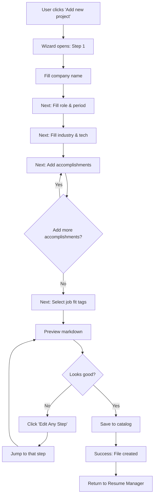
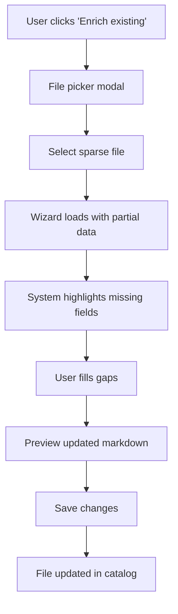
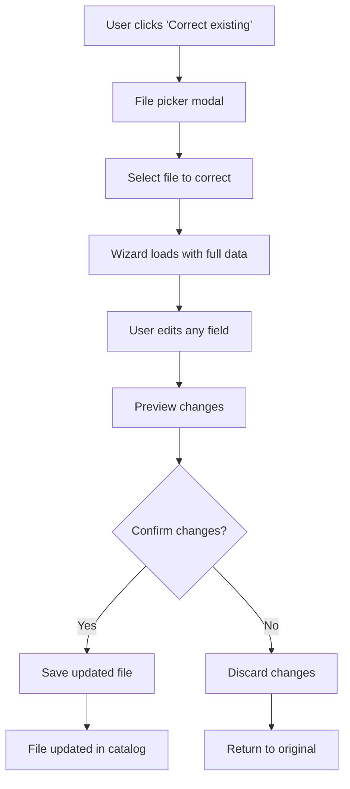

# Dialogue Capture Wizard — UC-1 Design Specification

## Overview

The Dialogue Capture Wizard provides a conversational interface for users to create STAR-formatted project/experience files through guided questions. This replaces manual markdown authoring with a structured dialogue flow.

**Related Use Cases:**
- **UC-1:** Create new project STAR file from scratch
- **UC-1a:** Enrich existing sparse STAR file
- **UC-1b:** Correct/revise existing STAR file

**Requirements Source:**
- Full user stories and acceptance criteria documented in [WIC-94](/WIC/issues/WIC-94)
- 26 testable acceptance criteria (AC-1.1 through AC-1b.7)
- Dialogue state machine and question templates defined
- See [WIC-94 plan document](/WIC/issues/WIC-94#document-plan) for complete requirements

---

## Design Principles

1. **Conversational, Not Form-Like** — Questions feel natural, one at a time
2. **Progressive Disclosure** — Show only current question, hide complexity
3. **Contextual Validation** — Validate inline, prevent bad data early
4. **Clear Progress** — User always knows where they are in the flow
5. **Forgiving** — Easy to go back and change answers
6. **No Content Invention** — System NEVER suggests, auto-completes, or hallucinates content. All data comes directly from user input.

---

## Wizard Flow Structure

### High-Level Steps

```
1. Initiation
   └─> User triggers "Add new project" or "Enrich/correct existing"

2. Context Capture
   ├─> Company
   ├─> Role/Title
   ├─> Time Period
   ├─> Industry
   └─> Tech Stack

3. Accomplishment Collection
   ├─> Accomplishment 1
   │   ├─> Situation
   │   ├─> Task
   │   ├─> Action
   │   └─> Result
   ├─> Accomplishment 2...
   └─> [Add more or continue]

4. Metadata & Tags
   ├─> Job fit categories
   └─> Technical tags

5. Review & Generate
   ├─> Preview markdown
   ├─> Edit if needed
   └─> Save to catalog
```

---

## Wireframes

### Entry Point — Initiation Screen

```
┌────────────────────────────────────────────────────────┐
│  Resume Manager                            [Dashboard] │
├────────────────────────────────────────────────────────┤
│                                                        │
│  ┌────────────────────────────────────────────────┐  │
│  │                                                │  │
│  │             💼                                 │  │
│  │                                                │  │
│  │     Let's capture a new project experience    │  │
│  │                                                │  │
│  │  ┌──────────────────────────────────────────┐ │  │
│  │  │  📝 Create new project file              │ │  │
│  │  │  Start from scratch with guided questions│ │  │
│  │  └──────────────────────────────────────────┘ │  │
│  │                                                │  │
│  │  ┌──────────────────────────────────────────┐ │  │
│  │  │  ✨ Enrich existing file                 │ │  │
│  │  │  Add details to a sparse project file    │ │  │
│  │  └──────────────────────────────────────────┘ │  │
│  │                                                │  │
│  │  ┌──────────────────────────────────────────┐ │  │
│  │  │  ✏️  Correct existing file               │  │
│  │  │  Fix or update an existing project       │ │  │
│  │  └──────────────────────────────────────────┘ │  │
│  │                                                │  │
│  └────────────────────────────────────────────────┘  │
│                                                        │
└────────────────────────────────────────────────────────┘
```

**Behavior:**
- **UC-1 (Create New):** Starts wizard from step 1
- **UC-1a (Enrich):** Shows file picker → Loads partial data → Wizard fills gaps
- **UC-1b (Correct):** Shows file picker → Loads full data → Wizard allows edits

---

### Step 1 — Company Capture

```
┌────────────────────────────────────────────────────────┐
│  New Project                     Step 1 of 5    [Save Draft] │
├────────────────────────────────────────────────────────┤
│                                                        │
│  ┌────────────────────────────────────────────────┐  │
│  │                                                │  │
│  │  What company or organization was this        │  │
│  │  project with?                                │  │
│  │                                                │  │
│  │  ┌──────────────────────────────────────────┐ │  │
│  │  │ Acme Corp                                │ │  │
│  │  └──────────────────────────────────────────┘ │  │
│  │                                                │  │
│  │  💡 Use the full company name                 │  │
│  │                                                │  │
│  └────────────────────────────────────────────────┘  │
│                                                        │
│  Progress: ████░░░░░░░░░░░░ 20%                        │
│                                                        │
│  [Back]                                      [Next]    │
└────────────────────────────────────────────────────────┘
```

**Validation (per WIC-94 AC-1.1):**
- Required field
- Non-empty, max 100 characters
- Must not contain file system unsafe characters

---

### Step 2 — Role & Period

```
┌────────────────────────────────────────────────────────┐
│  New Project                     Step 2 of 5    [Save Draft] │
├────────────────────────────────────────────────────────┤
│                                                        │
│  ┌────────────────────────────────────────────────┐  │
│  │  What was your role or title?                  │  │
│  │                                                │  │
│  │  ┌──────────────────────────────────────────┐ │  │
│  │  │ Senior Software Engineer                 │ │  │
│  │  └──────────────────────────────────────────┘ │  │
│  └────────────────────────────────────────────────┘  │
│                                                        │
│  ┌────────────────────────────────────────────────┐  │
│  │  What was the time period?                     │  │
│  │  (e.g., 'Jan 2022 - Dec 2023' or              │  │
│  │   'Mar 2021 - Present')                        │  │
│  │                                                │  │
│  │  ┌──────────────────────────────────────────┐ │  │
│  │  │ Jan 2023 - Present                       │ │  │
│  │  └──────────────────────────────────────────┘ │  │
│  │                                                │  │
│  │  💡 Format: 'Mon YYYY - Mon YYYY' or 'Present'│  │
│  └────────────────────────────────────────────────┘  │
│                                                        │
│  Progress: ████████░░░░░░░░ 40%                        │
│                                                        │
│  [Back]                                      [Next]    │
└────────────────────────────────────────────────────────┘
```

**Validation (per WIC-94 AC-1.2, AC-1.3):**
- Role: Required, non-empty, max 100 characters
- Period: Required, must match regex `^[A-Z][a-z]{2} \d{4} - ([A-Z][a-z]{2} \d{4}|Present)$`
- End date must be >= start date (when not "Present")

---

### Step 3 — Industry

```
┌────────────────────────────────────────────────────────┐
│  New Project                     Step 3 of 5    [Save Draft] │
├────────────────────────────────────────────────────────┤
│                                                        │
│  ┌────────────────────────────────────────────────┐  │
│  │  What industry or sector?                      │  │
│  │  (e.g., 'FinTech', 'Healthcare', 'E-commerce') │  │
│  │                                                │  │
│  │  ┌──────────────────────────────────────────┐ │  │
│  │  │ FinTech                                  │ │  │
│  │  └──────────────────────────────────────────┘ │  │
│  │                                                │  │
│  │  💡 Enter the industry name (no autocomplete) │  │
│  └────────────────────────────────────────────────┘  │
│                                                        │
│  Progress: ████████████░░░░ 60%                        │
│                                                        │
│  [Back]                                      [Next]    │
└────────────────────────────────────────────────────────┘
```

**Validation (per WIC-94 AC-1.4):**
- Industry: Required, non-empty, max 50 characters
- NO autocomplete or suggestions (per "no invention" constraint)

---

### Step 4 — Accomplishments (STAR Breakdown)

```
┌────────────────────────────────────────────────────────┐
│  New Project                     Step 4 of 5    [Save Draft] │
├────────────────────────────────────────────────────────┤
│                                                        │
│  ┌────────────────────────────────────────────────┐  │
│  │  Describe a key accomplishment in one sentence:│  │
│  │  ┌──────────────────────────────────────────┐ │  │
│  │  │ Payment system redesign for high scale   │ │  │
│  │  └──────────────────────────────────────────┘ │  │
│  └────────────────────────────────────────────────┘  │
│                                                        │
│  ┌────────────────────────────────────────────────┐  │
│  │  What was the context? Describe the challenge  │  │
│  │  or situation you faced:                       │  │
│  │  ┌──────────────────────────────────────────┐ │  │
│  │  │ Our payment processing system was         │ │  │
│  │  │ experiencing 20% failure rate during      │ │  │
│  │  │ peak hours due to timeout issues.         │ │  │
│  │  └──────────────────────────────────────────┘ │  │
│  └────────────────────────────────────────────────┘  │
│                                                        │
│  ┌────────────────────────────────────────────────┐  │
│  │  What was your specific responsibility or task │  │
│  │  in this situation?                            │  │
│  │  ┌──────────────────────────────────────────┐ │  │
│  │  │ Redesign the payment architecture to      │ │  │
│  │  │ handle 10x load and reduce failures.      │ │  │
│  │  └──────────────────────────────────────────┘ │  │
│  └────────────────────────────────────────────────┘  │
│                                                        │
│  ┌────────────────────────────────────────────────┐  │
│  │  What specific actions did you take?           │  │
│  │  Be concrete about steps:                      │  │
│  │  ┌──────────────────────────────────────────┐ │  │
│  │  │ Implemented async queue-based processing  │ │  │
│  │  │ with Redis, added retry logic and circuit │ │  │
│  │  │ breakers, optimized database queries.     │ │  │
│  │  └──────────────────────────────────────────┘ │  │
│  └────────────────────────────────────────────────┘  │
│                                                        │
│  ┌────────────────────────────────────────────────┐  │
│  │  What was the outcome? Include metrics or      │  │
│  │  impact where possible:                        │  │
│  │  ┌──────────────────────────────────────────┐ │  │
│  │  │ Reduced failure rate from 20% to 0.5%,    │ │  │
│  │  │ improved throughput by 300%.              │ │  │
│  │  └──────────────────────────────────────────┘ │  │
│  │                                                │  │
│  │  💡 If you can include numbers (%, $, time    │  │
│  │  saved, etc.), that strengthens the story.    │  │
│  └────────────────────────────────────────────────┘  │
│                                                        │
│  ┌────────────────────────────────────────────────┐  │
│  │  What technologies did you use?                │  │
│  │  (comma-separated, or 'skip'):                 │  │
│  │  ┌──────────────────────────────────────────┐ │  │
│  │  │ Redis, Node.js, PostgreSQL               │ │  │
│  │  └──────────────────────────────────────────┘ │  │
│  └────────────────────────────────────────────────┘  │
│                                                        │
│  [Save Accomplishment]                                 │
│                                                        │
│  Saved accomplishments: 0                              │
│  [+ Add Another Accomplishment]                        │
│                                                        │
│  Progress: ████████████████ 80%                        │
│                                                        │
│  [Back]                                      [Next]    │
└────────────────────────────────────────────────────────┘
```

**Validation (per WIC-94 AC-1.5, AC-1.6, AC-1.7):**
- Headline: Required, non-empty, max 200 characters
- Situation: Required, non-empty, max 500 characters
- Task: Required, non-empty, max 500 characters
- Action: Required, non-empty, max 1000 characters
- Result: Required, non-empty, max 500 characters
- Technologies: Optional (user can type 'skip')
- At least 1 accomplishment required to proceed

**Behavior:**
- One field at a time presentation (can be condensed for space)
- Each saved accomplishment appears as a collapsible card
- User can add multiple accomplishments via "+ Add Another"
- Tech tags auto-normalized: lowercase, trimmed, deduplicated

---

### Step 5 — Job Fit Tags

```
┌────────────────────────────────────────────────────────┐
│  New Project                     Step 5 of 5    [Save Draft] │
├────────────────────────────────────────────────────────┤
│                                                        │
│  ┌────────────────────────────────────────────────┐  │
│  │  What types of roles would this project be     │  │
│  │  relevant for?                                 │  │
│  │  (comma-separated, or 'skip'):                 │  │
│  │                                                │  │
│  │  ┌──────────────────────────────────────────┐ │  │
│  │  │ backend, fullstack, devops               │ │  │
│  │  └──────────────────────────────────────────┘ │  │
│  │                                                │  │
│  │  💡 No suggestions provided - enter what      │  │
│  │  matches your experience                      │  │
│  └────────────────────────────────────────────────┘  │
│                                                        │
│  Progress: ████████████████████ 100%                   │
│                                                        │
│  [Back]                                  [Preview]     │
└────────────────────────────────────────────────────────┘
```

**Validation (per WIC-94 requirements):**
- Optional field (user can type 'skip')
- If provided: array of strings, auto-normalized to lowercase
- NO predefined list or checkboxes (per "no invention" constraint)

---

### Final Step — Review & Generate

```
┌────────────────────────────────────────────────────────┐
│  Review Project                              [Save Draft] │
├────────────────────────────────────────────────────────┤
│                                                        │
│  ┌──────────────────┬───────────────────────────────┐ │
│  │ Project Summary  │  Markdown Preview            │ │
│  ├──────────────────┼───────────────────────────────┤ │
│  │                  │  ---                         │ │
│  │ Company:         │  company: Acme Corp          │ │
│  │ Acme Corp        │  role: Senior SWE            │ │
│  │                  │  period: Jan 2023 - Dec 2024 │ │
│  │ Role:            │  industry: FinTech           │ │
│  │ Senior SWE       │  tech_stack:                 │ │
│  │                  │    - React                   │ │
│  │ Period:          │    - Node.js                 │ │
│  │ Jan 2023 - 2024  │    - PostgreSQL              │ │
│  │                  │  job_fit:                    │ │
│  │ Industry:        │    - backend                 │ │
│  │ FinTech          │    - fullstack               │ │
│  │                  │  ---                         │ │
│  │ Tech:            │                               │ │
│  │ [React]          │  ## Accomplishments          │ │
│  │ [Node.js]        │                               │ │
│  │ [PostgreSQL]     │  ### Payment System Redesign │ │
│  │                  │                               │ │
│  │ Accomplishments: │  **Situation:** Our payment  │ │
│  │ • Payment System │  processing system was...    │ │
│  │   Redesign       │                               │ │
│  │                  │  **Task:** Redesign the...   │ │
│  │ [Edit Any Step]  │                               │ │
│  │                  │  **Action:** Implemented...  │ │
│  └──────────────────┴───────────────────────────────┘ │
│                                                        │
│  File name: acme-corp-senior-swe-2023.md               │
│  Location: /projects/                                  │
│                                                        │
│  [Back to Edit]              [Save to Catalog]        │
└────────────────────────────────────────────────────────┘
```

**Behavior:**
- **Left Panel:** Summary with quick edit links
- **Right Panel:** Live markdown preview
- **File Name:** Auto-generated from company-role-year
- **Save:** Creates markdown file in projects directory

---

## Component Specifications

### 1. WizardContainer

**Purpose:** Main wrapper for wizard flow with progress tracking.

```tsx
interface WizardContainerProps {
  variant: 'create' | 'enrich' | 'correct'
  existingFileId?: string
  onComplete: (generatedFile: ProjectFile) => void
  onCancel: () => void
  onSaveDraft: (draftData: Partial<ProjectData>) => void
}

interface WizardState {
  currentStep: number
  totalSteps: number
  data: ProjectData
  isDirty: boolean
}
```

**States:**
- Initial: Step 1/5, empty data
- In Progress: Steps 1-5, partial data filled
- Review: Step 6, all data complete
- Saving: Loading spinner, disabled interactions
- Success: Confirmation screen
- Error: Error message with retry

**Keyboard Navigation:**
- Tab: Move between fields
- Enter: Submit current step (if valid)
- Escape: Cancel wizard (with confirmation)
- Ctrl/Cmd + S: Save draft

---

### 2. WizardButton

**Purpose:** Primary and secondary action buttons with clear visual states.

```tsx
interface WizardButtonProps {
  variant: 'primary' | 'secondary' | 'ghost'
  disabled?: boolean
  loading?: boolean
  children: React.ReactNode
  onClick: () => void
  type?: 'button' | 'submit'
}
```

**Visual Specifications:**

#### Primary Button (Next, Save, Confirm)

| State | Background | Text Color | Border | Shadow |
|-------|------------|------------|--------|--------|
| **Default** | `primary-600` (#2563eb) | `white` | none | `shadow-sm` |
| **Hover** | `primary-700` (#1d4ed8) | `white` | none | `shadow-md` |
| **Focus** | `primary-600` | `white` | `2px solid primary-500` | `shadow-md` |
| **Disabled** | `neutral-300` (#d1d5db) | `neutral-500` | none | none |
| **Loading** | `primary-600` | `white` | none | `shadow-sm` + spinner |

**Size:**
- Padding: `12px vertical, 24px horizontal`
- Font: `text-base` (16px), `font-semibold` (600)
- Border radius: `lg` (8px)
- Min width: `120px`

#### Secondary Button (Back, Cancel)

| State | Background | Text Color | Border | Shadow |
|-------|------------|------------|--------|--------|
| **Default** | `white` | `neutral-700` | `1px solid neutral-300` | `shadow-sm` |
| **Hover** | `neutral-50` | `neutral-900` | `1px solid neutral-400` | `shadow-md` |
| **Focus** | `white` | `neutral-700` | `2px solid primary-500` | `shadow-md` |
| **Disabled** | `neutral-100` | `neutral-400` | `1px solid neutral-200` | none |

**Size:** Same as primary

#### Ghost Button (Save Draft)

| State | Background | Text Color | Border | Shadow |
|-------|------------|------------|--------|--------|
| **Default** | `transparent` | `primary-600` | none | none |
| **Hover** | `primary-50` | `primary-700` | none | none |
| **Focus** | `transparent` | `primary-600` | `2px solid primary-500` | none |
| **Disabled** | `transparent` | `neutral-400` | none | none |

**Size:**
- Padding: `8px vertical, 16px horizontal`
- Font: `text-sm` (14px), `font-medium` (500)

**Transitions:**
- All states: `transition-colors` (250ms ease-in-out)
- Hover shadow: `transition-shadow` (250ms ease-out)

**Accessibility:**
- `role="button"` (if not using `<button>`)
- `aria-disabled="true"` when disabled
- `aria-busy="true"` when loading
- Focus ring always visible (not `:focus-visible` only)

**Usage Example:**
```tsx
// Primary
<WizardButton variant="primary" onClick={handleNext} disabled={!canProceed}>
  Next
</WizardButton>

// Secondary
<WizardButton variant="secondary" onClick={handleBack}>
  Back
</WizardButton>

// Ghost
<WizardButton variant="ghost" onClick={handleSaveDraft}>
  Save Draft
</WizardButton>
```

---

### 3. WizardStep

**Purpose:** Individual step container with question and input.

```tsx
interface WizardStepProps {
  stepNumber: number
  totalSteps: number
  question: string
  hint?: string
  children: React.ReactNode
  onNext: () => void
  onBack: () => void
  canProceed: boolean
}
```

**Layout:**
- Question text: H2, primary color
- Hint: Body-sm, neutral-600
- Input area: Custom per step type
- Progress bar: Bottom of screen
- Navigation: Back (secondary) / Next (primary)

---

### 4. STARInput

**Purpose:** Four-field STAR breakdown editor.

```tsx
interface STARInputProps {
  value: STARData
  onChange: (data: STARData) => void
  errors?: Partial<Record<keyof STARData, string>>
}

interface STARData {
  situation: string
  task: string
  action: string
  result: string
}
```

**Validation:**
- Each field min 10 chars
- Result field: Encourage numbers/metrics
- Visual: Green checkmark when field valid

**Guidance:**
- Placeholder text with examples
- Character count for each field
- Inline tips (e.g., "Use 'I' not 'we'")

---

### 5. TechStackPicker

**Purpose:** Simple tag input for technologies (NO autocomplete per "no invention" constraint).

```tsx
interface TechStackPickerProps {
  value: string[]
  onChange: (tags: string[]) => void
  maxTags?: number
}
```

**Behavior:**
- Free text input (comma-separated or Enter to add)
- Tags auto-normalized: lowercase, trimmed, deduplicated
- X to remove tag
- Drag to reorder tags (optional enhancement)
- Max 20 tags (configurable)
- NO autocomplete or suggestions

---

### 6. ProgressIndicator

**Purpose:** Visual progress through wizard steps.

```tsx
interface ProgressIndicatorProps {
  currentStep: number
  totalSteps: number
  stepLabels: string[]
  onStepClick?: (step: number) => void
}
```

**Visual:**
```
1. Context → 2. Tech → 3. Accomplishments → 4. Tags → 5. Review
   ✓          ✓             •                 ○         ○

████████████████████░░░░░░░░ 60%
```

**States:**
- Completed: Green checkmark, bold
- Current: Blue dot, bold
- Upcoming: Gray circle, normal

---

## User Flows

### UC-1: Create New Project File



---

### UC-1a: Enrich Existing Sparse File



**Pre-population Rules:**
- If field exists in file → Show as read-only with "Edit" option
- If field missing → Show empty input (highlighted)
- If STAR incomplete → Prompt to complete missing parts

---

### UC-1b: Correct Existing File



---

## Validation States

### Field-Level Validation

| Field | Validation Rule | Error Message |
|-------|----------------|---------------|
| Company | Required, min 2 chars | "Company name is required" |
| Role | Required, min 2 chars | "Role/title is required" |
| Start Date | Required, valid date | "Start date is required" |
| End Date | Optional, must be > start date | "End date must be after start date" |
| Industry | Required | "Please select or enter an industry" |
| Tech Stack | Optional, max 20 tags | "Maximum 20 technologies allowed" |
| Situation | Required, min 10 chars | "Situation must be at least 10 characters" |
| Task | Required, min 10 chars | "Task must be at least 10 characters" |
| Action | Required, min 10 chars | "Action must be at least 10 characters" |
| Result | Required, min 10 chars, encourage numbers | "Result must be at least 10 characters. Include metrics if possible." |
| Job Fit | At least 1 selected | "Select at least one job fit category" |

### Step-Level Validation

- User cannot proceed to next step until current step valid
- "Next" button disabled if validation fails
- Errors shown inline below each field
- Toast notification on attempted invalid submit

---

## Error Handling

### Client-Side Errors

| Error | Cause | User Action |
|-------|-------|-------------|
| Missing required field | User tries to proceed without filling | Show inline error, focus field |
| Invalid date range | End date before start date | Show error message, suggest correction |
| Too many tags | More than 20 tech tags | Show limit warning, prevent adding more |
| No accomplishments | User tries to skip accomplishments | Block next, show "Add at least one accomplishment" |

### Server-Side Errors

| Error | Cause | User Action |
|-------|-------|-------------|
| Duplicate file name | File with same name exists | Suggest rename or overwrite option |
| Save failure | Network or server issue | Show error toast, enable retry |
| Catalog write error | Permissions or disk issue | Show error, contact support link |

### Autosave & Draft Recovery

- **Autosave:** Save partial data to `.draft` file in `data/projects/` directory every 30 seconds
- **Draft Format:** Same structure as final file but with `.draft` extension (e.g., `acme-corp-engineer.draft`)
- **Recovery:** On wizard re-open, check for `.draft` file and offer to resume
- **Clear Draft:** Delete `.draft` file on successful save or user explicitly cancels

---

## Integration Points

### Resume Manager Integration

**Entry Points:**
- Main button: "Add New Project"
- Context menu on existing files: "Enrich" or "Correct"

**File Storage:**
- Save to `/data/projects/{company}-{role}-{year}.md`
- Update catalog index with new entry
- Generate frontmatter with all metadata

**Post-Save Actions:**
- Show success toast
- Redirect to file detail view (or stay in list)
- Offer to link to job application

### Application Linking

After wizard completes:
```
┌────────────────────────────────────────┐
│  ✅ Project file created successfully! │
│                                        │
│  📄 acme-corp-senior-swe-2023.md       │
│                                        │
│  Would you like to link this to a      │
│  job application?                      │
│                                        │
│  [Link to Application]  [Not Now]     │
└────────────────────────────────────────┘
```

---

## Responsive Behavior

### Desktop (>1024px)
- Full-width wizard (max 800px centered)
- Side-by-side preview in review step
- All fields visible at once

### Tablet (768-1024px)
- Single-column layout
- Stacked review preview
- Slightly smaller input fields

### Mobile (<768px)
- Minimal wizard chrome
- One question per screen
- Bottom navigation (sticky)
- Compact progress indicator

---

## Accessibility

### ARIA Labels
- Wizard: `role="dialog"`, `aria-labelledby="wizard-title"`
- Progress: `role="progressbar"`, `aria-valuenow`, `aria-valuemin`, `aria-valuemax`
- Steps: `role="tabpanel"`, `aria-labelledby="step-{n}-title"`

### Keyboard Navigation
- Tab order: Question → Inputs → Back → Next
- Enter: Submit current step
- Escape: Cancel wizard (with confirm)
- Ctrl/Cmd + S: Save draft

### Screen Reader Support
- Announce step changes: "Step 2 of 5: Role and Period"
- Announce validation errors
- Announce progress updates

### Focus Management
- Focus first input on step load
- Return focus to trigger on cancel
- Trap focus within wizard modal

---

## Animation & Transitions

| Interaction | Animation | Duration | Easing |
|-------------|-----------|----------|--------|
| Step transition | Slide left/right | 300ms | ease-in-out |
| Validation error | Shake + border pulse | 200ms | ease-out |
| Save success | Checkmark scale-in | 250ms | spring |
| Progress bar update | Width transition | 400ms | ease-out |
| Wizard open/close | Fade + scale | 250ms | ease-out |

---

## Testing Checklist

- [ ] All validation rules enforce correctly per WIC-94 acceptance criteria
- [ ] Can navigate back without losing data
- [ ] Draft autosave to `.draft` file works
- [ ] Draft recovery prompts on re-open
- [ ] STAR input validates all four components (S, T, A, R)
- [ ] Tech stack tag input works (no autocomplete)
- [ ] Job fit free text input works (no predefined checkboxes)
- [ ] Markdown preview renders correctly
- [ ] File saves to `data/projects/{slug}/` with correct naming
- [ ] Enrich mode pre-populates existing data correctly
- [ ] Correct mode allows targeted edits without data loss
- [ ] No content invention: system never suggests or auto-completes
- [ ] Keyboard navigation works (Tab, Enter, Escape, Ctrl/Cmd+S)
- [ ] Screen reader announces state changes properly
- [ ] Mobile layout responsive
- [ ] Error messages clear and actionable
- [ ] Period format validation matches regex exactly
- [ ] File slug generation matches specification

---

## Requirements Decisions (From WIC-94)

The following questions were resolved in [WIC-94](/WIC/issues/WIC-94):

1. **Multi-file projects:** One file per company-role combination with multiple STAR sections within. ✅
2. **Job fit inference:** System prompts but does NOT suggest. User enters freely. ✅
3. **Draft persistence:** Save partial data to `.draft` file in project directory for resumption. ✅
4. **File naming:** Auto-generated slug format `{company}-{role}` (lowercased, hyphenated). ✅
5. **Tech stack source:** User input only, NO autocomplete or suggestions. ✅
6. **Job fit categories:** User-defined, NO predefined checkboxes. ✅
7. **Markdown template:** Strict template from `resume.service.ts:generateProjectMarkdown()`. ✅
8. **Content invention:** FORBIDDEN - system never suggests or auto-completes content. ✅
9. **STAR consistency:** All four components (S, T, A, R) required for each accomplishment. ✅
10. **Catalog integration:** Files must link cleanly into master catalog index. ✅

---

## Future Enhancements

### Phase 2 Features
- AI-assisted STAR generation from bullet points
- Import from LinkedIn profile
- Bulk edit multiple projects
- Templates for common roles (SWE, PM, Designer)
- Voice input for mobile
- Collaboration: Share draft for review

### Advanced Features
- Version history for project files
- Diff view for "Correct" mode
- Smart suggestions based on tech stack
- Job description matching analysis
- Export to portfolio format
