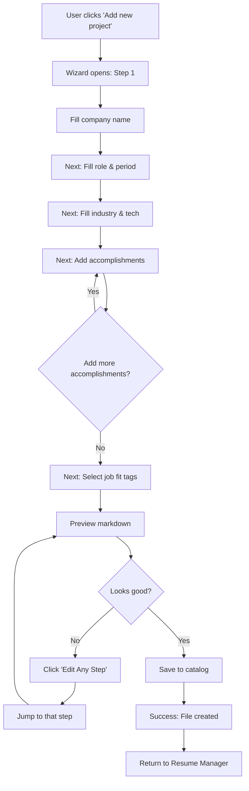
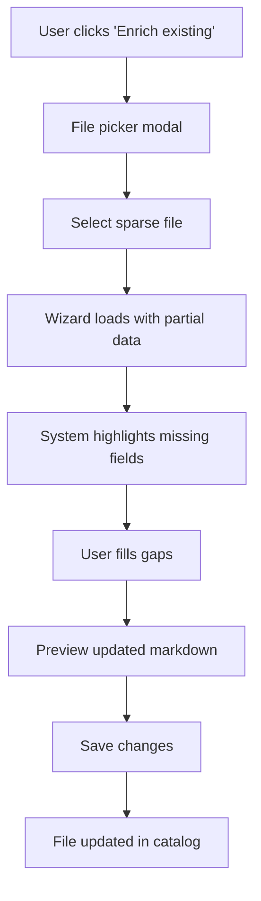
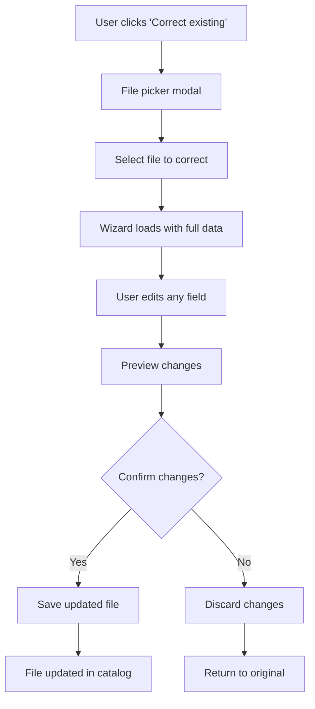

# Dialogue Capture Wizard — UC-1 Design Specification

## Overview

The Dialogue Capture Wizard provides a conversational interface for users to create STAR-formatted project/experience files through guided questions. This replaces manual markdown authoring with a structured dialogue flow.

**Related Use Cases:**
- **UC-1:** Create new project STAR file from scratch
- **UC-1a:** Enrich existing sparse STAR file
- **UC-1b:** Correct/revise existing STAR file

**Requirements Source:**
- Full user stories and acceptance criteria documented in [WIC-94](/WIC/issues/WIC-94)
- 26 testable acceptance criteria (AC-1.1 through AC-1b.7)
- Dialogue state machine and question templates defined
- See [WIC-94 plan document](/WIC/issues/WIC-94#document-plan) for complete requirements

---

## Ruling: draft persistence is dropped (WIC-1621)

**This section takes precedence over every "Autosave", "Draft Recovery", "Save Draft" and
`onSaveDraft` mention below.** Those are struck in place rather than deleted, so a reader who
arrives from an old link sees what changed. Measured on `origin/main` @ `bb21d20`.

### What this document claimed, and what is actually built

This spec describes a complete draft-persistence feature — `.draft` files in `data/projects/`,
autosave every 30 seconds, a recovery prompt on re-open, and a clear-on-save/cancel path — and
§"Requirements Decisions (From WIC-94)" item 3 marks it **✅**, i.e. shipped.

None of it exists. What ships is a single `localStorage.setItem` in
`packages/web/src/pages/DialogueCapture.tsx:47`, under the key
`dialogue-wizard-draft-{variant}`. Measured, not inferred:

| Claim in this doc | Reality on `bb21d20` |
|---|---|
| `.draft` files in `data/projects/` | No API, no route, no file. It is `localStorage`. |
| "Recovery: on wizard re-open, offer to resume" | **No read path exists.** `git grep dialogue-wizard-draft` returns exactly **one** hit tree-wide — the write. |
| "Clear Draft on successful save or cancel" | No `removeItem` for this key anywhere. The store survives logout and accumulates, keyed per variant. |
| Item 3 marked ✅ | Unbuilt. |
| "Escape: Cancel wizard (with confirmation)" | **Also unbuilt** — no `Escape` handler and no `confirm()` in `WizardContainer.tsx`. |

The 30-second autosave also fires **unconditionally**. Its guard is
`if (Object.keys(data).length > 0)`, and `data` is seeded with three keys
(`accomplishments`, `jobFit`, `techStack`), so the condition is vacuous. Rendering the real
route in jsdom and advancing 30s with **zero user input** writes:

```
{"data":{"accomplishments":[],"jobFit":[],"techStack":[]},"timestamp":"..."}
```

So the wizard persists project content to disk on a timer the user never started, and a
"Save Draft" button that returns no feedback and restores nothing.

### The ruling

**Draft persistence is dropped. The affordance stays gone.** Do not build the `.draft` store.

1. **The affordance today is a control that lies.** "Save Draft" implies restoration. There is
   no read path, so the promise cannot be kept, and the button gives no toast, no confirmation,
   no observable result at all. That is worse than having no button.
2. **The autosave is unconsented data-at-rest**, on a timer, surviving logout — for a feature
   the user cannot benefit from because nothing reads it back.
3. **Building it properly is disproportionate.** It needs a per-user server-side store, a read
   path repopulating `WizardContainer` state on mount, a clear path on completion *and* on
   logout, and a retention policy — a backend and a frontend half — to protect a five-step form
   whose completion is one submit.
4. **The actual user-visible harm is narrower than the feature.** It is "close the wizard
   mid-way and lose what you typed, with no warning." A confirm-on-discard guard closes that
   completely, with no promise and no data at rest.

### What replaces it

Nothing new: **this document already specified the remedy** and it was never built.
§"WizardContainer → Keyboard Navigation" reads *"Escape: Cancel wizard (with confirmation)"*.
Honour that, and extend it to the other two discard paths, so all three behave alike:

| Discard path | Required behaviour |
|---|---|
| `Escape` | Confirm before discarding |
| Header close (`aria-label="Close wizard"`) | Confirm before discarding |
| In-app navigation away from `/projects/new/dialogue` | Confirm before discarding |

Rules for the guard:

- **Only prompt when there is something to lose.** Track dirtiness against the *seeded* initial
  state, not `Object.keys(data).length` — that is the exact bug that made the autosave vacuous,
  and it will reproduce here if copied.
- **Never prompt on the success path.** Completing the wizard navigates to the new file; that is
  not a discard.
- **Confirm copy** — follow `CONTENT_STYLE.md`. Name the loss, do not ask an abstract question:
  - Title: `Discard this project?`
  - Body: `You have unsaved answers. Closing now discards them — they are not saved anywhere.`
  - Confirm: `Discard` · Cancel: `Keep editing`
  - The body's second clause is load-bearing. Users who saw "Save Draft" for months will
    reasonably assume a draft exists; the copy has to say plainly that it does not.
- **Reuse `packages/web/src/components/ConfirmationModal.tsx`. Do not build a new dialog, and do
  not reach for `window.confirm`.** Its props already take exactly this shape —
  `{isOpen, title, message, confirmLabel, cancelLabel, variant, onConfirm, onCancel}` — so the
  copy above maps onto it directly, with `variant="danger"`.
- **It is a dialog, so `MODAL_FOCUS_MANAGEMENT_SPEC.md` applies** — focus trap, `Escape` resolves
  to "Keep editing", focus returns to the control that opened it. Be aware of what you are
  inheriting: at `bb21d20` `ConfirmationModal` declares **no** `role="dialog"`, no `aria-modal`,
  no focus trap and no `restoreFocusTo` (the repo's own `confirmation-modal-focus-audit.py`
  reports §5.3 as *not enforced* pending WIC-1181 / PR #115). Reusing it is still right — the fix
  belongs in the shared component, not in a wizard-local copy — but this guard must not be
  reported as focus-managed until that lands.
- **Nesting matters.** `WizardContainer` is itself `role="dialog" aria-modal="true"`, so this is
  a dialog inside a dialog: the focus-restore target is the wizard control that was activated,
  not the page beneath.
- **No `beforeunload`.** It cannot carry this copy, browsers show their own generic string, and
  it would fire on tab close where the user has no recourse. The in-app router guard is the
  whole scope.

### Status

The ruling is the deliverable of WIC-1621 and is in force from this commit. The code changes it
implies are **not** in this commit and are tracked separately:

- **Removal** of the write, the 30s interval, the Ctrl/Cmd+S handler and the "Save Draft" button
  is already authored in the branch behind WIC-1495. Do not duplicate it here.
- **The confirm-on-discard guard** is not written anywhere yet. It must land *with or after* the
  removal — shipping the removal alone takes the user from "a button that lies" to "silent
  total loss", which is the one ordering that is worse than today.

---

## Design Principles

1. **Conversational, Not Form-Like** — Questions feel natural, one at a time
2. **Progressive Disclosure** — Show only current question, hide complexity
3. **Contextual Validation** — Validate inline, prevent bad data early
4. **Clear Progress** — User always knows where they are in the flow
5. **Forgiving** — Easy to go back and change answers
6. **No Content Invention** — System NEVER suggests, auto-completes, or hallucinates content. All data comes directly from user input.

---

## Wizard Flow Structure

### High-Level Steps

```
1. Initiation
   └─> User triggers "Add new project" or "Enrich/correct existing"

2. Context Capture
   ├─> Company
   ├─> Role/Title
   ├─> Time Period
   ├─> Industry
   └─> Tech Stack

3. Accomplishment Collection
   ├─> Accomplishment 1
   │   ├─> Situation
   │   ├─> Task
   │   ├─> Action
   │   └─> Result
   ├─> Accomplishment 2...
   └─> [Add more or continue]

4. Metadata & Tags
   ├─> Job fit categories
   └─> Technical tags

5. Review & Generate
   ├─> Preview markdown
   ├─> Edit if needed
   └─> Save to catalog
```

---

## Wireframes

### Entry Point — Initiation Screen

```
┌────────────────────────────────────────────────────────┐
│  Resume Manager                            [Dashboard] │
├────────────────────────────────────────────────────────┤
│                                                        │
│  ┌────────────────────────────────────────────────┐  │
│  │                                                │  │
│  │             💼                                 │  │
│  │                                                │  │
│  │     Let's capture a new project experience    │  │
│  │                                                │  │
│  │  ┌──────────────────────────────────────────┐ │  │
│  │  │  📝 Create new project file              │ │  │
│  │  │  Start from scratch with guided questions│ │  │
│  │  └──────────────────────────────────────────┘ │  │
│  │                                                │  │
│  │  ┌──────────────────────────────────────────┐ │  │
│  │  │  ✨ Enrich existing file                 │ │  │
│  │  │  Add details to a sparse project file    │ │  │
│  │  └──────────────────────────────────────────┘ │  │
│  │                                                │  │
│  │  ┌──────────────────────────────────────────┐ │  │
│  │  │  ✏️  Correct existing file               │  │
│  │  │  Fix or update an existing project       │ │  │
│  │  └──────────────────────────────────────────┘ │  │
│  │                                                │  │
│  └────────────────────────────────────────────────┘  │
│                                                        │
└────────────────────────────────────────────────────────┘
```

**Behavior:**
- **UC-1 (Create New):** Starts wizard from step 1
- **UC-1a (Enrich):** Shows file picker → Loads partial data → Wizard fills gaps
- **UC-1b (Correct):** Shows file picker → Loads full data → Wizard allows edits

---

> **Wireframe note (WIC-1621).** Every wizard frame below draws `[Save Draft]` in the header.
> **That control is removed** — see the ruling section at the top of this file. The frames are
> left as drawn rather than redrawn, because their ASCII alignment is load-bearing and the
> single change is the deletion of that one chip. Read every `[Save Draft]` below as absent.

### Step 1 — Company Capture

```
┌────────────────────────────────────────────────────────┐
│  New Project                     Step 1 of 5    [Save Draft] │
├────────────────────────────────────────────────────────┤
│                                                        │
│  ┌────────────────────────────────────────────────┐  │
│  │                                                │  │
│  │  What company or organization was this        │  │
│  │  project with?                                │  │
│  │                                                │  │
│  │  ┌──────────────────────────────────────────┐ │  │
│  │  │ Acme Corp                                │ │  │
│  │  └──────────────────────────────────────────┘ │  │
│  │                                                │  │
│  │  💡 Use the full company name                 │  │
│  │                                                │  │
│  └────────────────────────────────────────────────┘  │
│                                                        │
│  Progress: ████░░░░░░░░░░░░ 20%                        │
│                                                        │
│  [Back]                                      [Next]    │
└────────────────────────────────────────────────────────┘
```

**Validation (per WIC-94 AC-1.1):**
- Required field
- Non-empty, max 100 characters
- Must not contain file system unsafe characters

---

### Step 2 — Role & Period

```
┌────────────────────────────────────────────────────────┐
│  New Project                     Step 2 of 5    [Save Draft] │
├────────────────────────────────────────────────────────┤
│                                                        │
│  ┌────────────────────────────────────────────────┐  │
│  │  What was your role or title?                  │  │
│  │                                                │  │
│  │  ┌──────────────────────────────────────────┐ │  │
│  │  │ Senior Software Engineer                 │ │  │
│  │  └──────────────────────────────────────────┘ │  │
│  └────────────────────────────────────────────────┘  │
│                                                        │
│  ┌────────────────────────────────────────────────┐  │
│  │  What was the time period?                     │  │
│  │  (e.g., 'Jan 2022 - Dec 2023' or              │  │
│  │   'Mar 2021 - Present')                        │  │
│  │                                                │  │
│  │  ┌──────────────────────────────────────────┐ │  │
│  │  │ Jan 2023 - Present                       │ │  │
│  │  └──────────────────────────────────────────┘ │  │
│  │                                                │  │
│  │  💡 Format: 'Mon YYYY - Mon YYYY' or 'Present'│  │
│  └────────────────────────────────────────────────┘  │
│                                                        │
│  Progress: ████████░░░░░░░░ 40%                        │
│                                                        │
│  [Back]                                      [Next]    │
└────────────────────────────────────────────────────────┘
```

**Validation (per WIC-94 AC-1.2, AC-1.3):**
- Role: Required, non-empty, max 100 characters
- Period: Required, must match regex `^[A-Z][a-z]{2} \d{4} - ([A-Z][a-z]{2} \d{4}|Present)$`
- End date must be >= start date (when not "Present")

---

### Step 3 — Industry

```
┌────────────────────────────────────────────────────────┐
│  New Project                     Step 3 of 5    [Save Draft] │
├────────────────────────────────────────────────────────┤
│                                                        │
│  ┌────────────────────────────────────────────────┐  │
│  │  What industry or sector?                      │  │
│  │  (e.g., 'FinTech', 'Healthcare', 'E-commerce') │  │
│  │                                                │  │
│  │  ┌──────────────────────────────────────────┐ │  │
│  │  │ FinTech                                  │ │  │
│  │  └──────────────────────────────────────────┘ │  │
│  │                                                │  │
│  │  💡 Enter the industry name (no autocomplete) │  │
│  └────────────────────────────────────────────────┘  │
│                                                        │
│  Progress: ████████████░░░░ 60%                        │
│                                                        │
│  [Back]                                      [Next]    │
└────────────────────────────────────────────────────────┘
```

**Validation (per WIC-94 AC-1.4):**
- Industry: Required, non-empty, max 50 characters
- NO autocomplete or suggestions (per "no invention" constraint)

---

### Step 4 — Accomplishments (STAR Breakdown)

```
┌────────────────────────────────────────────────────────┐
│  New Project                     Step 4 of 5    [Save Draft] │
├────────────────────────────────────────────────────────┤
│                                                        │
│  ┌────────────────────────────────────────────────┐  │
│  │  Describe a key accomplishment in one sentence:│  │
│  │  ┌──────────────────────────────────────────┐ │  │
│  │  │ Payment system redesign for high scale   │ │  │
│  │  └──────────────────────────────────────────┘ │  │
│  └────────────────────────────────────────────────┘  │
│                                                        │
│  ┌────────────────────────────────────────────────┐  │
│  │  What was the context? Describe the challenge  │  │
│  │  or situation you faced:                       │  │
│  │  ┌──────────────────────────────────────────┐ │  │
│  │  │ Our payment processing system was         │ │  │
│  │  │ experiencing 20% failure rate during      │ │  │
│  │  │ peak hours due to timeout issues.         │ │  │
│  │  └──────────────────────────────────────────┘ │  │
│  └────────────────────────────────────────────────┘  │
│                                                        │
│  ┌────────────────────────────────────────────────┐  │
│  │  What was your specific responsibility or task │  │
│  │  in this situation?                            │  │
│  │  ┌──────────────────────────────────────────┐ │  │
│  │  │ Redesign the payment architecture to      │ │  │
│  │  │ handle 10x load and reduce failures.      │ │  │
│  │  └──────────────────────────────────────────┘ │  │
│  └────────────────────────────────────────────────┘  │
│                                                        │
│  ┌────────────────────────────────────────────────┐  │
│  │  What specific actions did you take?           │  │
│  │  Be concrete about steps:                      │  │
│  │  ┌──────────────────────────────────────────┐ │  │
│  │  │ Implemented async queue-based processing  │ │  │
│  │  │ with Redis, added retry logic and circuit │ │  │
│  │  │ breakers, optimized database queries.     │ │  │
│  │  └──────────────────────────────────────────┘ │  │
│  └────────────────────────────────────────────────┘  │
│                                                        │
│  ┌────────────────────────────────────────────────┐  │
│  │  What was the outcome? Include metrics or      │  │
│  │  impact where possible:                        │  │
│  │  ┌──────────────────────────────────────────┐ │  │
│  │  │ Reduced failure rate from 20% to 0.5%,    │ │  │
│  │  │ improved throughput by 300%.              │ │  │
│  │  └──────────────────────────────────────────┘ │  │
│  │                                                │  │
│  │  💡 If you can include numbers (%, $, time    │  │
│  │  saved, etc.), that strengthens the story.    │  │
│  └────────────────────────────────────────────────┘  │
│                                                        │
│  ┌────────────────────────────────────────────────┐  │
│  │  What technologies did you use?                │  │
│  │  (comma-separated, or 'skip'):                 │  │
│  │  ┌──────────────────────────────────────────┐ │  │
│  │  │ Redis, Node.js, PostgreSQL               │ │  │
│  │  └──────────────────────────────────────────┘ │  │
│  └────────────────────────────────────────────────┘  │
│                                                        │
│  [Save Accomplishment]                                 │
│                                                        │
│  Saved accomplishments: 0                              │
│  [+ Add Another Accomplishment]                        │
│                                                        │
│  Progress: ████████████████ 80%                        │
│                                                        │
│  [Back]                                      [Next]    │
└────────────────────────────────────────────────────────┘
```

**Validation (per WIC-94 AC-1.5, AC-1.6, AC-1.7):**
- Headline: Required, non-empty, max 200 characters
- Situation: Required, non-empty, max 500 characters
- Task: Required, non-empty, max 500 characters
- Action: Required, non-empty, max 1000 characters
- Result: Required, non-empty, max 500 characters
- Technologies: Optional (user can type 'skip')
- At least 1 accomplishment required to proceed

**Behavior:**
- One field at a time presentation (can be condensed for space)
- Each saved accomplishment appears as a collapsible card
- User can add multiple accomplishments via "+ Add Another"
- Tech tags auto-normalized: lowercase, trimmed, deduplicated

---

### Step 5 — Job Fit Tags

```
┌────────────────────────────────────────────────────────┐
│  New Project                     Step 5 of 5    [Save Draft] │
├────────────────────────────────────────────────────────┤
│                                                        │
│  ┌────────────────────────────────────────────────┐  │
│  │  What types of roles would this project be     │  │
│  │  relevant for?                                 │  │
│  │  (comma-separated, or 'skip'):                 │  │
│  │                                                │  │
│  │  ┌──────────────────────────────────────────┐ │  │
│  │  │ backend, fullstack, devops               │ │  │
│  │  └──────────────────────────────────────────┘ │  │
│  │                                                │  │
│  │  💡 No suggestions provided - enter what      │  │
│  │  matches your experience                      │  │
│  └────────────────────────────────────────────────┘  │
│                                                        │
│  Progress: ████████████████████ 100%                   │
│                                                        │
│  [Back]                                  [Preview]     │
└────────────────────────────────────────────────────────┘
```

**Validation (per WIC-94 requirements):**
- Optional field (user can type 'skip')
- If provided: array of strings, auto-normalized to lowercase
- NO predefined list or checkboxes (per "no invention" constraint)

---

### Final Step — Review & Generate

```
┌────────────────────────────────────────────────────────┐
│  Review Project                              [Save Draft] │
├────────────────────────────────────────────────────────┤
│                                                        │
│  ┌──────────────────┬───────────────────────────────┐ │
│  │ Project Summary  │  Markdown Preview            │ │
│  ├──────────────────┼───────────────────────────────┤ │
│  │                  │  ---                         │ │
│  │ Company:         │  company: Acme Corp          │ │
│  │ Acme Corp        │  role: Senior SWE            │ │
│  │                  │  period: Jan 2023 - Dec 2024 │ │
│  │ Role:            │  industry: FinTech           │ │
│  │ Senior SWE       │  tech_stack:                 │ │
│  │                  │    - React                   │ │
│  │ Period:          │    - Node.js                 │ │
│  │ Jan 2023 - 2024  │    - PostgreSQL              │ │
│  │                  │  job_fit:                    │ │
│  │ Industry:        │    - backend                 │ │
│  │ FinTech          │    - fullstack               │ │
│  │                  │  ---                         │ │
│  │ Tech:            │                               │ │
│  │ [React]          │  ## Accomplishments          │ │
│  │ [Node.js]        │                               │ │
│  │ [PostgreSQL]     │  ### Payment System Redesign │ │
│  │                  │                               │ │
│  │ Accomplishments: │  **Situation:** Our payment  │ │
│  │ • Payment System │  processing system was...    │ │
│  │   Redesign       │                               │ │
│  │                  │  **Task:** Redesign the...   │ │
│  │ [Edit Any Step]  │                               │ │
│  │                  │  **Action:** Implemented...  │ │
│  └──────────────────┴───────────────────────────────┘ │
│                                                        │
│  File name: acme-corp-senior-swe-2023.md               │
│  Location: /projects/                                  │
│                                                        │
│  [Back to Edit]              [Save to Catalog]        │
└────────────────────────────────────────────────────────┘
```

**Behavior:**
- **Left Panel:** Summary with quick edit links
- **Right Panel:** Live markdown preview
- **File Name:** Auto-generated from company-role-year
- **Save:** Creates markdown file in projects directory

---

## Component Specifications

### 1. WizardContainer

**Purpose:** Main wrapper for wizard flow with progress tracking.

```tsx
interface WizardContainerProps {
  variant: 'create' | 'enrich' | 'correct'
  existingFileId?: string
  onComplete: (generatedFile: ProjectFile) => void
  onCancel: () => void
  // onSaveDraft — REMOVED by WIC-1621. See the ruling section at the top of this file.
}

interface WizardState {
  currentStep: number
  totalSteps: number
  data: ProjectData
  isDirty: boolean
}
```

**States:**
- Initial: Step 1/5, empty data
- In Progress: Steps 1-5, partial data filled
- Review: Step 6, all data complete
- Saving: Loading spinner, disabled interactions
- Success: Confirmation screen
- Error: Error message with retry

**Keyboard Navigation:**
- Tab: Move between fields
- Enter: Submit current step (if valid)
- Escape: Cancel wizard (with confirmation) — **still required, and still unbuilt.** This is the
  guard WIC-1621 rules in; see the ruling section at the top of this file for the confirm copy
  and the other two discard paths it must cover.
- ~~Ctrl/Cmd + S: Save draft~~ — struck, WIC-1621

---

### 2. WizardButton

**Purpose:** Primary and secondary action buttons with clear visual states.

```tsx
interface WizardButtonProps {
  variant: 'primary' | 'secondary' | 'ghost'
  disabled?: boolean
  loading?: boolean
  children: React.ReactNode
  onClick: () => void
  type?: 'button' | 'submit'
}
```

**Visual Specifications:**

#### Primary Button (Next, Save, Confirm)

| State | Background | Text Color | Border | Shadow |
|-------|------------|------------|--------|--------|
| **Default** | `primary-600` (#2563eb) | `white` | none | `shadow-sm` |
| **Hover** | `primary-700` (#1d4ed8) | `white` | none | `shadow-md` |
| **Focus** | `primary-600` | `white` | `2px solid primary-500` | `shadow-md` |
| **Disabled** | `neutral-300` (#d1d5db) | `neutral-500` | none | none |
| **Loading** | `primary-600` | `white` | none | `shadow-sm` + spinner |

**Size:**
- Padding: `12px vertical, 24px horizontal`
- Font: `text-base` (16px), `font-semibold` (600)
- Border radius: `lg` (8px)
- Min width: `120px`

#### Secondary Button (Back, Cancel)

| State | Background | Text Color | Border | Shadow |
|-------|------------|------------|--------|--------|
| **Default** | `white` | `neutral-700` | `1px solid neutral-300` | `shadow-sm` |
| **Hover** | `neutral-50` | `neutral-900` | `1px solid neutral-400` | `shadow-md` |
| **Focus** | `white` | `neutral-700` | `2px solid primary-500` | `shadow-md` |
| **Disabled** | `neutral-100` | `neutral-400` | `1px solid neutral-200` | none |

**Size:** Same as primary

#### Ghost Button

> ~~(Save Draft)~~ — WIC-1621 removes the "Save Draft" button, which is `variant="ghost"`'s
> **only** call site in the app today (`git grep 'variant="ghost"'` → 1 hit, at `bb21d20`).
> The replacement guard reuses `ConfirmationModal`, which renders its own buttons rather than
> `WizardButton`, so it does **not** pick this variant back up. **`variant="ghost"` therefore
> becomes unused.** Leave the variant defined — it is part of the button scale and costs
> nothing — but do not cite it as live, and do not treat a future ghost usage as precedented
> by this section.

| State | Background | Text Color | Border | Shadow |
|-------|------------|------------|--------|--------|
| **Default** | `transparent` | `primary-600` | none | none |
| **Hover** | `primary-50` | `primary-700` | none | none |
| **Focus** | `transparent` | `primary-600` | `2px solid primary-500` | none |
| **Disabled** | `transparent` | `neutral-400` | none | none |

**Size:**
- Padding: `8px vertical, 16px horizontal`
- Font: `text-sm` (14px), `font-medium` (500)

**Transitions:**
- All states: `transition-colors` (250ms ease-in-out)
- Hover shadow: `transition-shadow` (250ms ease-out)

**Accessibility:**
- `role="button"` (if not using `<button>`)
- `aria-disabled="true"` when disabled
- `aria-busy="true"` when loading
- Focus ring always visible (not `:focus-visible` only)

**Usage Example:**
```tsx
// Primary
<WizardButton variant="primary" onClick={handleNext} disabled={!canProceed}>
  Next
</WizardButton>

// Secondary
<WizardButton variant="secondary" onClick={handleBack}>
  Back
</WizardButton>

// Ghost — WIC-1621 removes `handleSaveDraft`, this variant's only call site. Kept as a
// reference example; there is no live ghost usage in the app.
<WizardButton variant="ghost" onClick={handleSomething}>
  Ghost action
</WizardButton>
```

---

### 3. WizardStep

**Purpose:** Individual step container with question and input.

```tsx
interface WizardStepProps {
  stepNumber: number
  totalSteps: number
  question: string
  hint?: string
  children: React.ReactNode
  onNext: () => void
  onBack: () => void
  canProceed: boolean
}
```

**Layout:**
- Question text: H2, primary color
- Hint: Body-sm, neutral-600
- Input area: Custom per step type
- Progress bar: Bottom of screen
- Navigation: Back (secondary) / Next (primary)

---

### 4. STARInput

**Purpose:** Four-field STAR breakdown editor.

```tsx
interface STARInputProps {
  value: STARData
  onChange: (data: STARData) => void
  errors?: Partial<Record<keyof STARData, string>>
}

interface STARData {
  situation: string
  task: string
  action: string
  result: string
}
```

**Validation:**
- Each field min 10 chars
- Result field: Encourage numbers/metrics
- Visual: Green checkmark when field valid

**Guidance:**
- Placeholder text with examples
- Character count for each field
- Inline tips (e.g., "Use 'I' not 'we'")

---

### 5. TechStackPicker

**Purpose:** Simple tag input for technologies (NO autocomplete per "no invention" constraint).

```tsx
interface TechStackPickerProps {
  value: string[]
  onChange: (tags: string[]) => void
  maxTags?: number
}
```

**Behavior:**
- Free text input (comma-separated or Enter to add)
- Tags auto-normalized: lowercase, trimmed, deduplicated
- X to remove tag
- Drag to reorder tags (optional enhancement)
- Max 20 tags (configurable)
- NO autocomplete or suggestions

---

### 6. ProgressIndicator

**Purpose:** Visual progress through wizard steps.

```tsx
interface ProgressIndicatorProps {
  currentStep: number
  totalSteps: number
  stepLabels: string[]
  onStepClick?: (step: number) => void
}
```

**Visual:**
```
1. Context → 2. Tech → 3. Accomplishments → 4. Tags → 5. Review
   ✓          ✓             •                 ○         ○

████████████████████░░░░░░░░ 60%
```

**States:**
- Completed: Green checkmark, bold
- Current: Blue dot, bold
- Upcoming: Gray circle, normal

---

## User Flows

### UC-1: Create New Project File


```mermaid
flowchart TD
    A[User clicks 'Add new project'] --> B[Wizard opens: Step 1]
    B --> C[Fill company name]
    C --> D[Next: Fill role & period]
    D --> E[Next: Fill industry & tech]
    E --> F[Next: Add accomplishments]
    F --> G{Add more accomplishments?}
    G -->|Yes| F
    G -->|No| H[Next: Select job fit tags]
    H --> I[Preview markdown]
    I --> J{Looks good?}
    J -->|No| K[Click 'Edit Any Step']
    K --> L[Jump to that step]
    L --> I
    J -->|Yes| M[Save to catalog]
    M --> N[Success: File created]
    N --> O[Return to Resume Manager]
```

---

### UC-1a: Enrich Existing Sparse File


```mermaid
flowchart TD
    A[User clicks 'Enrich existing'] --> B[File picker modal]
    B --> C[Select sparse file]
    C --> D[Wizard loads with partial data]
    D --> E[System highlights missing fields]
    E --> F[User fills gaps]
    F --> G[Preview updated markdown]
    G --> H[Save changes]
    H --> I[File updated in catalog]
```

**Pre-population Rules:**
- If field exists in file → Show as read-only with "Edit" option
- If field missing → Show empty input (highlighted)
- If STAR incomplete → Prompt to complete missing parts

---

### UC-1b: Correct Existing File


```mermaid
flowchart TD
    A[User clicks 'Correct existing'] --> B[File picker modal]
    B --> C[Select file to correct]
    C --> D[Wizard loads with full data]
    D --> E[User edits any field]
    E --> F[Preview changes]
    F --> G{Confirm changes?}
    G -->|Yes| H[Save updated file]
    G -->|No| I[Discard changes]
    H --> J[File updated in catalog]
    I --> K[Return to original]
```

---

## Validation States

### Field-Level Validation

| Field | Validation Rule | Error Message |
|-------|----------------|---------------|
| Company | Required, min 2 chars | "Company name is required" |
| Role | Required, min 2 chars | "Role/title is required" |
| Start Date | Required, valid date | "Start date is required" |
| End Date | Optional, must be > start date | "End date must be after start date" |
| Industry | Required | "Please select or enter an industry" |
| Tech Stack | Optional, max 20 tags | "Maximum 20 technologies allowed" |
| Situation | Required, min 10 chars | "Situation must be at least 10 characters" |
| Task | Required, min 10 chars | "Task must be at least 10 characters" |
| Action | Required, min 10 chars | "Action must be at least 10 characters" |
| Result | Required, min 10 chars, encourage numbers | "Result must be at least 10 characters. Include metrics if possible." |
| Job Fit | At least 1 selected | "Select at least one job fit category" |

### Step-Level Validation

- User cannot proceed to next step until current step valid
- "Next" button disabled if validation fails
- Errors shown inline below each field
- Toast notification on attempted invalid submit

---

## Error Handling

### Client-Side Errors

| Error | Cause | User Action |
|-------|-------|-------------|
| Missing required field | User tries to proceed without filling | Show inline error, focus field |
| Invalid date range | End date before start date | Show error message, suggest correction |
| Too many tags | More than 20 tech tags | Show limit warning, prevent adding more |
| No accomplishments | User tries to skip accomplishments | Block next, show "Add at least one accomplishment" |

### Server-Side Errors

| Error | Cause | User Action |
|-------|-------|-------------|
| Duplicate file name | File with same name exists | Suggest rename or overwrite option |
| Save failure | Network or server issue | Show error toast, enable retry |
| Catalog write error | Permissions or disk issue | Show error, contact support link |

### Autosave & Draft Recovery — STRUCK (WIC-1621)

> **Struck. Never built, and not to be built.** See §"Ruling: draft persistence is dropped
> (WIC-1621)". Replaced by a confirm-on-discard guard. Retained struck, not deleted, because
> `onSaveDraft` and the "Save Draft" wireframes elsewhere in this file still refer to it.

- ~~**Autosave:** Save partial data to `.draft` file in `data/projects/` directory every 30 seconds~~
- ~~**Draft Format:** Same structure as final file but with `.draft` extension (e.g., `acme-corp-engineer.draft`)~~
- ~~**Recovery:** On wizard re-open, check for `.draft` file and offer to resume~~
- ~~**Clear Draft:** Delete `.draft` file on successful save or user explicitly cancels~~

---

## Integration Points

### Resume Manager Integration

**Entry Points:**
- Main button: "Add New Project"
- Context menu on existing files: "Enrich" or "Correct"

**File Storage:**
- Save to `/data/projects/{company}-{role}-{year}.md`
- Update catalog index with new entry
- Generate frontmatter with all metadata

**Post-Save Actions:**
- Show success toast
- Redirect to file detail view (or stay in list)
- Offer to link to job application

### Application Linking

After wizard completes:
```
┌────────────────────────────────────────┐
│  ✅ Project file created successfully! │
│                                        │
│  📄 acme-corp-senior-swe-2023.md       │
│                                        │
│  Would you like to link this to a      │
│  job application?                      │
│                                        │
│  [Link to Application]  [Not Now]     │
└────────────────────────────────────────┘
```

---

## Responsive Behavior

### Desktop (>1024px)
- Full-width wizard (max 800px centered)
- Side-by-side preview in review step
- All fields visible at once

### Tablet (768-1024px)
- Single-column layout
- Stacked review preview
- Slightly smaller input fields

### Mobile (<768px)
- Minimal wizard chrome
- One question per screen
- Bottom navigation (sticky)
- Compact progress indicator

---

## Accessibility

### ARIA Labels
- Wizard: `role="dialog"`, `aria-labelledby="wizard-title"`
- Progress: `role="progressbar"`, `aria-valuenow`, `aria-valuemin`, `aria-valuemax`
- Steps: `role="tabpanel"`, `aria-labelledby="step-{n}-title"`

### Keyboard Navigation
- Tab order: Question → Inputs → Back → Next
- Enter: Submit current step
- Escape: Cancel wizard (with confirm) — unbuilt; ruled in by WIC-1621, see the ruling section
- ~~Ctrl/Cmd + S: Save draft~~ — struck, WIC-1621

### Screen Reader Support
- Announce step changes: "Step 2 of 5: Role and Period"
- Announce validation errors
- Announce progress updates

### Focus Management
- Focus first input on step load
- Return focus to trigger on cancel
- Trap focus within wizard modal

---

## Animation & Transitions

| Interaction | Animation | Duration | Easing |
|-------------|-----------|----------|--------|
| Step transition | Slide left/right | 300ms | ease-in-out |
| Validation error | Shake + border pulse | 200ms | ease-out |
| Save success | Checkmark scale-in | 250ms | spring |
| Progress bar update | Width transition | 400ms | ease-out |
| Wizard open/close | Fade + scale | 250ms | ease-out |

---

## Testing Checklist

- [ ] All validation rules enforce correctly per WIC-94 acceptance criteria
- [ ] Can navigate back without losing data
- [ ] ~~Draft autosave to `.draft` file works~~ — struck, WIC-1621
- [ ] ~~Draft recovery prompts on re-open~~ — struck, WIC-1621
- [ ] Discarding via `Escape`, the header close button, or in-app navigation away all prompt to confirm when the wizard is dirty (WIC-1621)
- [ ] Completing the wizard does **not** prompt (WIC-1621)
- [ ] STAR input validates all four components (S, T, A, R)
- [ ] Tech stack tag input works (no autocomplete)
- [ ] Job fit free text input works (no predefined checkboxes)
- [ ] Markdown preview renders correctly
- [ ] File saves to `data/projects/{slug}/` with correct naming
- [ ] Enrich mode pre-populates existing data correctly
- [ ] Correct mode allows targeted edits without data loss
- [ ] No content invention: system never suggests or auto-completes
- [ ] Keyboard navigation works (Tab, Enter, Escape, Ctrl/Cmd+S)
- [ ] Screen reader announces state changes properly
- [ ] Mobile layout responsive
- [ ] Error messages clear and actionable
- [ ] Period format validation matches regex exactly
- [ ] File slug generation matches specification

---

## Requirements Decisions (From WIC-94)

The following questions were resolved in [WIC-94](/WIC/issues/WIC-94):

1. **Multi-file projects:** One file per company-role combination with multiple STAR sections within. ✅
2. **Job fit inference:** System prompts but does NOT suggest. User enters freely. ✅
3. ~~**Draft persistence:** Save partial data to `.draft` file in project directory for resumption.~~ **❌ Reversed by WIC-1621 — and the ✅ that stood here was false.** It was never built: the only implementation is a `localStorage` write with no read path. Draft persistence is dropped; see §"Ruling: draft persistence is dropped (WIC-1621)".
4. **File naming:** Auto-generated slug format `{company}-{role}` (lowercased, hyphenated). ✅
5. **Tech stack source:** User input only, NO autocomplete or suggestions. ✅
6. **Job fit categories:** User-defined, NO predefined checkboxes. ✅
7. **Markdown template:** Strict template from `resume.service.ts:generateProjectMarkdown()`. ✅
8. **Content invention:** FORBIDDEN - system never suggests or auto-completes content. ✅
9. **STAR consistency:** All four components (S, T, A, R) required for each accomplishment. ✅
10. **Catalog integration:** Files must link cleanly into master catalog index. ✅

---

## Future Enhancements

### Phase 2 Features
- AI-assisted STAR generation from bullet points
- Import from LinkedIn profile
- Bulk edit multiple projects
- Templates for common roles (SWE, PM, Designer)
- Voice input for mobile
- Collaboration: Share draft for review

### Advanced Features
- Version history for project files
- Diff view for "Correct" mode
- Smart suggestions based on tech stack
- Job description matching analysis
- Export to portfolio format
