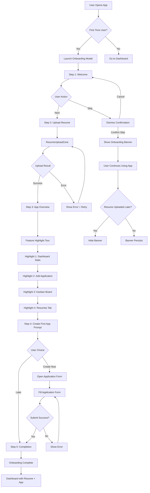
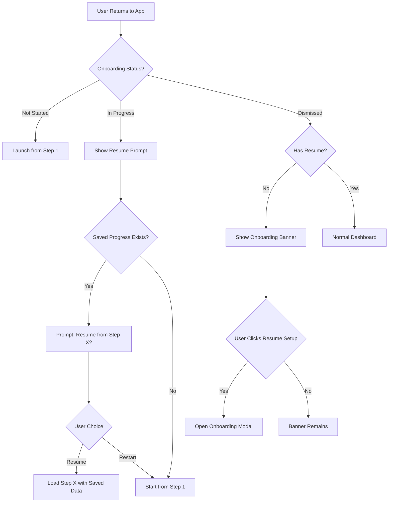

# Onboarding Flow — Component Spec & User Flow

## Overview

The onboarding flow guides new users through their first experience with the Job Application Manager, ensuring they understand core features and complete essential setup tasks before accessing the main application.

**Primary Goal:** Get users from "empty state" to "first application ready" with minimal friction.

**Success Criteria:**
- User uploads at least one resume
- User understands the application tracking workflow
- User creates their first application (or understands how to)
- Flow can be dismissed and resumed later

---

## Table of Contents

1. [User Journey](#user-journey)
2. [Component Specifications](#component-specifications)
3. [User Flow Diagram](#user-flow-diagram)
4. [Wireframes](#wireframes)
5. [Accessibility Requirements](#accessibility-requirements)
6. [Responsive Design](#responsive-design)
7. [Edge Cases & Error Handling](#edge-cases--error-handling)

---

## User Journey

### Trigger Conditions

The onboarding flow activates when:
- User visits the application for the first time
- User has zero resumes uploaded
- User has zero applications created
- Onboarding has not been explicitly dismissed

### Entry Points

| Entry Point | Trigger | Behavior |
|-------------|---------|----------|
| Initial Visit | First time user loads app | Auto-launch onboarding modal |
| Empty Dashboard | User dismisses then returns, still empty | Show persistent banner with "Resume Setup" CTA |
| Resume Tab | User navigates to empty resumes page | Show inline onboarding prompt |

### Exit Points

| Exit Point | Trigger | Next State |
|------------|---------|------------|
| Completed | User finishes all steps | Dashboard with uploaded resume |
| Dismissed | User clicks "Skip for now" | Dashboard with dismissible banner |
| Timeout | User inactive for 5+ minutes | Auto-save progress, resume later |

---

## Component Specifications

### 1. OnboardingModal

**Purpose:** Full-screen modal container for the onboarding wizard.

#### Props

```typescript
interface OnboardingModalProps {
  isOpen: boolean
  onComplete: () => void
  onDismiss: () => void
  onSaveProgress: (progress: OnboardingProgress) => void
}

interface OnboardingProgress {
  currentStep: number
  completedSteps: number[]
  resumeUploaded: boolean
  userEmail?: string
}
```

#### Visual Structure

```
┌─────────────────────────────────────────────────┐
│  [Progress: ●●●○○]              [Skip] [✕]     │  ← Header
├─────────────────────────────────────────────────┤
│                                                 │
│                                                 │
│              [Step Content Area]                │  ← Dynamic content
│                                                 │
│                                                 │
├─────────────────────────────────────────────────┤
│  [← Back]                      [Next Step →]   │  ← Footer
└─────────────────────────────────────────────────┘
```

#### Behavior

- **Escape Key:** Prompts "Save progress and exit?"
- **Outside Click:** Disabled (must use Skip or Complete)
- **Auto-save:** Progress saved to localStorage every 30s
- **Dismissal:** Shows confirmation modal before closing

#### States

| State | Visual | Behavior |
|-------|--------|----------|
| Active | Full opacity, z-index: 1300 | User can interact |
| Saving | Semi-transparent overlay, spinner | Buttons disabled |
| Error | Error toast + retry button | Previous data preserved |

---

### 2. OnboardingStep

**Purpose:** Individual step container with consistent layout.

#### Props

```typescript
interface OnboardingStepProps {
  stepNumber: number
  totalSteps: number
  title: string
  description?: string
  illustration?: React.ReactNode
  canProceed: boolean
  onNext: () => void
  onBack?: () => void
  children: React.ReactNode
}
```

#### Anatomy

```
┌─────────────────────────────┐
│     [Illustration/Icon]     │  ← Optional visual (200x200px)
│                             │
│   [Step Title - H2]         │  ← Main heading
│   [Step Description]        │  ← Optional subtext
│                             │
│   [Interactive Content]     │  ← Form fields, upload zone, etc.
│                             │
│   [Validation Feedback]     │  ← Success/error messages
└─────────────────────────────┘
```

#### Validation

- **Visual Feedback:** Green checkmark when step complete
- **Error States:** Red border + error message below field
- **Next Button:** Disabled until `canProceed === true`

---

### 3. ResumeUploadZone

**Purpose:** Drag-and-drop zone for first resume upload.

#### Props

```typescript
interface ResumeUploadZoneProps {
  onUploadSuccess: (resume: Resume) => void
  onUploadError: (error: UploadError) => void
  acceptedFormats: string[]
  maxSizeBytes: number
  showFormatHints: boolean
}

interface Resume {
  id: string
  filename: string
  filesize: number
  format: 'pdf' | 'docx'
  uploadedAt: Date
}

interface UploadError {
  code: 'INVALID_FORMAT' | 'FILE_TOO_LARGE' | 'UPLOAD_FAILED'
  message: string
}
```

#### Visual States

**Idle:**
```
┌─────────────────────────────────┐
│                                 │
│    📄                           │
│    Drag & drop your resume      │
│    or click to browse           │
│                                 │
│    Accepts: PDF, DOCX (max 5MB) │
└─────────────────────────────────┘
```

**Hover (Drag Over):**
```
┌─────────────────────────────────┐
│   [Primary-500 border, dashed]  │
│    ⬇️                           │
│    Drop your resume here        │
│                                 │
└─────────────────────────────────┘
```

**Uploading:**
```
┌─────────────────────────────────┐
│                                 │
│    ⏳  Uploading...             │
│    [Progress Bar: 45%]          │
│                                 │
└─────────────────────────────────┘
```

**Success:**
```
┌─────────────────────────────────┐
│                                 │
│    ✅  Resume uploaded!         │
│    my-resume.pdf (2.3 MB)       │
│    [Change File]                │
└─────────────────────────────────┘
```

**Error:**
```
┌─────────────────────────────────┐
│   [Error-500 border]            │
│    ❌  Upload failed            │
│    File type not supported      │
│    [Try Again]                  │
└─────────────────────────────────┘
```

#### Behavior

- **Drag Enter:** Highlight border, show "Drop here" text
- **Drag Leave:** Return to idle state
- **Drop:** Validate format, size → Upload or show error
- **Click:** Open native file picker (same validation)
- **Keyboard:** Focus with Tab, activate with Enter/Space

#### Validation Rules

```typescript
const VALIDATION = {
  acceptedFormats: ['.pdf', '.docx'],
  maxSizeBytes: 5 * 1024 * 1024, // 5MB
  minSizeBytes: 1024, // 1KB
}
```

---

### 4. OnboardingProgressIndicator

**Purpose:** Visual progress tracker across all steps.

#### Props

```typescript
interface OnboardingProgressIndicatorProps {
  currentStep: number
  totalSteps: number
  stepLabels: string[]
  onStepClick?: (step: number) => void
  allowSkipAhead: boolean
}
```

#### Visual Layout

**Desktop:**
```
Step 1           Step 2          Step 3           Step 4           Step 5
  ●──────────────○──────────────○──────────────○──────────────○
Upload       Understand      Explore       Create First    Complete
Resume         App            Features      Application
```

**Mobile:**
```
Step 2 of 5
●●○○○

Understand the App
```

#### States

| Step State | Visual | Interaction |
|------------|--------|-------------|
| Completed | Solid circle (primary-600) | Clickable if `allowSkipAhead` |
| Current | Outlined circle with pulse | Not clickable |
| Future | Gray circle (neutral-300) | Not clickable |

#### Accessibility

- **ARIA Role:** `progressbar`
- **ARIA Label:** "Onboarding progress: Step {n} of {total}"
- **Screen Reader:** Announces step changes

---

### 5. FeatureHighlight

**Purpose:** Interactive tour overlay highlighting key UI elements.

#### Props

```typescript
interface FeatureHighlightProps {
  targetElement: HTMLElement | null
  title: string
  description: string
  position: 'top' | 'right' | 'bottom' | 'left'
  onNext: () => void
  onSkipTour: () => void
  step: number
  totalSteps: number
}
```

#### Visual Behavior

- **Spotlight:** Target element receives z-index boost + 2px primary-500 border
- **Overlay:** Semi-transparent black (opacity: 0.7) covers rest of UI
- **Tooltip:** Positioned relative to target with arrow pointer

**Example:**
```
┌─────────────────────────────────────────┐
│ [DIMMED BACKGROUND]                     │
│                                         │
│  ┌───────────────────┐                 │
│  │ [Highlighted Elem]│◄────┐           │
│  └───────────────────┘     │           │
│                            │           │
│  ┌────────────────────────┴────┐      │
│  │ Add Application Button      │      │
│  │ ───────────────────────────│      │
│  │ Click here to create your  │      │
│  │ first job application.     │      │
│  │                            │      │
│  │ [Skip Tour]  [Next (2/5) →]│      │
│  └────────────────────────────┘      │
└─────────────────────────────────────────┘
```

#### Interaction

- **Next Button:** Advances to next highlight
- **Skip Tour:** Exits tour, goes to final step
- **Escape Key:** Same as Skip Tour
- **Outside Click:** Disabled (must use buttons)

---

### 6. OnboardingBanner (Post-Dismissal)

**Purpose:** Persistent reminder for users who skipped onboarding.

#### Props

```typescript
interface OnboardingBannerProps {
  onResume: () => void
  onDismissPermanently: () => void
  dismissible: boolean
}
```

#### Visual

```
┌──────────────────────────────────────────────────────────┐
│ 📋  Get started by uploading your resume                 │
│                                                          │
│     [Resume Setup →]  [Dismiss]                          │
└──────────────────────────────────────────────────────────┘
```

#### Placement

- **Dashboard:** Top of page, below header
- **Other Pages:** Does not show (dashboard only)
- **Persistence:** Shows until resume uploaded or permanently dismissed

#### Behavior

- **Resume Setup:** Reopens onboarding at Step 1
- **Dismiss:** Hides banner for current session
- **Permanent Dismiss:** Link in settings to permanently disable

---

## User Flow Diagram

### Primary Flow



### Edge Case: Return User with Incomplete Onboarding



---

## Step-by-Step Content

### Step 1: Welcome

**Title:** Welcome to Your Job Application Manager

**Description:**
Let's get you set up in just a few minutes. We'll help you:
- Upload your resume
- Learn the basics
- Create your first application

**Illustration:** Hero image showing app dashboard preview

**Action:** [Get Started →]

**Duration:** ~30 seconds

---

### Step 2: Upload Resume

**Title:** Upload Your Resume

**Description:**
Your resume is the foundation of your profile. We'll extract your experience and achievements to help with applications later.

**Component:** `<ResumeUploadZone />`

**Validation:**
- File format must be PDF or DOCX
- File size must be < 5MB
- Upload must succeed

**Action:** [Continue →] (enabled after successful upload)

**Duration:** ~2 minutes (upload + processing)

---

### Step 3: App Overview

**Title:** Here's How It Works

**Description:**
Track applications through every stage of your job search.

**Interactive Tour Highlights:**

1. **Dashboard Stats** (5 seconds)
   - "See your progress at a glance"
   - Points to: Stats widgets at top

2. **Add Application Button** (5 seconds)
   - "Click here to add a new job application"
   - Points to: Primary CTA button

3. **Kanban Board** (5 seconds)
   - "Drag applications between stages"
   - Points to: Kanban columns

4. **Resumes Tab** (5 seconds)
   - "Manage your uploaded resumes here"
   - Points to: Resumes navigation item

**Action:** [Next (auto-advances through tour)]

**Duration:** ~30 seconds

---

### Step 4: Create First Application (Optional)

**Title:** Ready to Add Your First Application?

**Description:**
You can create your first application now, or explore the app and add one later.

**Options:**
- [Create Application Now] → Opens ApplicationForm modal
- [I'll Do This Later] → Proceeds to Step 5

**Duration:** ~1 minute (if user creates application)

---

### Step 5: All Set!

**Title:** You're All Set! 🎉

**Description:**
Your resume is uploaded and you're ready to start tracking applications.

**Quick Tips:**
- ✅ Add applications as you apply
- ✅ Drag cards to update status
- ✅ Link cover letters to applications

**Action:** [Go to Dashboard →]

**Duration:** ~15 seconds

---

## Wireframes

### Desktop View (1280px+)

#### Step 1: Welcome

```
┌────────────────────────────────────────────────────────────────┐
│  [Onboarding Progress: ●○○○○]                     [Skip] [✕]  │
├────────────────────────────────────────────────────────────────┤
│                                                                │
│                      [Hero Illustration]                       │
│                        📊 📋 📈                                │
│                                                                │
│            Welcome to Your Job Application Manager            │
│                                                                │
│              Let's get you set up in just a few minutes.      │
│                          We'll help you:                       │
│                                                                │
│                    • Upload your resume                        │
│                    • Learn the basics                          │
│                    • Create your first application             │
│                                                                │
│                                                                │
│                       [Get Started →]                          │
│                                                                │
└────────────────────────────────────────────────────────────────┘
```

#### Step 2: Upload Resume

```
┌────────────────────────────────────────────────────────────────┐
│  [Onboarding Progress: ●●○○○]                     [Skip] [✕]  │
├────────────────────────────────────────────────────────────────┤
│                                                                │
│                      Upload Your Resume                        │
│                                                                │
│   Your resume is the foundation of your profile. We'll extract│
│   your experience and achievements to help with applications. │
│                                                                │
│   ┌────────────────────────────────────────────────────────┐  │
│   │                                                        │  │
│   │              📄                                        │  │
│   │      Drag & drop your resume                          │  │
│   │      or click to browse                               │  │
│   │                                                        │  │
│   │      Accepts: PDF, DOCX (max 5MB)                     │  │
│   │                                                        │  │
│   └────────────────────────────────────────────────────────┘  │
│                                                                │
│                                                                │
│   [← Back]                              [Continue →] (disabled)│
│                                                                │
└────────────────────────────────────────────────────────────────┘
```

#### Step 3: Feature Tour

```
┌────────────────────────────────────────────────────────────────┐
│ [Semi-transparent overlay]                                     │
│                                                                │
│  ┌──────────────────┐                                         │
│  │ [Stats Widget]   │◄────┐                                   │
│  │ ●●●●             │     │                                   │
│  └──────────────────┘     │                                   │
│                           │                                   │
│  ┌───────────────────────┴──────────┐                        │
│  │  Dashboard Stats                 │                        │
│  │  ────────────────────────────── │                        │
│  │  See your application progress   │                        │
│  │  at a glance.                    │                        │
│  │                                  │                        │
│  │  [Skip Tour]        [Next (1/4)]│                        │
│  └──────────────────────────────────┘                        │
│                                                                │
└────────────────────────────────────────────────────────────────┘
```

### Mobile View (< 768px)

#### Step 1: Welcome (Mobile)

```
┌───────────────────────────┐
│  Step 1 of 5   [Skip] [✕] │
│  ●○○○○                    │
├───────────────────────────┤
│                           │
│    [Hero Illustration]    │
│         📊 📋            │
│                           │
│   Welcome to Your Job     │
│   Application Manager     │
│                           │
│   Let's get you set up in │
│   just a few minutes.     │
│                           │
│   • Upload your resume    │
│   • Learn the basics      │
│   • Create first app      │
│                           │
│                           │
│   [Get Started →]         │
│                           │
└───────────────────────────┘
```

#### Step 2: Upload Resume (Mobile)

```
┌───────────────────────────┐
│  Step 2 of 5   [Skip] [✕] │
│  ●●○○○                    │
├───────────────────────────┤
│                           │
│   Upload Your Resume      │
│                           │
│   Your resume is the      │
│   foundation of your      │
│   profile.                │
│                           │
│  ┌───────────────────────┐│
│  │                       ││
│  │      📄              ││
│  │  Tap to upload       ││
│  │                       ││
│  │  PDF or DOCX         ││
│  │  (max 5MB)           ││
│  │                       ││
│  └───────────────────────┘│
│                           │
│                           │
│  [← Back]  [Continue →]   │
│                           │
└───────────────────────────┘
```

---

## Accessibility Requirements

### Screen Reader Support

#### Step Navigation
- **Announce on step change:** "Step 2 of 5: Upload Resume"
- **Progress updates:** "Onboarding 40% complete"
- **Upload success:** "Resume uploaded successfully: filename.pdf"
- **Upload error:** "Upload failed: File type not supported"

#### Feature Tour
- **Spotlight focus:** "Highlighting: Dashboard stats widget"
- **Tour navigation:** "Feature tour, step 1 of 4. Next: Add Application button"
- **Skip confirmation:** "Tour skipped. You can access the help menu anytime."

### Keyboard Navigation

| Action | Keyboard Shortcut | Behavior |
|--------|------------------|----------|
| Next Step | Enter or Tab to Next + Enter | Advances if validation passes |
| Previous Step | Shift+Tab to Back + Enter | Returns to previous step |
| Skip Onboarding | Escape | Shows confirmation modal |
| Close Modal | Escape (2x) | Confirms skip after first press |
| Upload File | Tab to zone + Enter/Space | Opens file picker |
| Navigate Tour | Arrow keys | Cycles through highlighted elements |

### Focus Management

1. **On Modal Open:** Focus moves to first interactive element (Skip or close button)
2. **On Step Change:** Focus moves to step title (H2)
3. **On Upload Success:** Focus moves to "Continue" button
4. **On Tour Start:** Focus moves to "Next" button in tour tooltip
5. **On Completion:** Focus returns to dashboard header

### ARIA Attributes

```html
<!-- Onboarding Modal -->
<div
  role="dialog"
  aria-modal="true"
  aria-labelledby="onboarding-title"
  aria-describedby="onboarding-description"
>
  <h2 id="onboarding-title">Welcome to Your Job Application Manager</h2>
  <p id="onboarding-description">Let's get you set up...</p>
  
  <!-- Progress Indicator -->
  <div
    role="progressbar"
    aria-valuenow="2"
    aria-valuemin="1"
    aria-valuemax="5"
    aria-label="Onboarding progress: Step 2 of 5"
  ></div>
  
  <!-- Upload Zone -->
  <div
    role="button"
    tabindex="0"
    aria-label="Upload resume: Drag and drop or click to browse"
    aria-describedby="upload-hint"
  >
    <p id="upload-hint">Accepts PDF, DOCX (max 5MB)</p>
  </div>
</div>

<!-- Feature Tour Tooltip -->
<div
  role="tooltip"
  aria-live="polite"
  aria-atomic="true"
>
  <p>Dashboard Stats</p>
  <p>See your application progress at a glance.</p>
</div>
```

### Color Contrast

All text must meet WCAG AA standards:
- **Large text (18px+):** Minimum 3:1 contrast ratio
- **Normal text (< 18px):** Minimum 4.5:1 contrast ratio
- **Interactive elements:** Minimum 3:1 against background

**Validated Combinations:**
- Primary-600 on White: 7.2:1 ✅
- Neutral-700 on White: 11.6:1 ✅
- Success-600 on White: 3.9:1 ✅
- Error-600 on White: 5.1:1 ✅

---

## Responsive Design

### Breakpoint Behavior

| Breakpoint | Layout | Interaction | Changes |
|------------|--------|-------------|---------|
| Mobile (< 640px) | Single column, full screen | Touch-optimized, larger tap targets | Step labels hidden, only numbers |
| Tablet (640-1024px) | Centered modal, 90% width | Hybrid touch/mouse | Abbreviated step labels |
| Desktop (> 1024px) | Centered modal, max-width 900px | Mouse + keyboard | Full step labels, feature tour |

### Touch Optimization (Mobile/Tablet)

- **Minimum tap target:** 44x44px (Apple HIG standard)
- **Upload zone:** Full-width, height 200px minimum
- **Buttons:** Increased padding (16px vertical, 24px horizontal)
- **Gesture Support:** Swipe right/left to navigate steps (optional)

### Modal Sizing

```css
.onboarding-modal {
  /* Mobile */
  @media (max-width: 640px) {
    width: 100%;
    height: 100vh;
    border-radius: 0;
  }
  
  /* Tablet */
  @media (min-width: 641px) and (max-width: 1024px) {
    width: 90%;
    max-width: 700px;
    max-height: 90vh;
    border-radius: var(--radius-2xl);
  }
  
  /* Desktop */
  @media (min-width: 1025px) {
    width: 80%;
    max-width: 900px;
    max-height: 90vh;
    border-radius: var(--radius-2xl);
  }
}
```

### Content Adaptation

**Desktop:**
- Show full step titles in progress indicator
- Display illustrations (200x200px)
- Multi-column layout for completion checklist

**Mobile:**
- Show step numbers only in progress indicator
- Smaller illustrations (120x120px)
- Single-column layout for all content
- Sticky footer with navigation buttons

---

## Edge Cases & Error Handling

### 1. Upload Failures

**Scenario:** Network error during resume upload

```
┌───────────────────────────────────┐
│   ❌  Upload failed               │
│   Network error. Please try again.│
│                                   │
│   [Try Again]  [Use Different File]│
└───────────────────────────────────┘
```

**Behavior:**
- Show error message with specific reason
- Preserve user's file selection
- Enable "Try Again" to retry same file
- Log error to backend for debugging

**Retry Strategy:**
- Automatic retry: 1 attempt after 2 seconds
- Manual retry: User clicks "Try Again"
- Maximum retries: 3 before suggesting alternate method

---

### 2. Incomplete Session

**Scenario:** User closes browser mid-onboarding

**On Return:**

```
┌───────────────────────────────────┐
│   Welcome back!                   │
│                                   │
│   You were at Step 2: Upload Resume│
│                                   │
│   [Continue Where I Left Off]     │
│   [Start Over]                    │
└───────────────────────────────────┘
```

**Behavior:**
- Detect saved progress in localStorage
- Prompt user to resume or restart
- If resume: Load step + any entered data
- If restart: Clear saved progress

**Progress Persistence:**
```typescript
interface SavedProgress {
  step: number
  timestamp: Date
  data: {
    resumeId?: string
    tourCompleted: boolean
    applicationCreated: boolean
  }
}

// Saved to: localStorage.getItem('onboarding_progress')
```

---

### 3. Browser Compatibility

**Scenario:** User on older browser without drag-and-drop API

**Fallback Behavior:**
- Hide drag-and-drop hints
- Show only "Click to upload" button
- Standard file picker opens
- Upload proceeds normally

**Detection:**
```typescript
const supportsDragDrop = 'draggable' in document.createElement('span') 
  && typeof FileReader !== 'undefined'

if (!supportsDragDrop) {
  showClickOnlyUpload()
}
```

---

### 4. Large File Handling

**Scenario:** User uploads 50MB file (exceeds 5MB limit)

```
┌───────────────────────────────────┐
│   ⚠️  File too large              │
│   Maximum size is 5MB             │
│   Your file: resume.pdf (50.2MB) │
│                                   │
│   Tips:                           │
│   • Compress the PDF              │
│   • Remove images/graphics        │
│   • Save as plain text            │
│                                   │
│   [Choose Different File]         │
└───────────────────────────────────┘
```

**Behavior:**
- Client-side validation before upload
- Show helpful compression tips
- Suggest alternative file formats

---

### 5. No Resume Scenario

**Scenario:** User wants to skip resume upload entirely

**Flow:**
```
[Skip Resume Upload] 
   ↓
[Confirmation Modal]
"You can upload your resume later from Settings"
[Yes, Skip]  [Cancel]
   ↓
[Feature Tour Only]
   ↓
[Dashboard with Banner]
"Upload your resume to unlock full features"
```

**Limitations When Skipped:**
- Cannot generate cover letters
- Cannot run job fit analysis
- Cannot create STAR stories
- Banner persists until resume uploaded

---

### 6. Multiple Attempts

**Scenario:** User dismisses onboarding 3+ times

**After 3rd Dismissal:**
```
┌───────────────────────────────────┐
│   We've noticed you keep          │
│   skipping the setup.             │
│                                   │
│   Would you like to:              │
│                                   │
│   • [Hide setup permanently]      │
│   • [Remind me later]             │
│   • [Complete setup now]          │
└───────────────────────────────────┘
```

**Behavior:**
- Track dismissal count in user preferences
- After 3 dismissals, offer permanent hide
- "Remind later" sets 7-day snooze
- "Complete now" forces full onboarding

---

## State Management

### Onboarding State Schema

```typescript
interface OnboardingState {
  status: 'not_started' | 'in_progress' | 'completed' | 'dismissed'
  currentStep: number
  progress: {
    welcomeViewed: boolean
    resumeUploaded: boolean
    resumeId?: string
    tourCompleted: boolean
    firstApplicationCreated: boolean
  }
  dismissCount: number
  lastDismissedAt?: Date
  completedAt?: Date
  metadata: {
    startedAt: Date
    totalTimeSpent: number // seconds
    deviceType: 'mobile' | 'tablet' | 'desktop'
  }
}
```

### Persistence Strategy

- **localStorage:** Used for client-side progress tracking
- **Backend API:** Sync state on completion or dismissal
- **Conflict Resolution:** Server state wins on login

**API Endpoints:**

```typescript
// Save progress
POST /api/users/me/onboarding/progress
{
  "step": 2,
  "progress": { ... },
  "timestamp": "2026-05-08T14:00:00Z"
}

// Mark completed
POST /api/users/me/onboarding/complete
{
  "completedAt": "2026-05-08T14:15:00Z",
  "metadata": { ... }
}

// Dismiss onboarding
POST /api/users/me/onboarding/dismiss
{
  "reason": "user_skip",
  "timestamp": "2026-05-08T14:00:00Z"
}
```

---

## Analytics & Metrics

### Track These Events

| Event | Trigger | Data Captured |
|-------|---------|---------------|
| onboarding_started | Modal opens | timestamp, device_type |
| onboarding_step_viewed | Step changes | step_number, time_on_prev_step |
| resume_upload_attempted | File selected | file_size, file_format |
| resume_upload_success | Upload complete | file_id, processing_time |
| resume_upload_failed | Upload error | error_code, error_message |
| tour_started | Step 3 begins | - |
| tour_completed | Tour finishes | total_duration |
| tour_skipped | User skips tour | skipped_at_step |
| first_app_created | Application saved | from_onboarding: true |
| onboarding_completed | Step 5 done | total_duration, steps_completed |
| onboarding_dismissed | User skips | dismiss_count, dismissed_at_step |

### Success Metrics

- **Completion Rate:** % of users who finish all 5 steps
- **Drop-off Points:** Which steps have highest abandonment
- **Resume Upload Rate:** % of users who upload resume
- **Time to Complete:** Median time from start to finish
- **Dismissal Reasons:** Why users skip (tracked via survey)

**Target Metrics:**
- Completion Rate: > 70%
- Resume Upload Rate: > 85%
- Median Time to Complete: < 5 minutes
- Step 2 Drop-off: < 15%

---

## Implementation Notes

### Component Dependencies

```
OnboardingModal
  ├─ OnboardingProgressIndicator
  ├─ OnboardingStep
  │   ├─ ResumeUploadZone
  │   ├─ FeatureHighlight (Step 3)
  │   └─ ApplicationForm (Step 4, optional)
  └─ OnboardingBanner (post-dismissal)
```

### State Machine (XState)

```typescript
const onboardingMachine = createMachine({
  id: 'onboarding',
  initial: 'welcome',
  states: {
    welcome: {
      on: {
        NEXT: 'uploadResume',
        SKIP: 'confirmDismiss'
      }
    },
    uploadResume: {
      on: {
        UPLOAD_SUCCESS: 'featureTour',
        UPLOAD_ERROR: 'uploadResume', // retry
        BACK: 'welcome',
        SKIP: 'confirmDismiss'
      }
    },
    featureTour: {
      on: {
        TOUR_COMPLETE: 'createFirstApp',
        SKIP_TOUR: 'createFirstApp'
      }
    },
    createFirstApp: {
      on: {
        APP_CREATED: 'completion',
        SKIP_APP: 'completion',
        BACK: 'featureTour'
      }
    },
    completion: {
      type: 'final'
    },
    confirmDismiss: {
      on: {
        CONFIRM: 'dismissed',
        CANCEL: 'welcome' // return to where they were
      }
    },
    dismissed: {
      type: 'final'
    }
  }
})
```

### Styling Tokens

```css
/* Onboarding-specific tokens */
:root {
  --onboarding-modal-width-mobile: 100%;
  --onboarding-modal-width-tablet: 90%;
  --onboarding-modal-width-desktop: 80%;
  --onboarding-modal-max-width: 900px;
  
  --onboarding-step-padding: var(--space-8);
  --onboarding-step-gap: var(--space-6);
  
  --upload-zone-height: 200px;
  --upload-zone-border-dashed: 2px dashed var(--border-default);
  --upload-zone-border-active: 2px dashed var(--color-primary-500);
  
  --feature-highlight-overlay: rgba(0, 0, 0, 0.7);
  --feature-highlight-border: 2px solid var(--color-primary-500);
  --feature-highlight-z: var(--z-modal);
  
  --progress-indicator-dot-size: 12px;
  --progress-indicator-line-thickness: 2px;
}
```

---

## Testing Checklist

### Functional Tests

- [ ] Modal opens on first visit
- [ ] Progress persists across page refreshes
- [ ] Resume upload succeeds with valid file
- [ ] Resume upload rejects invalid format
- [ ] Resume upload rejects oversized file
- [ ] Feature tour highlights correct elements
- [ ] Feature tour can be skipped
- [ ] Application creation works from Step 4
- [ ] Onboarding can be dismissed at any step
- [ ] Dismissal shows confirmation modal
- [ ] Banner appears after dismissal
- [ ] Banner disappears after resume upload
- [ ] Completion marks onboarding as done

### Accessibility Tests

- [ ] All steps navigable via keyboard
- [ ] Screen reader announces step changes
- [ ] Focus management works correctly
- [ ] Color contrast meets WCAG AA
- [ ] Interactive elements have 44x44px touch targets (mobile)
- [ ] ARIA labels present and accurate
- [ ] Error messages associated with fields

### Responsive Tests

- [ ] Modal renders correctly on 320px width
- [ ] Modal renders correctly on 768px width
- [ ] Modal renders correctly on 1280px width
- [ ] Upload zone works on mobile touch
- [ ] Feature tour adapts to small screens
- [ ] Navigation buttons accessible on mobile
- [ ] Content does not overflow viewport

### Performance Tests

- [ ] Modal opens in < 300ms
- [ ] Step transitions animate smoothly
- [ ] File upload shows progress indicator
- [ ] Large file validation happens client-side
- [ ] Feature tour does not cause layout shift

---

## Future Enhancements

### Phase 2 (Post-MVP)

1. **Video Tutorials:** Embedded 30-second clips per step
2. **Interactive Demo:** Simulated application with fake data
3. **Personalized Tips:** Based on user's LinkedIn/resume parsing
4. **Gamification:** Achievement badges for completing steps
5. **Email Onboarding Series:** Follow-up emails with tips

### Phase 3 (Advanced)

1. **AI-Powered Setup:** Auto-generate first application from resume
2. **Voice Guidance:** Audio narration for each step
3. **Multi-language Support:** Internationalized onboarding
4. **Team Onboarding:** For enterprise/coaching scenarios
5. **Custom Onboarding Flows:** Configurable by admin

---

## Acceptance Criteria

### Must-Have (MVP)

- [x] 5-step wizard with clear progress indicator
- [x] Resume upload with drag-and-drop and file picker
- [x] Feature tour highlighting 4 key UI elements
- [x] Ability to skip and resume later
- [x] Persistent banner for dismissed onboarding
- [x] Mobile-responsive design
- [x] Keyboard accessible
- [x] Screen reader compatible

### Should-Have

- [ ] Automatic retry on upload failure
- [ ] Client-side file validation before upload
- [ ] Progress saved to backend API
- [ ] Analytics tracking for drop-off analysis
- [ ] Dismissal confirmation modal
- [ ] "Resume where you left off" prompt

### Nice-to-Have

- [ ] Swipe gestures for mobile step navigation
- [ ] Animated transitions between steps
- [ ] Confetti animation on completion
- [ ] Optional demo data generation
- [ ] Export onboarding progress to PDF

---

## Related Documents

- [USER_FLOWS.md](./USER_FLOWS.md) — Full user flow diagrams
- [DESIGN_SYSTEM.md](./DESIGN_SYSTEM.md) — Color, typography, spacing tokens
- [COMPONENT_SPECS.md](./COMPONENT_SPECS.md) — Other component specifications
- [ACCESSIBILITY.md](./ACCESSIBILITY.md) — Detailed accessibility guidelines
- [WIREFRAMES.md](./WIREFRAMES.md) — Visual mockups of all screens
