# User Flows — Job Application Manager

## Overview

This document outlines the key user flows for the application tracking features in the Job Application Manager MVP (Phase 1).

## Primary User Flows

### 1. Add New Job Application

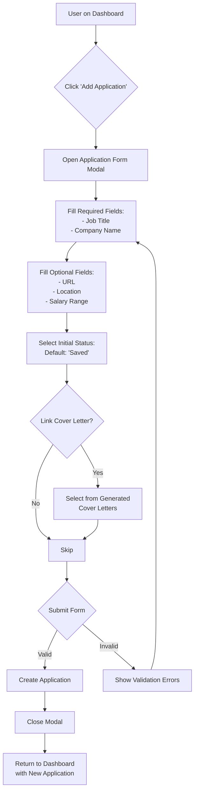
```mermaid
flowchart TD
    A[User on Dashboard] --> B{Click 'Add Application'}
    B --> C[Open Application Form Modal]
    C --> D[Fill Required Fields:<br/>- Job Title<br/>- Company Name]
    D --> E[Fill Optional Fields:<br/>- URL<br/>- Location<br/>- Salary Range]
    E --> F[Select Initial Status:<br/>Default: 'Saved']
    F --> G{Link Cover Letter?}
    G -->|Yes| H[Select from Generated<br/>Cover Letters]
    G -->|No| I[Skip]
    H --> I
    I --> J{Submit Form}
    J -->|Valid| K[Create Application]
    J -->|Invalid| L[Show Validation Errors]
    L --> D
    K --> M[Close Modal]
    M --> N[Return to Dashboard<br/>with New Application]
```

**Entry Points:**
- Primary: Dashboard "Add Application" button
- Secondary: From cover letter generation success screen

**Exit Points:**
- Success: Dashboard with new application card visible
- Cancel: Return to dashboard without changes

---

### 2. Update Application Status

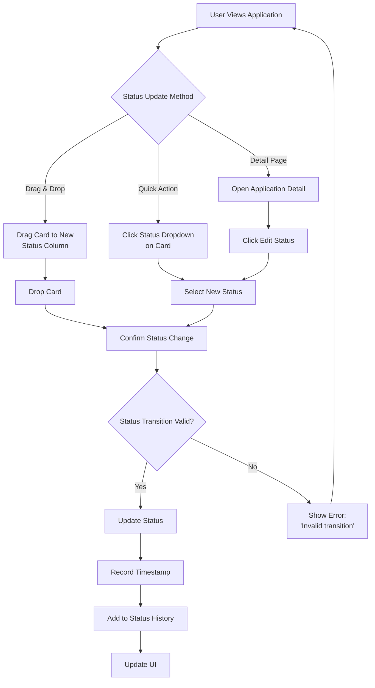
```mermaid
flowchart TD
    A[User Views Application] --> B{Status Update Method}
    B -->|Drag & Drop| C[Drag Card to New<br/>Status Column]
    B -->|Quick Action| D[Click Status Dropdown<br/>on Card]
    B -->|Detail Page| E[Open Application Detail]
    
    C --> F[Drop Card]
    D --> G[Select New Status]
    E --> H[Click Edit Status]
    
    F --> I[Confirm Status Change]
    G --> I
    H --> G
    
    I --> J{Status Transition Valid?}
    J -->|Yes| K[Update Status]
    J -->|No| L[Show Error:<br/>'Invalid transition']
    
    K --> M[Record Timestamp]
    M --> N[Add to Status History]
    N --> O[Update UI]
    
    L --> A
```

**Valid Status Transitions:**
- `Saved` → `Applied`, `Withdrawn`
- `Applied` → `Phone Screen`, `Rejected`, `Withdrawn`
- `Phone Screen` → `Interview`, `Rejected`, `Withdrawn`
- `Interview` → `Offer`, `Rejected`, `Withdrawn`
- `Offer` → (final state)
- `Rejected` → (final state)
- `Withdrawn` → (final state)

---

### 3. View Application Dashboard

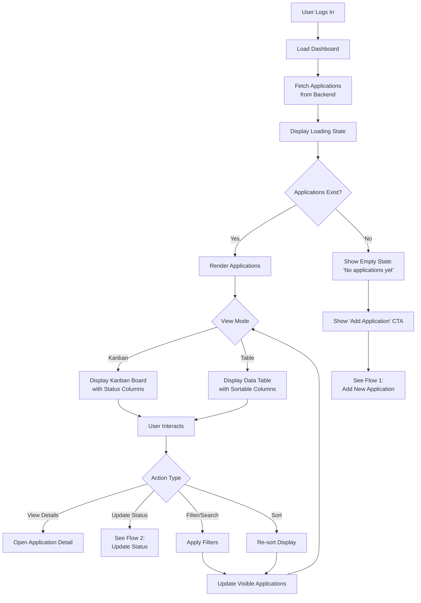
```mermaid
flowchart TD
    A[User Logs In] --> B[Load Dashboard]
    B --> C[Fetch Applications<br/>from Backend]
    C --> D[Display Loading State]
    D --> E{Applications Exist?}
    E -->|Yes| F[Render Applications]
    E -->|No| G[Show Empty State:<br/>'No applications yet']
    
    F --> H{View Mode}
    H -->|Kanban| I[Display Kanban Board<br/>with Status Columns]
    H -->|Table| J[Display Data Table<br/>with Sortable Columns]
    
    I --> K[User Interacts]
    J --> K
    G --> L[Show 'Add Application' CTA]
    L --> M[See Flow 1:<br/>Add New Application]
    
    K --> N{Action Type}
    N -->|View Details| O[Open Application Detail]
    N -->|Update Status| P[See Flow 2:<br/>Update Status]
    N -->|Filter/Search| Q[Apply Filters]
    N -->|Sort| R[Re-sort Display]
    
    Q --> S[Update Visible Applications]
    R --> S
    S --> H
```

**Dashboard Features:**
- Quick stats at top (total applications, applied this week, response rate)
- View toggle: Kanban vs Table
- Filters: Status, Company, Date range
- Search: Job title, company name
- Sort: Date, Status, Company (A-Z)

---

### 4. Link Cover Letter to Application

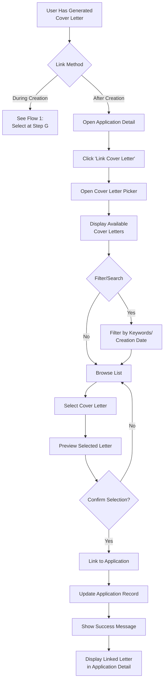
```mermaid
flowchart TD
    A[User Has Generated<br/>Cover Letter] --> B{Link Method}
    B -->|During Creation| C[See Flow 1:<br/>Select at Step G]
    B -->|After Creation| D[Open Application Detail]
    
    D --> E[Click 'Link Cover Letter']
    E --> F[Open Cover Letter Picker]
    F --> G[Display Available<br/>Cover Letters]
    G --> H{Filter/Search}
    H -->|Yes| I[Filter by Keywords/<br/>Creation Date]
    H -->|No| J[Browse List]
    
    I --> J
    J --> K[Select Cover Letter]
    K --> L[Preview Selected Letter]
    L --> M{Confirm Selection?}
    M -->|Yes| N[Link to Application]
    M -->|No| J
    
    N --> O[Update Application Record]
    O --> P[Show Success Message]
    P --> Q[Display Linked Letter<br/>in Application Detail]
```

---

### 5. Navigate Application Detail

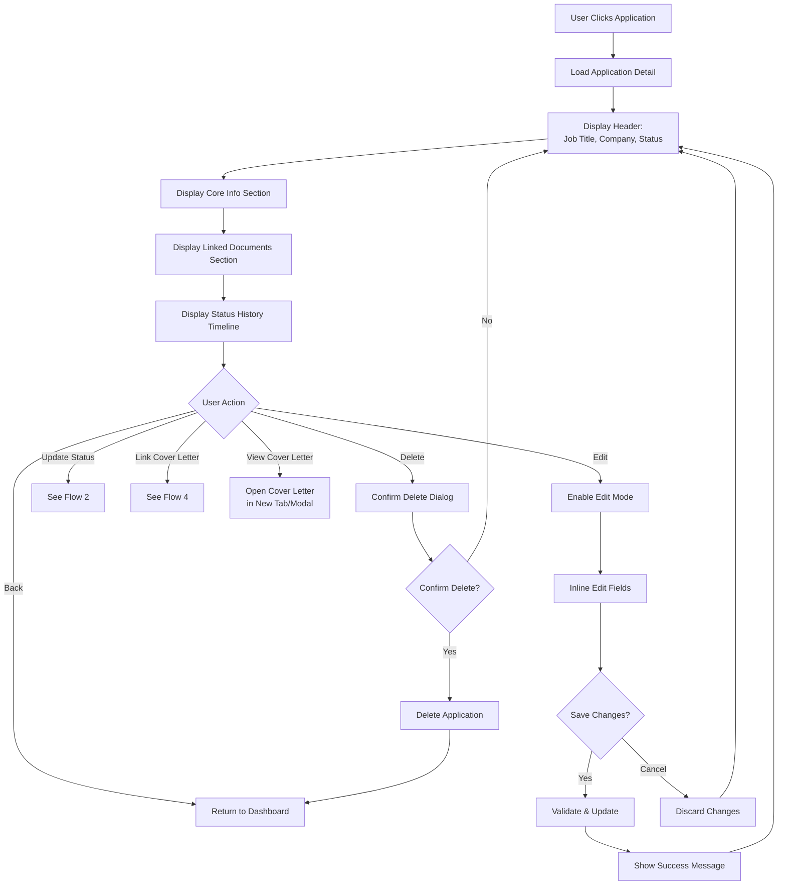
```mermaid
flowchart TD
    A[User Clicks Application] --> B[Load Application Detail]
    B --> C[Display Header:<br/>Job Title, Company, Status]
    C --> D[Display Core Info Section]
    D --> E[Display Linked Documents Section]
    E --> F[Display Status History Timeline]
    
    F --> G{User Action}
    G -->|Edit| H[Enable Edit Mode]
    G -->|Update Status| I[See Flow 2]
    G -->|Link Cover Letter| J[See Flow 4]
    G -->|View Cover Letter| K[Open Cover Letter<br/>in New Tab/Modal]
    G -->|Delete| L[Confirm Delete Dialog]
    G -->|Back| M[Return to Dashboard]
    
    H --> N[Inline Edit Fields]
    N --> O{Save Changes?}
    O -->|Yes| P[Validate & Update]
    O -->|Cancel| Q[Discard Changes]
    
    P --> R[Show Success Message]
    Q --> C
    R --> C
    
    L --> S{Confirm Delete?}
    S -->|Yes| T[Delete Application]
    S -->|No| C
    T --> M
```

---

## Navigation Map

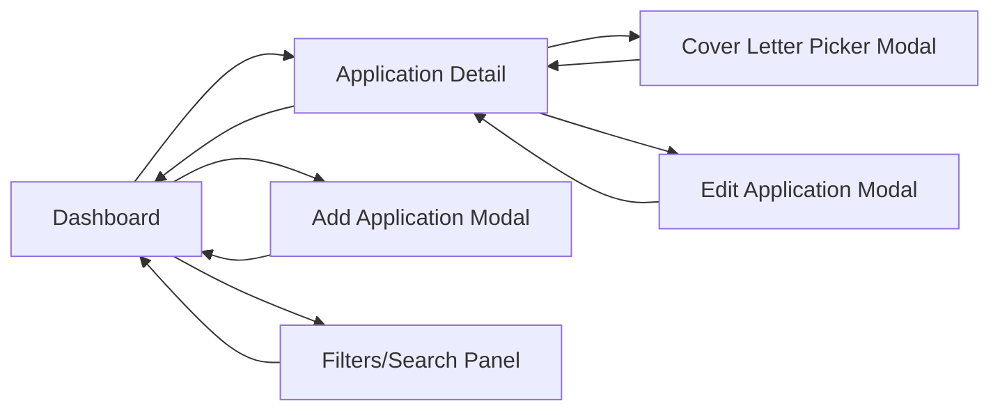
```mermaid
flowchart LR
    A[Dashboard] --> B[Application Detail]
    B --> A
    A --> C[Add Application Modal]
    C --> A
    B --> D[Cover Letter Picker Modal]
    D --> B
    B --> E[Edit Application Modal]
    E --> B
    A --> F[Filters/Search Panel]
    F --> A
```

---

## Error Flows

### Network Error During Save

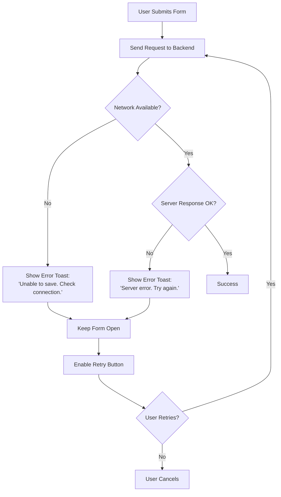
```mermaid
flowchart TD
    A[User Submits Form] --> B[Send Request to Backend]
    B --> C{Network Available?}
    C -->|No| D[Show Error Toast:<br/>'Unable to save. Check connection.']
    C -->|Yes| E{Server Response OK?}
    E -->|No| F[Show Error Toast:<br/>'Server error. Try again.']
    E -->|Yes| G[Success]
    
    D --> H[Keep Form Open]
    F --> H
    H --> I[Enable Retry Button]
    I --> J{User Retries?}
    J -->|Yes| B
    J -->|No| K[User Cancels]
```

### Invalid Status Transition

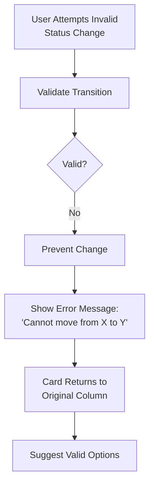
```mermaid
flowchart TD
    A[User Attempts Invalid<br/>Status Change] --> B[Validate Transition]
    B --> C{Valid?}
    C -->|No| D[Prevent Change]
    D --> E[Show Error Message:<br/>'Cannot move from X to Y']
    E --> F[Card Returns to<br/>Original Column]
    F --> G[Suggest Valid Options]
```

---

## Accessibility Considerations

- **Keyboard Navigation:** All flows must be completable via keyboard only
  - Tab order follows logical flow
  - Enter/Space to activate buttons
  - Escape to close modals
  - Arrow keys for drag-and-drop alternative

- **Screen Reader Support:**
  - Announce status changes ("Application moved to Interview")
  - Form validation errors read aloud
  - Loading states announced
  - Success/error toasts have ARIA live regions

- **Focus Management:**
  - Focus returns to trigger element after modal close
  - First interactive element receives focus on modal open
  - Focus trap within modals

---

---

## 6. Master Catalog Index (UC-2)

The Catalog is a normalized knowledge base of professional attributes extracted from resumes and applications. It surfaces companies, skills, achievements, and career themes for the user to review, curate, and use as context when tailoring future applications.

### 6a. Browse the Catalog

**Entry point**: "Catalog" in the main navigation

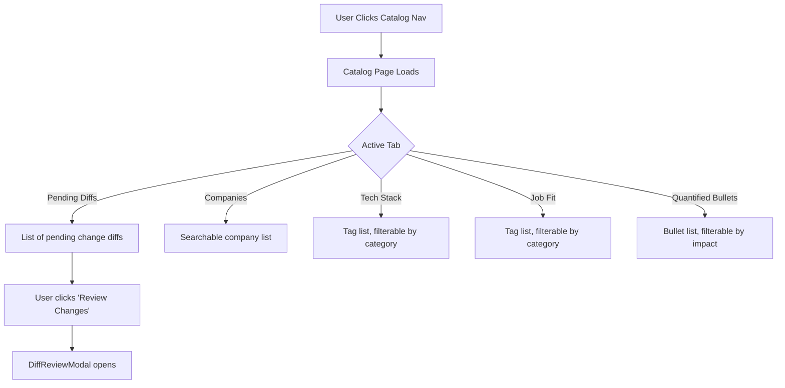
```mermaid
flowchart TD
    A[User Clicks Catalog Nav] --> B[Catalog Page Loads]
    B --> C{Active Tab}
    C -->|Pending Diffs| D[List of pending change diffs]
    C -->|Companies| E[Searchable company list]
    C -->|Tech Stack| F[Tag list, filterable by category]
    C -->|Job Fit| G[Tag list, filterable by category]
    C -->|Quantified Bullets| H[Bullet list, filterable by impact]
    D --> I[User clicks 'Review Changes']
    I --> J[DiffReviewModal opens]
```

**Tab descriptions**:
- **Pending Diffs** — Diffs waiting for user approval. Each card shows a summary, change counts (➕ new / ✏️ updated / ➖ deleted), and a warning count for ambiguities.
- **Companies** — Normalized company entries deduplicated across all applications. Searchable by name or alias.
- **Tech Stack** — Technology tags organized by category (language, frontend, backend, database, cloud, devops, ai_ml). Includes version info and legacy flags.
- **Job Fit** — Role, industry, seniority, and work-style signals extracted from application content.
- **Quantified Bullets** — Metric-bearing resume achievements categorized by business impact.

### 6b. Diff Review Flow

When a resume is uploaded or an application is updated, the system generates a diff of proposed catalog changes. The user must review and approve or reject these changes before they are committed.

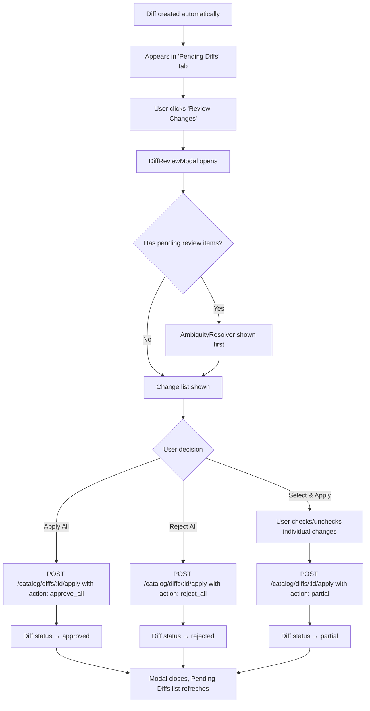
```mermaid
flowchart TD
    A[Diff created automatically] --> B[Appears in 'Pending Diffs' tab]
    B --> C[User clicks 'Review Changes']
    C --> D[DiffReviewModal opens]
    D --> E{Has pending review items?}
    E -->|Yes| F[AmbiguityResolver shown first]
    E -->|No| G[Change list shown]
    F --> G
    G --> H{User decision}
    H -->|Apply All| I[POST /catalog/diffs/:id/apply with action: approve_all]
    H -->|Select & Apply| J[User checks/unchecks individual changes]
    H -->|Reject All| K[POST /catalog/diffs/:id/apply with action: reject_all]
    J --> L[POST /catalog/diffs/:id/apply with action: partial]
    I --> M[Diff status → approved]
    K --> N[Diff status → rejected]
    L --> O[Diff status → partial]
    M & N & O --> P[Modal closes, Pending Diffs list refreshes]
```

### 6c. Resolving Ambiguities

Some extracted values cannot be resolved automatically and require human input. These appear as review items at the top of the DiffReviewModal.

| Review Type | Icon | When it appears | User action |
|-------------|------|-----------------|-------------|
| `ambiguous_tag` | ⚠️ | Text could map to multiple known tags (e.g. "PM" → "Product Manager" or "Project Manager") | Select the correct meaning via radio buttons |
| `fuzzy_match` | 🔍 | Text closely resembles an existing catalog entry | Confirm or reject the suggested match |
| `unresolved_wikilink` | 🔗 | Text contains a `[[wikilink]]` that has no registry entry | Select a catalog entity or skip |

Users can skip any review item to defer resolution. Skipped items remain in `pendingReview` until the diff is fully applied or expired.

### 6d. Diff Expiry

Diffs expire **7 days** after generation. Expired diffs cannot be applied. If a diff expires before review, the extracted changes are lost and must be regenerated by re-uploading or re-saving the source document.

### 6e. Catalog Curation

Users can curate catalog data directly from the browse tabs:

- **Merge companies** — Combine duplicate company entries into one canonical record. All historical application associations are preserved.
- **Edit tags** — Update a tag's display name, category, or review flag directly from the tag list.
- **Merge tags** — Combine duplicate tags (e.g. "Node" + "Node.js" → "Node.js") so mention counts are consolidated.

---

## 7. Job Description Fit Analysis (UC-3)

### Overview
Allow users to analyze how well a job posting matches their professional profile by comparing job requirements against their catalog of skills, experiences, and achievements. The system provides an honest assessment including gaps.

### 7a. Submit Job for Analysis

**Entry Points:**
- Dashboard "Analyze Job Fit" button
- Application detail page "Check Fit" action
- Main navigation "Job Fit" link

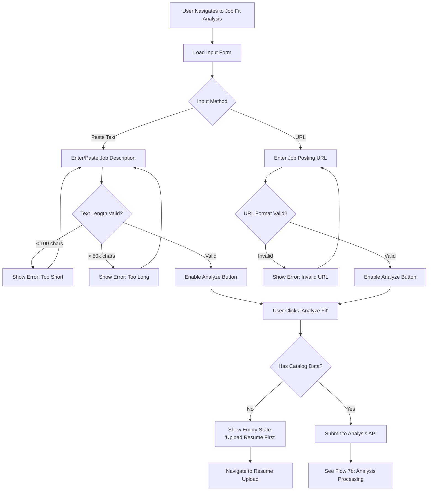
```mermaid
flowchart TD
    A[User Navigates to Job Fit Analysis] --> B[Load Input Form]
    B --> C{Input Method}
    C -->|Paste Text| D[Enter/Paste Job Description]
    C -->|URL| E[Enter Job Posting URL]
    
    D --> F{Text Length Valid?}
    E --> G{URL Format Valid?}
    
    F -->|< 100 chars| H[Show Error: Too Short]
    F -->|> 50k chars| I[Show Error: Too Long]
    F -->|Valid| J[Enable Analyze Button]
    
    G -->|Invalid| K[Show Error: Invalid URL]
    G -->|Valid| L[Enable Analyze Button]
    
    H --> D
    I --> D
    K --> E
    
    J --> M[User Clicks 'Analyze Fit']
    L --> M
    
    M --> N{Has Catalog Data?}
    N -->|No| O[Show Empty State:<br/>'Upload Resume First']
    N -->|Yes| P[Submit to Analysis API]
    
    O --> Q[Navigate to Resume Upload]
    P --> R[See Flow 7b: Analysis Processing]
```

### 7b. Analysis Processing

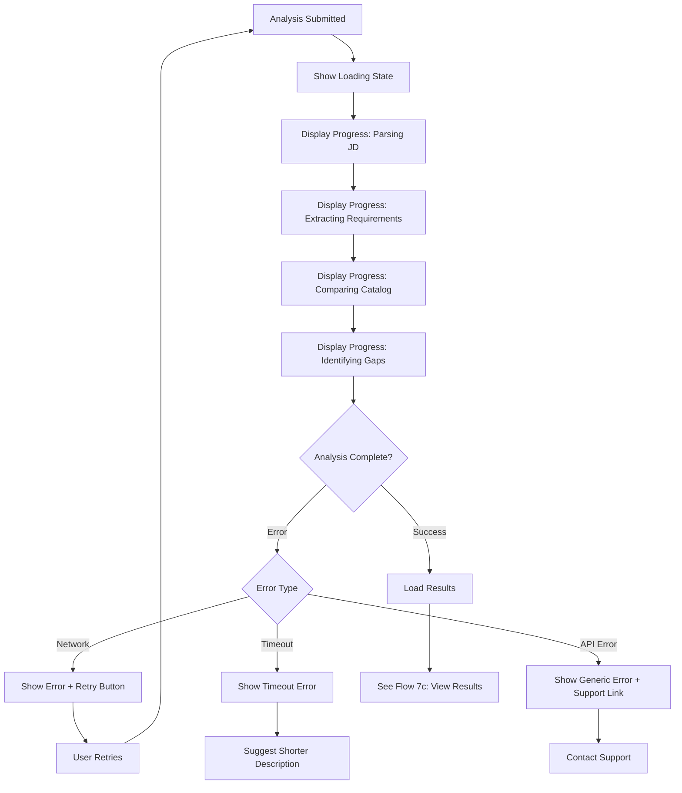
```mermaid
flowchart TD
    A[Analysis Submitted] --> B[Show Loading State]
    B --> C[Display Progress: Parsing JD]
    C --> D[Display Progress: Extracting Requirements]
    D --> E[Display Progress: Comparing Catalog]
    E --> F[Display Progress: Identifying Gaps]
    
    F --> G{Analysis Complete?}
    G -->|Success| H[Load Results]
    G -->|Error| I{Error Type}
    
    I -->|Network| J[Show Error + Retry Button]
    I -->|Timeout| K[Show Timeout Error]
    I -->|API Error| L[Show Generic Error + Support Link]
    
    J --> M[User Retries]
    M --> A
    
    K --> N[Suggest Shorter Description]
    L --> O[Contact Support]
    
    H --> P[See Flow 7c: View Results]
```

**Loading State Details:**
- Progress bar shows 0-100% completion
- Step-by-step status updates
- Estimated time: 10-15 seconds
- Cancelable (returns to input form)

### 7c. View and Interact with Results

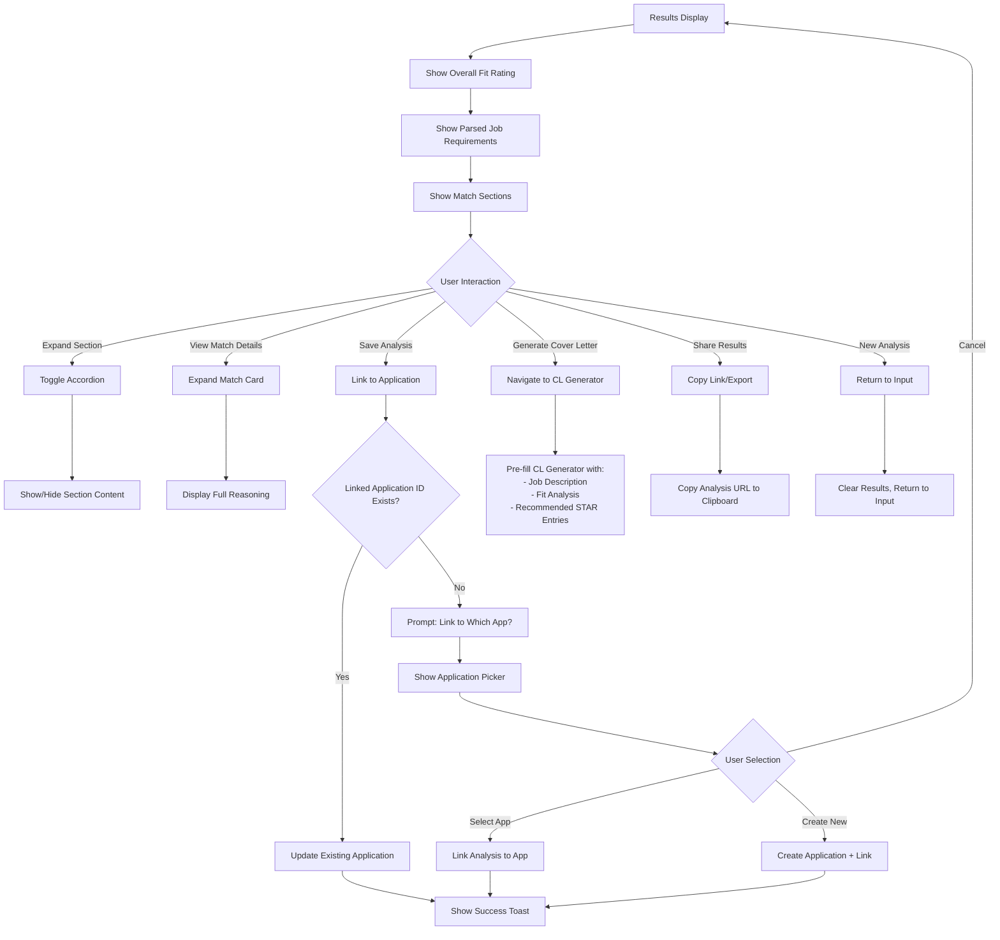
```mermaid
flowchart TD
    A[Results Display] --> B[Show Overall Fit Rating]
    B --> C[Show Parsed Job Requirements]
    C --> D[Show Match Sections]
    
    D --> E{User Interaction}
    E -->|Expand Section| F[Toggle Accordion]
    E -->|View Match Details| G[Expand Match Card]
    E -->|Save Analysis| H[Link to Application]
    E -->|Generate Cover Letter| I[Navigate to CL Generator]
    E -->|Share Results| J[Copy Link/Export]
    E -->|New Analysis| K[Return to Input]
    
    F --> L[Show/Hide Section Content]
    G --> M[Display Full Reasoning]
    
    H --> N{Linked Application ID Exists?}
    N -->|Yes| O[Update Existing Application]
    N -->|No| P[Prompt: Link to Which App?]
    
    P --> Q[Show Application Picker]
    Q --> R{User Selection}
    R -->|Select App| S[Link Analysis to App]
    R -->|Create New| T[Create Application + Link]
    R -->|Cancel| A
    
    S --> U[Show Success Toast]
    T --> U
    O --> U
    
    I --> V[Pre-fill CL Generator with:<br/>- Job Description<br/>- Fit Analysis<br/>- Recommended STAR Entries]
    
    J --> W[Copy Analysis URL to Clipboard]
    
    K --> X[Clear Results, Return to Input]
```

### 7d. Review Matches and Gaps

**Strong Matches Section:**
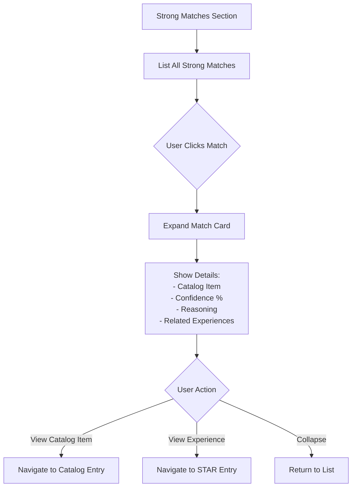
```mermaid
flowchart TD
    A[Strong Matches Section] --> B[List All Strong Matches]
    B --> C{User Clicks Match}
    C --> D[Expand Match Card]
    D --> E[Show Details:<br/>- Catalog Item<br/>- Confidence %<br/>- Reasoning<br/>- Related Experiences]
    E --> F{User Action}
    F -->|View Catalog Item| G[Navigate to Catalog Entry]
    F -->|View Experience| H[Navigate to STAR Entry]
    F -->|Collapse| I[Return to List]
```

**Gaps Section (Visually Prominent):**
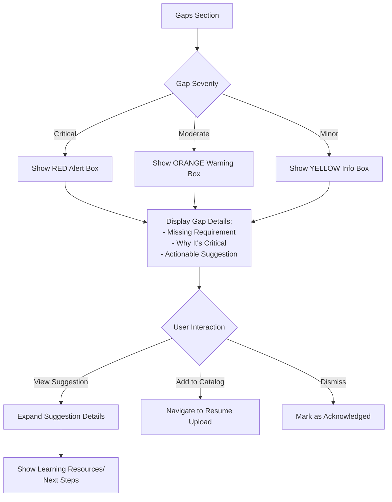
```mermaid
flowchart TD
    A[Gaps Section] --> B{Gap Severity}
    B -->|Critical| C[Show RED Alert Box]
    B -->|Moderate| D[Show ORANGE Warning Box]
    B -->|Minor| E[Show YELLOW Info Box]
    
    C --> F[Display Gap Details:<br/>- Missing Requirement<br/>- Why It's Critical<br/>- Actionable Suggestion]
    D --> F
    E --> F
    
    F --> G{User Interaction}
    G -->|View Suggestion| H[Expand Suggestion Details]
    G -->|Add to Catalog| I[Navigate to Resume Upload]
    G -->|Dismiss| J[Mark as Acknowledged]
    
    H --> K[Show Learning Resources/<br/>Next Steps]
```

**Gap Visual Hierarchy:**
1. **Critical** (Required skills missing): Large, red border, top of list
2. **Moderate** (Nice-to-have missing): Medium, orange border, middle
3. **Minor** (Adjacent skills): Small, yellow border, bottom

### 7e. Use Recommendations

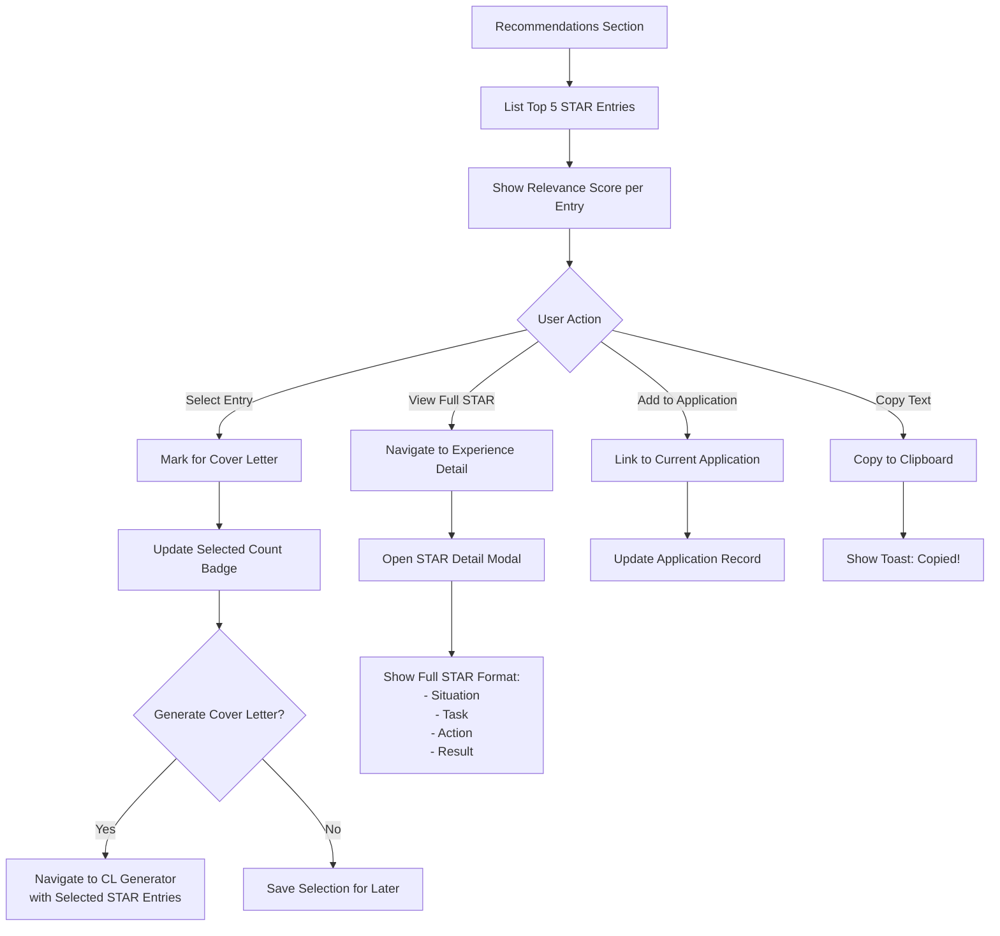
```mermaid
flowchart TD
    A[Recommendations Section] --> B[List Top 5 STAR Entries]
    B --> C[Show Relevance Score per Entry]
    C --> D{User Action}
    
    D -->|Select Entry| E[Mark for Cover Letter]
    D -->|View Full STAR| F[Navigate to Experience Detail]
    D -->|Add to Application| G[Link to Current Application]
    D -->|Copy Text| H[Copy to Clipboard]
    
    E --> I[Update Selected Count Badge]
    I --> J{Generate Cover Letter?}
    J -->|Yes| K[Navigate to CL Generator<br/>with Selected STAR Entries]
    J -->|No| L[Save Selection for Later]
    
    F --> M[Open STAR Detail Modal]
    M --> N[Show Full STAR Format:<br/>- Situation<br/>- Task<br/>- Action<br/>- Result]
    
    G --> O[Update Application Record]
    
    H --> P[Show Toast: Copied!]
```

### 7f. Save or Link Analysis

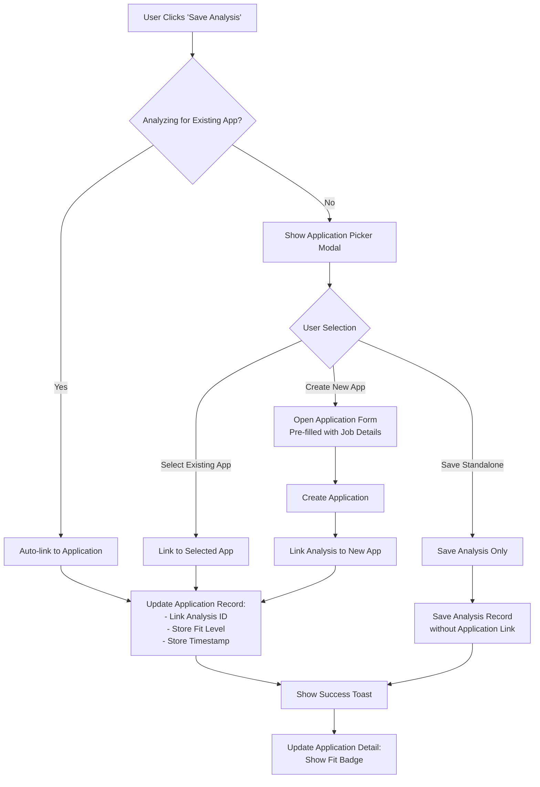
```mermaid
flowchart TD
    A[User Clicks 'Save Analysis'] --> B{Analyzing for Existing App?}
    B -->|Yes| C[Auto-link to Application]
    B -->|No| D[Show Application Picker Modal]
    
    C --> E[Update Application Record:<br/>- Link Analysis ID<br/>- Store Fit Level<br/>- Store Timestamp]
    
    D --> F{User Selection}
    F -->|Select Existing App| G[Link to Selected App]
    F -->|Create New App| H[Open Application Form<br/>Pre-filled with Job Details]
    F -->|Save Standalone| I[Save Analysis Only]
    
    G --> E
    H --> J[Create Application]
    J --> K[Link Analysis to New App]
    K --> E
    
    I --> L[Save Analysis Record<br/>without Application Link]
    
    E --> M[Show Success Toast]
    L --> M
    
    M --> N[Update Application Detail:<br/>Show Fit Badge]
```

**Saved Analysis Persistence:**
- Analysis results saved for 90 days
- Accessible from application detail page
- Can re-run analysis to update
- Old analyses archived, not deleted

### 7g. Error Handling Flows

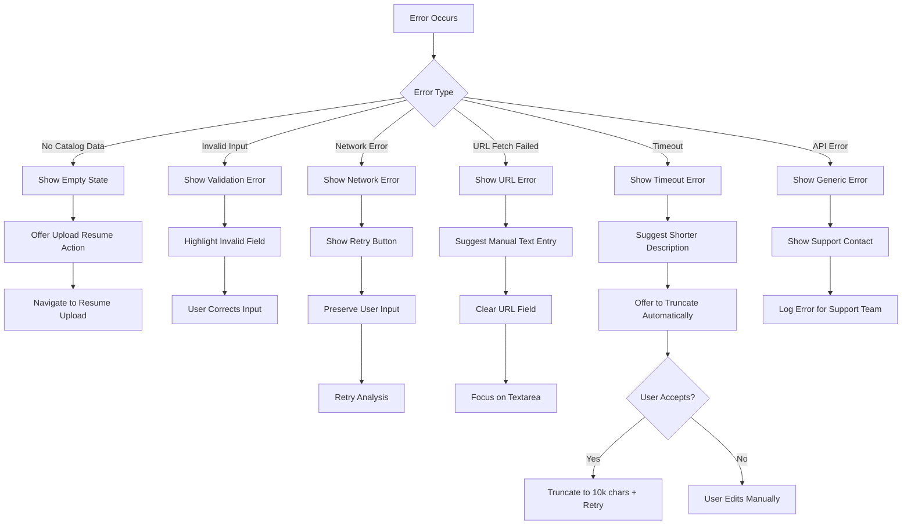
```mermaid
flowchart TD
    A[Error Occurs] --> B{Error Type}
    
    B -->|No Catalog Data| C[Show Empty State]
    B -->|Invalid Input| D[Show Validation Error]
    B -->|Network Error| E[Show Network Error]
    B -->|URL Fetch Failed| F[Show URL Error]
    B -->|Timeout| G[Show Timeout Error]
    B -->|API Error| H[Show Generic Error]
    
    C --> I[Offer Upload Resume Action]
    I --> J[Navigate to Resume Upload]
    
    D --> K[Highlight Invalid Field]
    K --> L[User Corrects Input]
    
    E --> M[Show Retry Button]
    M --> N[Preserve User Input]
    N --> O[Retry Analysis]
    
    F --> P[Suggest Manual Text Entry]
    P --> Q[Clear URL Field]
    Q --> R[Focus on Textarea]
    
    G --> S[Suggest Shorter Description]
    S --> T[Offer to Truncate Automatically]
    T --> U{User Accepts?}
    U -->|Yes| V[Truncate to 10k chars + Retry]
    U -->|No| W[User Edits Manually]
    
    H --> X[Show Support Contact]
    X --> Y[Log Error for Support Team]
```

---

## Navigation Map (Updated)

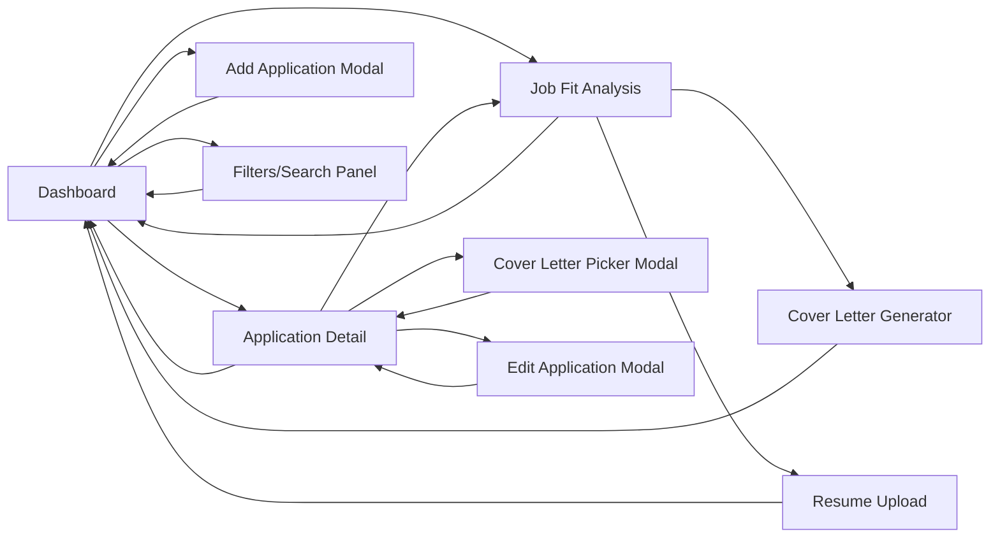
```mermaid
flowchart LR
    A[Dashboard] --> B[Application Detail]
    A --> C[Job Fit Analysis]
    B --> A
    B --> C
    C --> A
    C --> D[Cover Letter Generator]
    D --> A
    C --> E[Resume Upload]
    E --> A
    A --> F[Add Application Modal]
    F --> A
    B --> G[Cover Letter Picker Modal]
    G --> B
    B --> H[Edit Application Modal]
    H --> B
    A --> I[Filters/Search Panel]
    I --> A
```

---

## Accessibility Requirements for Job Fit Analysis

### Screen Reader Support
- **Overall Fit:** "Overall fit level: Moderate fit, 60% match"
- **Match Sections:** "Strong matches: 5 items. Partial matches: 2 items. Gaps: 2 items."
- **Gap Severity:** "Critical gap: TypeScript. Required skill not found in catalog."
- **Recommendations:** "Recommended STAR entry 1 of 3: Led React migration, 95% relevance"

### Keyboard Navigation
- **Tab Order:** Input → Submit → Results Header → Fit Rating → Sections → Action Buttons
- **Arrow Keys:** Navigate within match/gap lists
- **Enter/Space:** Expand/collapse sections
- **Escape:** Close modals, return to top

### ARIA Attributes
```html
<section role="region" aria-label="Job Fit Analysis Results">
  <div role="status" aria-live="polite" aria-atomic="true">
    <!-- Overall fit rating -->
  </div>
  <div role="alert" aria-live="assertive">
    <!-- Critical gaps -->
  </div>
  <div role="feed">
    <!-- Recommendations list -->
  </div>
</section>
```

### Focus Management
1. On analysis complete: Focus moves to "Overall Fit" heading
2. On error: Focus moves to error message
3. On modal open: Focus trap within modal
4. On modal close: Return focus to trigger element

---

## Notes for Frontend Developer

1. **State Management:** Dashboard and detail views should share application state to prevent refetching
2. **Optimistic Updates:** Update UI immediately on status change, rollback if API fails
3. **Caching:** Cache cover letter list for quick picker display
4. **Loading States:** Show skeleton screens for better perceived performance
5. **Transitions:** Smooth animations for status changes (300ms ease-in-out recommended)
6. **Job Fit Analysis:** 
   - Stream results as they arrive (parsed JD first, then matches/gaps)
   - Cache analysis results for 24 hours to avoid re-analysis
   - Persist input text in localStorage to prevent data loss
   - Use progressive disclosure for match details (expand on click)

---

## 8. Cover Letter Generation (UC-4)

### Overview

Generate personalized cover letters from the user's catalog of STAR entries, guided by job fit analysis results. The system produces honest, tailored content that highlights relevant experience while transparently addressing gaps.

### Content Integrity Constraints

All generated cover letters MUST adhere to these rules:

| Constraint | Description |
|------------|-------------|
| No fabrication | Never invent metrics, engagement numbers, credentials, or experiences not in the catalog |
| Tool attribution accuracy | If the user used Claude for project X, say "Claude" — never substitute generic "AI tools" |
| Honest gap framing | Address skill gaps with growth framing ("actively developing") rather than false claims |
| Format preference | Default output is `.docx`; PDF available on explicit request |

---

### 8a. UC-4 Base: Generate Cover Letter

**User Story:**
> As a job seeker, I want to generate a tailored cover letter from my catalog and job fit analysis so that I can quickly produce compelling, honest applications.

**Entry Points:**
- Job Fit Analysis results → "Generate Cover Letter" button
- Application detail page → "Create Cover Letter" action
- Cover Letters page → "New Cover Letter" button

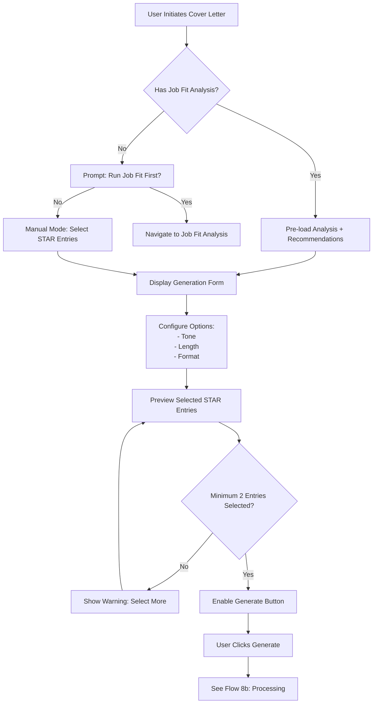
```mermaid
flowchart TD
    A[User Initiates Cover Letter] --> B{Has Job Fit Analysis?}
    B -->|Yes| C[Pre-load Analysis + Recommendations]
    B -->|No| D[Prompt: Run Job Fit First?]
    
    D -->|Yes| E[Navigate to Job Fit Analysis]
    D -->|No| F[Manual Mode: Select STAR Entries]
    
    C --> G[Display Generation Form]
    F --> G
    
    G --> H[Configure Options:<br/>- Tone<br/>- Length<br/>- Format]
    H --> I[Preview Selected STAR Entries]
    I --> J{Minimum 2 Entries Selected?}
    
    J -->|No| K[Show Warning: Select More]
    J -->|Yes| L[Enable Generate Button]
    
    K --> I
    L --> M[User Clicks Generate]
    M --> N[See Flow 8b: Processing]
```

**Acceptance Criteria:**

| Scenario | Given | When | Then |
|----------|-------|------|------|
| Happy path with fit analysis | User has completed job fit analysis for target role | User clicks "Generate Cover Letter" from results | Form pre-populates with job details, recommended STAR entries are pre-selected, overall fit level is displayed |
| Manual entry selection | User has catalog entries but no fit analysis | User selects 2+ STAR entries manually | Generate button enables, selected entries shown in preview panel |
| Insufficient entries | User has fewer than 2 STAR entries in catalog | User attempts to generate cover letter | Show blocking message: "Add more experiences to your catalog first" with link to resume upload |
| Tone selection | User is on generation form | User selects tone (Professional/Conversational/Enthusiastic) | Preview updates to reflect tone choice, tooltip explains tone characteristics |
| Length variant | User is on generation form | User selects length (Standard 300-400 words / Concise 150-200 words / Detailed 500-600 words) | Word count target displayed, output adheres to selected range |

**Input Requirements:**

| Input | Required | Source | Validation |
|-------|----------|--------|------------|
| Job Description | Yes | Job Fit Analysis or manual paste | Min 100 chars, max 50k chars |
| Company Name | Yes | Job Fit Analysis or manual entry | Non-empty string |
| Job Title | Yes | Job Fit Analysis or manual entry | Non-empty string |
| STAR Entries | Yes (min 2) | Catalog selection | At least 2 entries with complete STAR format |
| Tone | Yes | User selection | Enum: professional, conversational, enthusiastic |
| Length | Yes | User selection | Enum: concise, standard, detailed |
| Output Format | No | User selection | Default: docx, Options: docx, pdf |

**Output Specifications:**

| Attribute | Specification |
|-----------|---------------|
| Format | Microsoft Word (.docx) default; PDF on request |
| Structure | Opening hook → Body paragraphs (2-3) → Closing with call-to-action |
| Length variants | Concise: 150-200 words, Standard: 300-400 words, Detailed: 500-600 words |
| Personalization | Company name, job title, and specific requirements woven throughout |
| STAR integration | Selected achievements paraphrased naturally, not copied verbatim |

---

### 8b. Generation Processing

```mermaid
flowchart TD
    A[Generation Submitted] --> B[Show Progress Modal]
    B --> C[Step 1: Analyzing Requirements]
    C --> D[Step 2: Selecting Relevant Content]
    D --> E[Step 3: Drafting Paragraphs]
    E --> F[Step 4: Applying Tone]
    F --> G[Step 5: Formatting Output]
    
    G --> H{Generation Complete?}
    H -->|Success| I[Display Draft Preview]
    H -->|Error| J{Error Type}
    
    J -->|Content Violation| K[Show Error: Cannot Fabricate Content]
    J -->|Network| L[Show Retry Option]
    J -->|Timeout| M[Show Timeout + Retry]
    
    K --> N[Suggest: Add More Catalog Entries]
    L --> O[User Retries]
    M --> O
    O --> A
    
    I --> P[See Flow 8c: Review Draft]
```

**Processing States:**

| Step | Duration | User Feedback |
|------|----------|---------------|
| Analyzing Requirements | 2-3s | "Understanding what the role needs..." |
| Selecting Relevant Content | 2-3s | "Matching your experience to requirements..." |
| Drafting Paragraphs | 5-8s | "Writing your cover letter..." |
| Applying Tone | 1-2s | "Adjusting voice and style..." |
| Formatting Output | 1s | "Preparing your document..." |

---

### 8c. Review and Edit Draft

```mermaid
flowchart TD
    A[Draft Preview Displayed] --> B[Show Full Text in Editor]
    B --> C[Display Source Attribution Panel]
    C --> D{User Action}
    
    D -->|Edit Inline| E[Enable Rich Text Editor]
    D -->|Request Revision| F[See Flow 8d: Revise Draft]
    D -->|Accept| G[Finalize Document]
    D -->|Regenerate| H[Return to Form with Options]
    D -->|Cancel| I[Discard Draft]
    
    E --> J[User Makes Changes]
    J --> K{Validate Edits}
    K -->|Clean| L[Update Preview]
    K -->|Fabrication Detected| M[Warn: Added Content Not in Catalog]
    
    M --> N{User Acknowledges?}
    N -->|Keep Anyway| L
    N -->|Revert| J
    
    L --> D
    
    G --> O[Generate Final Document]
    O --> P{Output Format}
    P -->|DOCX| Q[Download .docx File]
    P -->|PDF| R[Download .pdf File]
    
    Q --> S[Prompt: Link to Application?]
    R --> S
    S --> T{User Choice}
    T -->|Link| U[Associate with Application Record]
    T -->|Skip| V[Save to Cover Letters Library]
    
    U --> V
    V --> W[Success Toast + Navigate to Library]
    
    I --> X[Confirm Discard Dialog]
    X -->|Confirm| Y[Return to Previous Page]
    X -->|Cancel| A
```

**Acceptance Criteria for Review:**

| Scenario | Given | When | Then |
|----------|-------|------|------|
| View source attribution | Draft is displayed | User views attribution panel | Each claim in the letter shows linked STAR entry source |
| Inline edit | Draft is displayed | User edits text directly | Changes are tracked, fabrication warnings shown if new claims added |
| Accept and download | Draft is finalized | User clicks Accept | Document downloads in selected format within 2 seconds |
| Link to application | Document is generated | User chooses to link | Cover letter appears in application detail page |

---

### 8d. UC-4a: Revise Existing Draft

**User Story:**
> As a job seeker, I want to request targeted revisions to my cover letter draft so that I can refine the content without regenerating from scratch.

**Entry Points:**
- Draft preview → "Request Revision" button
- Cover Letter library → "Revise" action on existing letter

```mermaid
flowchart TD
    A[User Clicks Request Revision] --> B[Open Revision Panel]
    B --> C[Display Current Draft]
    C --> D[Show Revision Options]
    
    D --> E{Revision Type}
    E -->|Tone Adjustment| F[Select New Tone]
    E -->|Length Change| G[Select New Length Target]
    E -->|Emphasis Shift| H[Highlight Sections to Emphasize/De-emphasize]
    E -->|Custom Instruction| I[Enter Free-text Guidance]
    
    F --> J[Queue Revision]
    G --> J
    H --> J
    I --> J
    
    J --> K{Multiple Revisions?}
    K -->|Add More| D
    K -->|Done| L[Submit Revision Request]
    
    L --> M[Process Revision]
    M --> N[Display Side-by-Side Diff]
    N --> O{User Decision}
    
    O -->|Accept Changes| P[Replace Draft with Revision]
    O -->|Reject Changes| Q[Keep Original Draft]
    O -->|Request Another| B
    
    P --> R[Update Preview]
    Q --> R
    R --> S[Return to Review Flow 8c]
```

**Acceptance Criteria:**

| Scenario | Given | When | Then |
|----------|-------|------|------|
| Tone adjustment | User has generated draft | User requests tone change to "Conversational" | Revised draft maintains same content but uses warmer, less formal language |
| Length reduction | User has 400-word draft | User requests "Concise" version | Revised draft is 150-200 words, key points preserved, filler removed |
| Emphasis shift | User has draft with 3 achievements | User marks achievement #2 for emphasis | Revised draft expands achievement #2, condenses others proportionally |
| Custom instruction | User has draft | User enters "Emphasize leadership experience" | Revision highlights leadership language, promotes relevant STAR entries |
| Diff view | Revision is complete | User views result | Side-by-side diff shows additions (green), removals (red), unchanged (gray) |

**Revision Constraints:**

| Constraint | Behavior |
|------------|----------|
| Preserve accuracy | Revisions cannot add claims not sourced from catalog |
| Respect format | Revision maintains selected output format |
| Track history | Each revision is versioned; user can revert to any previous version |
| Limit revisions | Maximum 10 revisions per draft to prevent infinite loops |

---

### 8e. UC-4b: Short-Form Outreach

**User Story:**
> As a job seeker, I want to generate short-form outreach messages (LinkedIn, email) so that I can reach out to recruiters and hiring managers with tailored, concise content.

**Entry Points:**
- Cover Letter library → "Create Outreach" action
- Job Fit Analysis → "Generate Outreach" button
- Application detail → "Draft Outreach" action

```mermaid
flowchart TD
    A[User Initiates Outreach] --> B[Select Outreach Type]
    B --> C{Type Selection}
    
    C -->|LinkedIn Message| D[LinkedIn Template]
    C -->|LinkedIn Connection Request| E[Connection Request Template]
    C -->|Email to Recruiter| F[Recruiter Email Template]
    C -->|Email to Hiring Manager| G[Hiring Manager Email Template]
    
    D --> H[Configure: 300 char limit]
    E --> I[Configure: 200 char limit]
    F --> J[Configure: 150-200 words]
    G --> J
    
    H --> K[Enter Recipient Context]
    I --> K
    J --> K
    
    K --> L[Optional: Add Mutual Connection/Shared Interest]
    L --> M[Select 1-2 Key STAR Highlights]
    M --> N[Generate Outreach]
    
    N --> O[Display Draft with Character Count]
    O --> P{Within Limits?}
    
    P -->|Yes| Q[Enable Copy/Send Actions]
    P -->|No| R[Show Warning + Auto-Trim Option]
    
    R --> S{User Choice}
    S -->|Auto-Trim| T[Trim to Limit]
    S -->|Edit Manually| U[User Edits]
    
    T --> Q
    U --> O
    
    Q --> V{User Action}
    V -->|Copy to Clipboard| W[Copy + Success Toast]
    V -->|Edit| U
    V -->|Save| X[Save to Outreach Library]
    V -->|Discard| Y[Confirm Discard]
    
    W --> X
    X --> Z[Link to Application if Applicable]
```

**Acceptance Criteria:**

| Scenario | Given | When | Then |
|----------|-------|------|------|
| LinkedIn message | User selects LinkedIn Message type | User generates outreach | Output is ≤300 characters, includes hook + value proposition + soft CTA |
| Connection request | User selects Connection Request type | User generates outreach | Output is ≤200 characters, focuses on shared context + reason to connect |
| Recruiter email | User selects Recruiter Email type | User generates outreach | Output is 150-200 words with subject line, includes role interest + key qualification + availability |
| Hiring manager email | User selects Hiring Manager Email type | User generates outreach | Output is 150-200 words with subject line, includes specific company interest + relevant achievement + meeting request |
| Mutual connection | User adds mutual connection name | User generates outreach | Output naturally references the mutual connection in opening |
| Character limit exceeded | Generated content exceeds platform limit | User views draft | Warning badge shows overage, auto-trim button available |

**Output Templates:**

| Type | Max Length | Structure |
|------|------------|-----------|
| LinkedIn Message | 300 chars | Hook → Value prop → Soft CTA |
| LinkedIn Connection Request | 200 chars | Shared context → Reason to connect |
| Recruiter Email | 150-200 words | Subject → Greeting → Role interest → Key qualification → Availability → Sign-off |
| Hiring Manager Email | 150-200 words | Subject → Greeting → Company-specific interest → Relevant achievement → Meeting request → Sign-off |

---

### 8f. Edge Cases and Error Handling

```mermaid
flowchart TD
    A[Edge Case Detected] --> B{Case Type}
    
    B -->|Empty Catalog| C[Block Generation]
    B -->|No Fit Analysis| D[Offer Manual Mode]
    B -->|Insufficient STAR Entries| E[Warn + Suggest Upload]
    B -->|Gap-Heavy Profile| F[Generate with Gap Framing]
    B -->|Stale Fit Analysis| G[Warn + Offer Re-analysis]
    
    C --> H[Show Empty State:<br/>'Upload a resume to get started']
    H --> I[Navigate to Resume Upload]
    
    D --> J[Show Manual Selection UI]
    J --> K[User Picks Entries Manually]
    
    E --> L[Show Warning:<br/>'2+ STAR entries needed']
    L --> M[Link to Catalog Curation]
    
    F --> N[Generate with Honest Gap Language]
    N --> O[Highlight Gap Sections in Preview]
    O --> P[Tooltip: 'This addresses a gap area']
    
    G --> Q[Show Warning:<br/>'Analysis is 30+ days old']
    Q --> R{User Choice}
    R -->|Re-analyze| S[Navigate to Job Fit]
    R -->|Proceed Anyway| T[Continue with Stale Data]
```

**Edge Case Handling:**

| Edge Case | Detection | User Experience |
|-----------|-----------|-----------------|
| Empty catalog | `catalogEntries.length === 0` | Blocking empty state with upload CTA |
| No fit analysis | `fitAnalysisId === null` when entering from non-fit flow | Manual mode available, fit analysis suggested |
| Fewer than 2 STAR entries | `selectedEntries.length < 2` | Warning message, generate button disabled |
| All gaps, no matches | `fitAnalysis.strongMatches.length === 0` | Warning: "This role may not be a good fit", generate allowed with honest framing |
| Fit analysis > 30 days old | `fitAnalysis.createdAt < now - 30d` | Warning badge, re-analysis suggested but not required |
| Selected STAR entry deleted | Entry removed from catalog after selection | Toast: "Some selections are no longer available", auto-deselect |

---

### 8g. Accessibility Requirements

**Screen Reader Support:**
- Draft content: "Cover letter draft, 350 words, Professional tone"
- Source attribution: "Paragraph 2 sources from: Project Alpha achievement, Cloud migration experience"
- Character count: "LinkedIn message, 280 of 300 characters used"
- Revision diff: "Change 1 of 3: Removed 'extensive', added 'significant'"

**Keyboard Navigation:**
- Tab order: Type selection → Options → STAR selection → Generate → Preview → Actions
- Enter/Space: Toggle selections, submit forms
- Escape: Close modals, cancel operations
- Arrow keys: Navigate STAR entry list, revision options

**Focus Management:**
1. On generation complete: Focus moves to draft preview heading
2. On error: Focus moves to error message with retry option
3. On revision complete: Focus moves to diff panel
4. On download: Focus remains on download button, success announced

---

### 8h. Data Model Integration

**Cover Letter Record:**

| Field | Type | Description |
|-------|------|-------------|
| `id` | ULID | Unique identifier |
| `applicationId` | ULID | Linked application |
| `fitAnalysisId` | ULID | Source job fit analysis |
| `type` | Enum | `cover_letter`, `linkedin_message`, `linkedin_connection`, `recruiter_email`, `hiring_manager_email` |
| `tone` | Enum | `professional`, `conversational`, `enthusiastic` |
| `length` | Enum | `concise`, `standard`, `detailed` |
| `content` | Text | Generated content |
| `sourceEntryIds` | ULID[] | STAR entries used |
| `version` | Integer | Optimistic locking |
| `createdAt` | Timestamp | Creation time |
| `updatedAt` | Timestamp | Last modification |

**Revision History:**

| Field | Type | Description |
|-------|------|-------------|
| `id` | ULID | Revision identifier |
| `coverLetterId` | ULID | Parent cover letter |
| `revisionType` | Enum | `tone`, `length`, `emphasis`, `custom` |
| `instruction` | Text | User's revision request |
| `previousContent` | Text | Content before revision |
| `newContent` | Text | Content after revision |
| `createdAt` | Timestamp | Revision timestamp |

---

## 9. Targeted Resume Variant Generation (UC-6)

### Overview

Allow users to generate tailored resume variants optimized for specific target roles by scoring and selecting catalog STAR bullets, then rewriting them into resume format. The system ensures traceability, validates constraints, and provides real-time preview.

### 9a. UC-6 Base: Generate Targeted Resume Variant

**User Story:**
> As a job seeker, I want to generate a targeted resume variant for a specific role so that I can highlight my most relevant experience while staying within length constraints.

**Entry Points:**
- Resumes page → "Generate Variant" button
- Application detail page → "Create Tailored Resume" action
- Job Fit Analysis → "Generate Resume for This Role" button

```mermaid
flowchart TD
    A[User Initiates Resume Variant] --> B{Has Catalog Data?}
    B -->|No| C[Show Empty State:<br/>'Upload Resume First']
    B -->|Yes| D[Open Variant Generator]
    
    C --> E[Navigate to Resume Upload]
    
    D --> F[Step 1: Configure Target]
    F --> G[User Enters:<br/>- Target Role<br/>- Seniority Level<br/>- Key Skills to Emphasize]
    G --> H[Set Constraints:<br/>- Max Pages 1-2<br/>- Target Word Count<br/>- Companies to Include 5-7]
    
    H --> I{From Job Fit Analysis?}
    I -->|Yes| J[Pre-load Target Role Info]
    I -->|No| K[Manual Entry]
    
    J --> L[Click 'Score Bullets']
    K --> L
    
    L --> M[Step 2: Scoring Process]
    M --> N[Show Progress:<br/>'Scoring catalog bullets...']
    N --> O[AI Scores Each STAR Bullet<br/>Against Target Role]
    O --> P[Sort by Relevance Score]
    
    P --> Q[Step 3: Bullet Selection]
    Q --> R[Display Scored Bullets<br/>with Relevance %]
    R --> S{Auto-Select Top Bullets?}
    S -->|Yes| T[Select Top 15-25 Bullets<br/>Across 5-7 Companies]
    S -->|No| U[User Manually Selects]
    
    T --> V[Show Selection Summary]
    U --> V
    
    V --> W{Constraints Valid?}
    W -->|No| X[Show Warnings:<br/>'Too many bullets'<br/>'Too few companies']
    W -->|Yes| Y[Click 'Generate Preview']
    
    X --> Z[User Adjusts Selection]
    Z --> V
    
    Y --> AA[Step 4: Generation]
    AA --> AB[Show Progress:<br/>'Rewriting bullets...'<br/>'Formatting resume...']
    AB --> AC[AI Rewrites STAR Bullets<br/>into Resume Format]
    AC --> AD[Generate Markdown Output]
    
    AD --> AE[Step 5: Preview & Edit]
    AE --> AF[Split View:<br/>- Left: Resume Preview<br/>- Right: Traceability Panel]
    AF --> AG[Real-time Preview Updates]
    
    AG --> AH{User Action}
    AH -->|Edit Constraints| AI[Return to Step 1]
    AH -->|Reselect Bullets| AJ[Return to Step 3]
    AH -->|Edit Content| AK[Inline Edit Mode]
    AH -->|Export| AL[Choose Format]
    
    AI --> H
    AJ --> Q
    
    AK --> AM[User Edits Markdown]
    AM --> AN[Update Preview]
    AN --> AH
    
    AL --> AO{Export Format}
    AO -->|Markdown| AP[Download .md]
    AO -->|Word| AQ[Download .docx]
    AO -->|PDF| AR[Download .pdf]
    
    AP --> AS[Save Variant to Library]
    AQ --> AS
    AR --> AS
    
    AS --> AT[Link to Application?]
    AT --> AU{User Choice}
    AU -->|Yes| AV[Link to Application Record]
    AU -->|No| AW[Save Standalone]
    
    AV --> AX[Success Toast]
    AW --> AX
    AX --> AY[Return to Resumes Library]
```

**Acceptance Criteria:**

| Scenario | Given | When | Then |
|----------|-------|------|------|
| Happy path from fit analysis | User has completed job fit analysis | User clicks "Generate Resume for This Role" | Generator pre-fills target role, seniority, key skills from analysis |
| Manual configuration | User starts from Resumes page | User enters target role and constraints manually | All fields accept valid input, constraints validated |
| Bullet scoring | User submits target role | System scores catalog bullets | Each bullet receives 0-100 relevance score with reasoning |
| Auto-selection | Scoring complete, user clicks "Auto-Select" | System selects top 15-25 bullets across 5-7 companies | Selection summary shows count, companies, constraint status |
| Constraint validation | User selects 30 bullets from 3 companies | System validates against constraints | Warning: "Too many bullets (max 25)" and "Need 5-7 companies (currently 3)" |
| Preview generation | Valid selection, user clicks "Generate Preview" | System generates resume variant | Markdown preview displayed with traceability panel showing source bullets |
| Real-time preview | User edits markdown content | Content changes trigger preview update | Preview updates within 200ms of edit |
| Traceability | User hovers over bullet in preview | Traceability panel highlights source STAR entry | Tooltip shows original STAR entry and relevance score |
| Export | User clicks "Download .docx" | System generates Word document | File downloads with proper formatting, filename: `Resume_{TargetRole}_{Date}.docx` |

---

### 9b. UC-6a: Rebalance Existing Resume

**User Story:**
> As a job seeker, I want to rebalance an existing resume variant for a different role emphasis so that I can quickly adjust without starting from scratch.

**Entry Points:**
- Resume variant detail page → "Rebalance" button
- Resumes library → Context menu → "Rebalance for Different Role"

```mermaid
flowchart TD
    A[User Selects Existing Variant] --> B[Open Rebalance Mode]
    B --> C[Load Current Configuration:<br/>- Bullets Used<br/>- Target Role<br/>- Constraints]
    
    C --> D[Show Rebalance Form]
    D --> E{User Action}
    
    E -->|Change Target Role| F[Update Target Role Field]
    E -->|Adjust Emphasis| G[Modify Key Skills to Emphasize]
    E -->|Keep Same Role| H[Adjust Constraints Only]
    
    F --> I[Click 'Re-Score Bullets']
    G --> I
    H --> J[Skip Scoring]
    
    I --> K[Re-score All Catalog Bullets<br/>Against New Target]
    K --> L[Show Updated Scores]
    L --> M[Highlight Score Changes:<br/>'↑ Relevance Increased'<br/>'↓ Relevance Decreased']
    
    J --> N[Keep Current Bullet Selection]
    M --> N
    
    N --> O{User Adjusts Selection?}
    O -->|Yes| P[Add/Remove Bullets<br/>Based on New Scores]
    O -->|No| Q[Keep Current Selection]
    
    P --> R[Validate Constraints]
    Q --> R
    
    R --> S{Constraints Valid?}
    S -->|No| T[Show Warnings]
    S -->|Yes| U[Click 'Regenerate']
    
    T --> V[User Fixes Issues]
    V --> R
    
    U --> W[Regenerate Resume<br/>with New Bullet Order/Emphasis]
    W --> X[Show Side-by-Side Diff:<br/>- Old Version (Left)<br/>- New Version (Right)]
    
    X --> Y{User Decision}
    Y -->|Accept Changes| Z[Replace Existing Variant]
    Y -->|Reject Changes| AA[Discard, Keep Original]
    Y -->|Save as New| AB[Save New Variant Copy]
    
    Z --> AC[Update Variant Record]
    AB --> AC
    
    AC --> AD[Success Toast:<br/>'Resume Rebalanced']
    AA --> AE[Return to Variant Detail]
    AD --> AE
```

**Acceptance Criteria:**

| Scenario | Given | When | Then |
|----------|-------|------|------|
| Load existing variant | User has saved variant for "Frontend Engineer" role | User clicks "Rebalance" | Form pre-fills with current target role, bullets, constraints |
| Change target role | User changes target from "Frontend" to "Full Stack" | User clicks "Re-Score" | System re-scores all bullets, shows score changes (↑/↓) |
| Adjust emphasis | User adds "Leadership" to key skills | System re-generates | Resume prioritizes leadership-focused bullets, adjusts order |
| Constraint adjustment | User changes max pages from 2 to 1 | User clicks "Regenerate" | System reduces content to fit 1 page, shows warning if constraints violated |
| Side-by-side diff | Regeneration complete | User views result | Diff view shows old (left) vs new (right) with additions (green), removals (red), changes (yellow) |
| Save as new | User rebalances existing variant | User clicks "Save as New" | Creates new variant, preserves original, updates library |

---

### 9c. UC-6b: One-Page Compression

**User Story:**
> As a job seeker, I want to compress an existing resume variant to fit on one page so that I can meet application requirements without losing key information.

**Entry Points:**
- Resume variant detail page → "Compress to 1 Page" button
- Resumes library → Quick action → "Compress"

```mermaid
flowchart TD
    A[User Selects Variant to Compress] --> B{Current Length?}
    B -->|1 Page| C[Show Info:<br/>'Already 1 page']
    B -->|2+ Pages| D[Open Compression Mode]
    
    C --> E[No Action Needed]
    
    D --> F[Analyze Current Content:<br/>- Total Word Count<br/>- Bullets Count<br/>- Companies Count]
    F --> G[Calculate Target Reduction:<br/>'Need to cut X words']
    
    G --> H[Show Compression Strategies]
    H --> I{User Selects Strategy}
    
    I -->|Smart Trim| J[Auto-Select Lowest-Scored Bullets<br/>to Remove]
    I -->|Manual Selection| K[User Chooses Bullets to Remove]
    I -->|Condense| L[Keep All Bullets,<br/>Shorten Each by ~30%]
    
    J --> M[Preview Trimmed Version]
    K --> M
    L --> N[AI Condenses Bullet Text]
    N --> M
    
    M --> O{Fits 1 Page?}
    O -->|No| P[Show Status:<br/>'Still X words over']
    O -->|Yes| Q[Show Success:<br/>'✓ Fits 1 page']
    
    P --> R[Offer Next Step:<br/>'Remove More' or 'Condense']
    R --> S{User Choice}
    S -->|Remove More| T[Remove Additional Bullets]
    S -->|Condense More| U[Further Shorten Text]
    
    T --> M
    U --> N
    
    Q --> V[Preview Compressed Resume]
    V --> W{User Action}
    
    W -->|Accept| X[Save Compressed Variant]
    W -->|Reject| Y[Discard, Keep Original]
    W -->|Edit Manually| Z[Inline Edit Mode]
    
    Z --> AA[User Edits Content]
    AA --> AB[Real-time Page Count]
    AB --> AC{Still 1 Page?}
    AC -->|Yes| W
    AC -->|No| AD[Warning: 'Exceeds 1 page']
    AD --> Z
    
    X --> AE[Save as New Variant or Replace]
    AE --> AF{Save Option}
    AF -->|Replace Original| AG[Update Existing Variant]
    AF -->|Save as New| AH[Create '1-Page' Variant]
    
    AG --> AI[Success Toast]
    AH --> AI
    AI --> AJ[Return to Resumes Library]
    
    Y --> AK[Return to Variant Detail]
```

**Acceptance Criteria:**

| Scenario | Given | When | Then |
|----------|-------|------|------|
| 2-page to 1-page | User has 2-page variant with 25 bullets | User clicks "Compress to 1 Page" | System calculates "Need to cut ~400 words", offers strategies |
| Smart trim | User selects "Smart Trim" strategy | System auto-selects lowest-scored 8 bullets to remove | Preview shows 17 bullets remaining, fits 1 page, traceability intact |
| Manual selection | User selects "Manual Selection" | User deselects 6 specific bullets | Preview updates in real-time, shows page count |
| Condense strategy | User selects "Condense" | AI shortens all bullets by ~30% | Preview shows same bullets, shorter text, fits 1 page |
| Not enough reduction | User removes 3 bullets, still 1.2 pages | System detects overflow | Warning: "Still 50 words over, remove 2 more bullets or condense further" |
| Real-time page count | User edits content manually | Each edit updates page count | Page indicator shows "Page 1 of 1 ✓" or "Page 1 of 1.1 ⚠" |
| Save compressed | Compression successful, user clicks "Save" | User chooses "Save as New" | Creates new "1-Page" variant with suffix, original unchanged |

---

## Error Flows (UC-6 Family)

### Empty Catalog State

```mermaid
flowchart TD
    A[User Attempts Resume Variant] --> B{Has Catalog Entries?}
    B -->|No| C[Show Empty State]
    C --> D[Empty State Message:<br/>'No Catalog Data Yet']
    D --> E[Display Call-to-Action:<br/>'Upload Resume to Build Catalog']
    E --> F{User Action}
    F -->|Upload Resume| G[Navigate to Resume Upload]
    F -->|Cancel| H[Return to Previous Page]
```

### Insufficient Bullets for Constraints

```mermaid
flowchart TD
    A[User Configures Constraints:<br/>'15-25 bullets, 5-7 companies'] --> B[Score Bullets]
    B --> C{Enough Bullets Meet Threshold?}
    C -->|No| D[Show Warning:<br/>'Only 8 bullets scored >60%']
    D --> E[Offer Solutions:<br/>'Lower Score Threshold' or<br/>'Broaden Target Role']
    E --> F{User Choice}
    F -->|Lower Threshold| G[Adjust Min Score to 50%]
    F -->|Broaden Role| H[Modify Target Role Keywords]
    F -->|Cancel| I[Return to Configuration]
    
    G --> J[Re-score with New Threshold]
    H --> J
    J --> K{Now Enough Bullets?}
    K -->|Yes| L[Proceed to Selection]
    K -->|No| M[Show Persistent Warning:<br/>'Consider Adding More Catalog Entries']
    M --> N[Allow Proceed Anyway]
```

### Generation Timeout

```mermaid
flowchart TD
    A[User Clicks 'Generate Preview'] --> B[Start AI Generation]
    B --> C{Response Within 30s?}
    C -->|Yes| D[Show Preview]
    C -->|No| E[Show Timeout Error:<br/>'Generation took too long']
    E --> F[Offer Actions]
    F --> G{User Choice}
    G -->|Retry| H[Retry Generation]
    G -->|Reduce Bullets| I[Remove Bullets to Speed Up]
    G -->|Cancel| J[Return to Selection]
    
    H --> B
    I --> K[User Removes 5-10 Bullets]
    K --> B
```

---

## Navigation Map (Updated with UC-6)

```mermaid
flowchart LR
    A[Dashboard] --> B[Application Detail]
    A --> C[Job Fit Analysis]
    A --> D[Resumes Library]
    
    B --> E[Create Tailored Resume]
    C --> E
    D --> E
    
    E --> F[Resume Variant Generator]
    F --> G[Preview & Edit]
    G --> H[Export Dialog]
    H --> D
    
    D --> I[Variant Detail]
    I --> J[Rebalance Mode]
    I --> K[Compress to 1 Page]
    
    J --> G
    K --> G
```

---

## Accessibility Requirements for UC-6

### Screen Reader Support

**Scoring Progress:**
- "Scoring bullet 12 of 45 against target role"
- "Bullet scored 87%, excellent match for Full Stack Engineer"

**Selection Summary:**
- "20 bullets selected across 6 companies. Estimated length: 1.5 pages. Constraint status: valid."

**Preview Updates:**
- "Preview updated. Current word count: 487 words, fits on 1 page."

**Traceability:**
- "This bullet traces to STAR entry: Led React migration, relevance: 95%"

### Keyboard Navigation

**Generator Flow:**
- Tab order: Target Role → Constraints → Score Bullets → Bullet List → Generate Preview → Export
- Enter/Space: Toggle bullet selection, submit forms
- Ctrl/Cmd + A: Select all recommended bullets
- Ctrl/Cmd + D: Deselect all bullets
- Arrow keys: Navigate bullet list
- Ctrl/Cmd + E: Toggle edit mode in preview
- Escape: Close modals, exit edit mode

### ARIA Attributes

```html
<section role="region" aria-label="Resume Variant Generator">
  <div role="status" aria-live="polite" aria-atomic="true">
    <!-- Scoring progress -->
  </div>
  <div role="alert" aria-live="assertive">
    <!-- Constraint violations -->
  </div>
  <div role="feed">
    <!-- Scored bullets list -->
  </div>
  <div role="complementary" aria-label="Traceability Panel">
    <!-- Source STAR entries -->
  </div>
</section>
```

### Focus Management

1. On generator load: Focus moves to "Target Role" field
2. On scoring complete: Focus moves to bullet list heading
3. On constraint violation: Focus moves to warning message
4. On preview generate: Focus moves to preview heading
5. On modal open: Focus trap within modal
6. On modal close: Return focus to trigger element

---

## Performance Considerations for UC-6

| Operation | Target Time | User Feedback |
|-----------|-------------|---------------|
| Bullet scoring (45 entries) | < 5 seconds | Progress bar with count |
| Preview generation | < 3 seconds | "Generating..." spinner |
| Real-time preview update | < 200ms | No spinner, instant update |
| Constraint validation | < 100ms | Instant visual feedback |
| Export .docx | < 2 seconds | Loading spinner on button |

### Optimization Strategies

- **Bullet Scoring:** Batch API requests (10 bullets per request), parallel processing
- **Preview Rendering:** Debounce edits (200ms), virtual scrolling for long previews
- **Constraint Checking:** Client-side validation (no server round-trip)
- **Export Generation:** Generate on server, stream to client

---

## Notes for Frontend Developer (UC-6)

1. **State Management:** Generator requires complex state (target, constraints, scores, selection, preview). Consider using a state machine (XState) or reducer pattern.

2. **Real-time Preview:** Use debounced markdown rendering with `react-markdown` or similar. Preview should update within 200ms of edit.

3. **Traceability Panel:** Implement bidirectional highlighting:
   - Hover bullet in preview → highlight source in traceability panel
   - Click source in traceability → scroll to bullet in preview

4. **Constraint Validation:** Real-time validation with visual indicators:
   - Green: All constraints met
   - Yellow: Approaching limit (e.g., 23/25 bullets)
   - Red: Constraint violated (e.g., 27/25 bullets)

5. **Bullet Scoring:** Display relevance scores with visual hierarchy:
   - Excellent (90-100%): Green badge, top of list
   - Great (80-89%): Light green badge
   - Good (70-79%): Yellow badge
   - Fair (60-69%): Orange badge
   - Low (< 60%): Gray, bottom of list

6. **Page Count Estimation:** Client-side estimation:
   - 1 page ≈ 400-500 words
   - Use `window.print()` media query simulation for accurate count
   - Update in real-time as user edits

7. **Diff View (Rebalance):** Use `react-diff-view` or similar for side-by-side comparison with syntax highlighting for additions/removals.

8. **Export Formats:**
   - Markdown: Direct download (client-side)
   - .docx: Server generates using `docx` library
   - PDF: Server generates using `puppeteer` or `pdfkit`

---

## 10. Interview Prep Pull (UC-7)

### Overview

Generate comprehensive interview preparation materials from the user's catalog of STAR entries, job fit analysis, and gap assessments. The system produces actionable prep content including anticipated questions, STAR story recommendations by theme, gap mitigation talking points, and time-boxed delivery formats for quick reference.

### Content Integrity Constraints

All generated interview prep content MUST adhere to these rules:

| Constraint | Description |
|------------|-------------|
| No fabrication | Never invent experiences, metrics, or accomplishments not in the catalog |
| Source traceability | Every recommendation must link back to a specific STAR entry or catalog item |
| Honest gap handling | Address skill gaps with prepared talking points, not false claims |
| Time-accurate delivery | Time-boxed responses (1-min, 2-min, 5-min) respect stated duration |

---

### 10a. UC-7 Base: Generate Interview Prep

**User Story:**
> As a job seeker with an upcoming interview, I want to generate tailored interview prep materials from my catalog and job fit analysis so that I can confidently discuss my relevant experience and address potential gaps.

**Entry Points:**
- Application detail page → "Prepare for Interview" button (visible when status = `interview`)
- Job Fit Analysis results → "Prepare for Interview" button
- Main navigation → "Interview Prep" link

```mermaid
flowchart TD
    A[User Initiates Interview Prep] --> B{Entry Point}
    B -->|Application Detail| C[Load Application Context]
    B -->|Job Fit Analysis| D[Load Fit Analysis Context]
    B -->|Main Nav| E[Show Target Selection]
    
    C --> F{Has Linked Fit Analysis?}
    F -->|Yes| G[Pre-load Analysis + Gaps]
    F -->|No| H[Prompt: Run Fit Analysis First?]
    
    D --> G
    E --> I[User Selects Application or<br/>Enters Job Details]
    I --> F
    
    H -->|Yes| J[Navigate to Job Fit Analysis]
    H -->|No| K[Manual Mode: Basic Prep Only]
    
    G --> L[Display Prep Configuration]
    K --> L
    
    L --> M[Configure Options:<br/>- Interview Type<br/>- Time Available<br/>- Focus Areas]
    M --> N{Has STAR Entries?}
    
    N -->|No| O[Show Empty State:<br/>'Upload Resume First']
    N -->|Yes| P[Click 'Generate Prep']
    
    O --> Q[Navigate to Resume Upload]
    P --> R[See Flow 10b: Generation Processing]
```

**Configuration Options:**

| Option | Values | Default | Description |
|--------|--------|---------|-------------|
| Interview Type | `behavioral`, `technical`, `mixed`, `case_study` | `mixed` | Tailors question categories and STAR emphasis |
| Time Available | `30min`, `1hr`, `2hr`, `full_day` | `1hr` | Adjusts prep depth and content volume |
| Focus Areas | Multi-select from: Leadership, Technical Skills, Problem Solving, Teamwork, Communication, Innovation | Auto from fit analysis | Prioritizes themes in recommendations |
| Delivery Formats | `1min`, `2min`, `5min` | All selected | Time-boxed response versions |

---

### 10b. Generation Processing

```mermaid
flowchart TD
    A[Generation Submitted] --> B[Show Progress Modal]
    B --> C[Step 1: Analyzing Job Requirements]
    C --> D[Step 2: Matching STAR Entries]
    D --> E[Step 3: Categorizing by Theme]
    E --> F[Step 4: Generating Anticipated Questions]
    F --> G[Step 5: Creating Gap Mitigation Talking Points]
    G --> H[Step 6: Building Time-Boxed Responses]
    
    H --> I{Generation Complete?}
    I -->|Success| J[Display Prep Dashboard]
    I -->|Error| K{Error Type}
    
    K -->|Insufficient Data| L[Show Warning:<br/>'Need more catalog entries']
    K -->|Network| M[Show Retry Option]
    K -->|Timeout| N[Show Timeout + Retry]
    
    L --> O[Suggest: Upload More Experiences]
    M --> P[User Retries]
    N --> P
    P --> A
    
    J --> Q[See Flow 10c: Browse Prep Materials]
```

**Processing States:**

| Step | Duration | User Feedback |
|------|----------|---------------|
| Analyzing Job Requirements | 2-3s | "Understanding what they're looking for..." |
| Matching STAR Entries | 3-5s | "Finding your best stories..." |
| Categorizing by Theme | 2-3s | "Organizing by interview themes..." |
| Generating Anticipated Questions | 4-6s | "Predicting likely questions..." |
| Creating Gap Mitigation | 2-3s | "Preparing for tough questions..." |
| Building Time-Boxed Responses | 3-5s | "Creating your response toolkit..." |

---

### 10c. Browse Interview Prep Materials

```mermaid
flowchart TD
    A[Prep Dashboard Loaded] --> B[Display Overview Section]
    B --> C[Show Interview Summary Card:<br/>- Company + Role<br/>- Interview Date<br/>- Fit Level<br/>- Prep Completeness]
    
    C --> D[Display Tab Navigation]
    D --> E{Active Tab}
    
    E -->|STAR Story Bank| F[See Flow 10d: Story Bank]
    E -->|Anticipated Questions| G[See Flow 10e: Questions List]
    E -->|Gap Mitigation| H[See Flow 10f: Gap Panel]
    E -->|Quick Reference| I[See Flow 10g: Export]
    
    F --> J{User Action}
    G --> J
    H --> J
    I --> J
    
    J -->|Navigate Tab| D
    J -->|Edit Selections| K[Modify Content]
    J -->|Export| L[Quick Reference Export Flow]
    J -->|Back to App| M[Return to Application Detail]
    
    K --> N[Update Prep Materials]
    N --> D
```

**Dashboard Sections:**

| Section | Purpose | Key Elements |
|---------|---------|--------------|
| Overview | At-a-glance prep status | Fit level badge, prep completeness %, interview countdown |
| STAR Story Bank | Organized achievement stories | Theme tabs, relevance scores, time-boxed versions |
| Anticipated Questions | Predicted interview questions | Categorized lists, suggested STAR responses |
| Gap Mitigation | Talking points for weaknesses | Honest framing, growth narrative, redirect strategies |
| Quick Reference | Exportable summary cards | PDF/Markdown export, mobile-friendly format |

---

### 10d. STAR Story Bank

**User Story:**
> As a job seeker, I want to browse my STAR stories organized by interview theme so that I can quickly select the best stories to tell during my interview.

```mermaid
flowchart TD
    A[STAR Story Bank Tab Active] --> B[Display Theme Tabs]
    B --> C{Selected Theme}
    
    C -->|Leadership| D[Filter: Leadership Stories]
    C -->|Technical| E[Filter: Technical Stories]
    C -->|Teamwork| F[Filter: Teamwork Stories]
    C -->|Problem Solving| G[Filter: Problem-Solving Stories]
    C -->|Communication| H[Filter: Communication Stories]
    C -->|Innovation| I[Filter: Innovation Stories]
    C -->|All| J[Show All Stories]
    
    D --> K[Display Filtered Story Cards]
    E --> K
    F --> K
    G --> K
    H --> K
    I --> K
    J --> K
    
    K --> L[Each Card Shows:<br/>- Title<br/>- Relevance Score<br/>- Theme Tags<br/>- Time Estimate]
    
    L --> M{User Action}
    M -->|Expand Story| N[Show Full STAR Breakdown]
    M -->|View Time Versions| O[Show 1/2/5 Min Versions]
    M -->|Mark Favorite| P[Add to Quick Reference]
    M -->|Practice| Q[Open Practice Mode]
    
    N --> R[Display:<br/>- Situation<br/>- Task<br/>- Action<br/>- Result<br/>+ Metrics if available]
    
    O --> S[Display Three Versions:<br/>- 1-min: Key point + result<br/>- 2-min: Full story, concise<br/>- 5-min: Detailed with context]
    
    P --> T[Update Quick Reference List]
    Q --> U[See Flow 10h: Practice Mode]
    
    R --> V{User Action}
    V -->|Copy to Clipboard| W[Copy Story Text]
    V -->|Edit Notes| X[Add Personal Notes]
    V -->|Return| K
```

**Theme Classification:**

| Theme | Detection Criteria | Example Keywords |
|-------|-------------------|------------------|
| Leadership | Led team, managed, directed, mentored | "led", "managed", "team of", "mentored" |
| Technical | Built, implemented, architected, debugged | "built", "coded", "designed system", "optimized" |
| Teamwork | Collaborated, cross-functional, partnered | "worked with", "collaborated", "partnered" |
| Problem Solving | Resolved, fixed, diagnosed, overcame | "solved", "fixed", "diagnosed", "overcame" |
| Communication | Presented, negotiated, documented | "presented to", "convinced", "documented" |
| Innovation | Created, invented, pioneered, transformed | "created new", "first to", "transformed" |

**Relevance Scoring:**

| Score Range | Badge | Meaning |
|-------------|-------|---------|
| 90-100% | Excellent | Direct match to job requirements |
| 80-89% | Strong | Highly relevant experience |
| 70-79% | Good | Relevant with minor gaps |
| 60-69% | Fair | Tangentially relevant |
| <60% | Low | May need creative positioning |

---

### 10e. Anticipated Questions List

**User Story:**
> As a job seeker, I want to see predicted interview questions with suggested STAR responses so that I can prepare thoughtful answers in advance.

```mermaid
flowchart TD
    A[Questions Tab Active] --> B[Display Question Categories]
    B --> C{Category Filter}
    
    C -->|Behavioral| D[Filter: Tell me about a time...]
    C -->|Technical| E[Filter: How would you...]
    C -->|Situational| F[Filter: What would you do if...]
    C -->|Role-Specific| G[Filter: Job-specific questions]
    C -->|Gap-Probing| H[Filter: Questions about gaps]
    C -->|All| I[Show All Questions]
    
    D --> J[Display Question Cards]
    E --> J
    F --> J
    G --> J
    H --> J
    I --> J
    
    J --> K[Each Card Shows:<br/>- Question Text<br/>- Category Badge<br/>- Difficulty Level<br/>- Suggested STAR Count]
    
    K --> L{User Action}
    L -->|Expand Question| M[Show Full Question + Suggestions]
    L -->|Link STAR| N[Associate STAR Entry]
    L -->|Add Notes| O[Personal Answer Notes]
    L -->|Mark Practiced| P[Update Practice Status]
    
    M --> Q[Display:<br/>- Why They Ask This<br/>- What They Want to Hear<br/>- Suggested STAR Stories<br/>- Answer Framework]
    
    Q --> R[Show Linked STAR Cards]
    R --> S{STAR Action}
    S -->|View Full Story| T[Expand STAR Detail]
    S -->|Use This Story| U[Mark as Primary Answer]
    S -->|Find Alternative| V[Search Story Bank]
    
    N --> W[Open STAR Picker]
    W --> X[Select from Story Bank]
    X --> Y[Link STAR to Question]
    Y --> J
    
    O --> Z[Open Notes Editor]
    Z --> AA[Save Personal Notes]
    AA --> J
```

**Question Categories:**

| Category | Example Questions | Count (typical) |
|----------|-------------------|-----------------|
| Behavioral | "Tell me about a time you led a difficult project" | 8-12 |
| Technical | "How would you design a scalable API?" | 5-8 |
| Situational | "What would you do if you disagreed with your manager?" | 4-6 |
| Role-Specific | Generated from job description keywords | 3-5 |
| Gap-Probing | "I notice you don't have X experience..." | 2-4 |

**Difficulty Levels:**

| Level | Indicator | Prep Time Suggested |
|-------|-----------|---------------------|
| Standard | Green dot | 5 min |
| Challenging | Yellow dot | 10 min |
| Tough | Red dot | 15+ min |

---

### 10f. Gap Mitigation Panel

**User Story:**
> As a job seeker, I want prepared talking points for my skill gaps so that I can address tough questions honestly while redirecting to my strengths.

```mermaid
flowchart TD
    A[Gap Mitigation Tab Active] --> B{Has Gaps from Fit Analysis?}
    B -->|No| C[Show Success State:<br/>'No significant gaps identified!']
    B -->|Yes| D[Display Gap Cards]
    
    C --> E[Show Strength Summary Instead]
    
    D --> F[Sort by Severity:<br/>Critical → Moderate → Minor]
    F --> G[Each Gap Card Shows:<br/>- Gap Description<br/>- Severity Badge<br/>- Mitigation Strategy]
    
    G --> H{User Action}
    H -->|Expand Gap| I[Show Full Mitigation Details]
    H -->|Practice Response| J[Open Practice Mode]
    H -->|Mark Addressed| K[Update Learning Log]
    
    I --> L[Display:<br/>- Why This Matters<br/>- Honest Framing Script<br/>- Growth Narrative<br/>- Redirect to Strengths<br/>- Related STAR Stories]
    
    L --> M[Show Talking Point Options]
    M --> N{Response Style}
    
    N -->|Acknowledge & Pivot| O[Show Pivot Response]
    N -->|Growth Mindset| P[Show Learning Response]
    N -->|Adjacent Experience| Q[Show Transfer Response]
    
    O --> R[Example: 'While I haven't used X directly,<br/>I've worked extensively with Y which shares...'']
    P --> S[Example: 'I'm actively building this skill by...<br/>and have already...']
    Q --> T[Example: 'In my role at Z, I solved similar<br/>problems using...']
    
    R --> U[Copy to Notes]
    S --> U
    T --> U
    
    J --> V[See Flow 10h: Practice Mode]
    K --> W[Log Learning Activity]
    W --> D
```

**Gap Severity Handling:**

| Severity | Visual | Mitigation Approach |
|----------|--------|---------------------|
| Critical | Red border, top of list | Prepare detailed response, identify transferable skills |
| Moderate | Orange border | Acknowledge honestly, show learning path |
| Minor | Yellow border | Brief acknowledgment, quick pivot to strengths |

**Talking Point Templates:**

| Strategy | When to Use | Template Structure |
|----------|-------------|-------------------|
| Acknowledge & Pivot | Direct question about missing skill | Acknowledge → Bridge → Strength |
| Growth Mindset | Question about experience level | Current state → Active learning → Progress made |
| Adjacent Experience | Related but not exact match | Similar problem → Transfer skills → Outcome |

---

### 10g. Quick Reference Card Export

**User Story:**
> As a job seeker, I want to export a concise quick reference card so that I can review key points right before my interview.

```mermaid
flowchart TD
    A[Quick Reference Tab Active] --> B[Display Card Preview]
    B --> C[Show Sections:<br/>- Top 5 STAR Stories<br/>- Key Questions + Answers<br/>- Gap Talking Points<br/>- Company Facts]
    
    C --> D{User Action}
    D -->|Customize Content| E[Edit Card Sections]
    D -->|Choose Format| F[Select Export Format]
    D -->|Preview Mobile| G[Show Mobile Preview]
    
    E --> H[Drag to Reorder]
    E --> I[Toggle Sections On/Off]
    E --> J[Add/Remove Stories]
    H --> B
    I --> B
    J --> B
    
    F --> K{Export Format}
    K -->|PDF| L[Generate PDF]
    K -->|Markdown| M[Generate MD File]
    K -->|Print-Friendly| N[Generate Print Layout]
    
    L --> O[Download PDF]
    M --> P[Download .md]
    N --> Q[Open Print Dialog]
    
    G --> R[Display Mobile Layout:<br/>- Swipeable cards<br/>- Large text<br/>- Key points only]
    
    O --> S[Success Toast:<br/>'Quick Reference Downloaded']
    P --> S
    Q --> S
    
    S --> T{Link to Application?}
    T -->|Yes| U[Save Reference to App Record]
    T -->|No| V[Save to Prep Library]
    
    U --> W[Update Application Detail]
    V --> W
```

**Quick Reference Card Structure:**

| Section | Content | Space Allocation |
|---------|---------|------------------|
| Header | Company, Role, Interview Date/Time | 10% |
| Top Stories | 5 best STAR stories with 1-min versions | 35% |
| Key Q&A | 3-5 anticipated questions with bullet answers | 25% |
| Gap Prep | 2-3 gap talking points | 15% |
| Company Intel | Key facts to mention/ask about | 15% |

**Export Specifications:**

| Format | Use Case | Details |
|--------|----------|---------|
| PDF | Print or tablet review | 1-2 pages, professional layout, printer-friendly |
| Markdown | Digital notes app | Structured headers, easy to edit |
| Print-Friendly | Last-minute printout | High contrast, large fonts, minimal ink |

---

### 10h. Practice Mode (Optional Flow)

```mermaid
flowchart TD
    A[User Enters Practice Mode] --> B[Select Practice Type]
    B --> C{Type Selection}
    
    C -->|Single Question| D[Random Question Draw]
    C -->|Full Interview| E[Simulated Interview Set]
    C -->|Timed Responses| F[Time-Boxed Practice]
    
    D --> G[Display Question]
    E --> H[Queue 5-10 Questions]
    F --> I[Set Timer: 1/2/5 min]
    
    G --> J[User Thinks/Responds]
    H --> J
    I --> J
    
    J --> K[Show Suggested Answer]
    K --> L[Self-Rate: How'd I Do?]
    L --> M{Rating}
    
    M -->|Needs Work| N[Mark for More Practice]
    M -->|Good| O[Mark as Comfortable]
    M -->|Great| P[Mark as Confident]
    
    N --> Q[Update Practice Log]
    O --> Q
    P --> Q
    
    Q --> R{Continue?}
    R -->|Yes| B
    R -->|No| S[Show Practice Summary]
    
    S --> T[Display:<br/>- Questions Practiced<br/>- Confidence Distribution<br/>- Areas to Focus]
```

---

### 10i. Error Handling Flows

**Empty Catalog State:**

```mermaid
flowchart TD
    A[User Attempts Interview Prep] --> B{Has Catalog Data?}
    B -->|No| C[Show Empty State]
    C --> D[Empty State Message:<br/>'No Experience Data Yet']
    D --> E[Display Call-to-Action:<br/>'Upload Resume to Build Your Story Bank']
    E --> F{User Action}
    F -->|Upload Resume| G[Navigate to Resume Upload]
    F -->|Cancel| H[Return to Previous Page]
```

**No Fit Analysis:**

```mermaid
flowchart TD
    A[User Starts Prep Without Fit Analysis] --> B[Show Warning Modal]
    B --> C[Message: 'Interview prep works<br/>best with job fit analysis']
    C --> D{User Choice}
    
    D -->|Run Fit Analysis| E[Navigate to Job Fit]
    D -->|Continue Without| F[Generate Basic Prep]
    D -->|Cancel| G[Return to App Detail]
    
    F --> H[Show Limited Prep:<br/>- Generic Questions<br/>- All STAR Stories<br/>- No Gap Analysis]
    H --> I[Banner: 'Add job description<br/>for tailored prep']
```

**Insufficient STAR Entries:**

```mermaid
flowchart TD
    A[Generation Attempted] --> B{STAR Entry Count}
    B -->|0 entries| C[Block Generation]
    B -->|1-2 entries| D[Show Warning]
    B -->|3+ entries| E[Proceed Normally]
    
    C --> F[Empty State:<br/>'Add experiences to your catalog']
    
    D --> G[Warning Banner:<br/>'Limited stories available.<br/>Prep may be incomplete.']
    G --> H{User Choice}
    H -->|Continue Anyway| I[Generate with Available]
    H -->|Add More| J[Navigate to Resume Upload]
    
    E --> K[Full Generation Flow]
```

---

### 10j. Acceptance Criteria

| Scenario | Given | When | Then |
|----------|-------|------|------|
| Generate prep from interview status | Application status = `interview` with linked fit analysis | User clicks "Prepare for Interview" | Prep generator loads with pre-filled context from application and fit analysis |
| STAR organization by theme | Catalog has 10+ STAR entries across multiple themes | User views Story Bank tab | Stories grouped by theme (Leadership, Technical, etc.) with relevance scores |
| Anticipated questions generation | Fit analysis identifies 3 required skills | User generates prep | At least 2 behavioral questions generated per required skill |
| Gap mitigation talking points | Fit analysis shows 2 critical gaps | User views Gap Mitigation tab | Each gap has 3 response strategies (Acknowledge & Pivot, Growth Mindset, Adjacent) |
| Time-boxed delivery formats | User selects a STAR story | User clicks "View Time Versions" | 1-min, 2-min, and 5-min versions displayed with estimated speaking time |
| Quick reference card export | User has generated prep materials | User exports as PDF | Single-page PDF with Top 5 stories, Key Q&A, Gap points, Company facts |
| Practice mode tracking | User practices 5 questions | User completes practice session | Summary shows confidence ratings and areas needing focus |
| Entry from main nav | No application context | User clicks "Interview Prep" in nav | Prompted to select application or enter job details manually |
| No fit analysis fallback | Application has no linked fit analysis | User initiates prep | Prompted to run fit analysis; can proceed with basic prep if declined |
| Empty catalog blocking | User has no STAR entries in catalog | User attempts to generate prep | Blocked with clear CTA to upload resume first |

---

### 10k. Navigation Map (UC-7)

```mermaid
flowchart LR
    A[Dashboard] --> B[Application Detail]
    A --> C[Main Nav: Interview Prep]
    
    B --> D[Prepare for Interview]
    C --> D
    
    D --> E[Prep Dashboard]
    
    E --> F[STAR Story Bank]
    E --> G[Anticipated Questions]
    E --> H[Gap Mitigation]
    E --> I[Quick Reference Export]
    
    F --> J[Practice Mode]
    G --> J
    H --> J
    
    I --> K[Download/Print]
    
    E --> L[Back to Application]
    L --> B
```

---

### 10l. Accessibility Requirements (UC-7)

**Screen Reader Support:**
- Overview: "Interview prep for Senior Engineer at TechCorp. Interview in 3 days. Prep completeness: 75%."
- Story Bank: "Leadership stories: 5 entries. Top story: Led React Migration, 95% relevance."
- Questions: "Behavioral question 1 of 12: Tell me about a time you handled conflict. Difficulty: Challenging."
- Gap Mitigation: "Critical gap: Kubernetes experience. 3 talking point strategies available."
- Export: "Quick reference card, 2 pages. Includes 5 stories, 4 questions, 2 gap points."

**Keyboard Navigation:**
- Tab order: Overview → Tab Navigation → Content Area → Actions
- Arrow keys: Navigate between theme tabs, question cards, story cards
- Enter/Space: Expand cards, toggle selections, submit actions
- Escape: Close expanded views, exit practice mode

**ARIA Attributes:**
```html
<section role="region" aria-label="Interview Prep Dashboard">
  <nav role="tablist" aria-label="Prep sections">
    <button role="tab" aria-selected="true" aria-controls="story-bank">
      STAR Story Bank
    </button>
  </nav>
  <div role="tabpanel" id="story-bank" aria-labelledby="story-bank-tab">
    <!-- Story cards -->
  </div>
  <div role="status" aria-live="polite" aria-atomic="true">
    <!-- Prep completeness updates -->
  </div>
</section>
```

**Focus Management:**
1. On prep load: Focus moves to Overview heading
2. On tab change: Focus moves to first item in new tab panel
3. On card expand: Focus moves to expanded content
4. On practice complete: Focus moves to summary heading
5. On export complete: Focus returns to export button with success announcement

---

### 10m. Performance Considerations (UC-7)

| Operation | Target Time | User Feedback |
|-----------|-------------|---------------|
| Initial prep generation | < 15 seconds | Step-by-step progress modal |
| Theme tab switch | < 100ms | Instant, no loading state |
| Question expansion | < 50ms | Smooth accordion animation |
| PDF export | < 3 seconds | Loading spinner on button |
| Practice mode start | < 200ms | Immediate question display |

**Optimization Strategies:**
- **Pre-compute theme classification:** Run during initial generation, cache results
- **Lazy load time-boxed versions:** Generate 1/2/5-min versions on demand
- **Virtualize long lists:** Use virtual scrolling for 20+ questions/stories
- **Client-side PDF generation:** Use `jspdf` for instant exports without server round-trip

---

### 10n. Notes for Frontend Developer (UC-7)

1. **State Management:** Interview prep involves complex nested state (stories, questions, gaps, selections). Consider a dedicated context or Zustand store separate from application state.

2. **Theme Classification:** Classification happens server-side during generation. Frontend receives pre-categorized data with theme tags on each STAR entry.

3. **Time-Boxed Versions:** Store all three versions per story. Implement as tabs within expanded story card:
   ```tsx
   <Tabs defaultValue="2min">
     <TabsList>
       <TabsTrigger value="1min">1 min</TabsTrigger>
       <TabsTrigger value="2min">2 min</TabsTrigger>
       <TabsTrigger value="5min">5 min</TabsTrigger>
     </TabsList>
     <TabsContent value="1min">{story.oneMinVersion}</TabsContent>
     ...
   </Tabs>
   ```

4. **Practice Mode:** Implement as modal overlay. Store practice results in localStorage for persistence across sessions. Sync to server on session end.

5. **Quick Reference Export:** Use `react-pdf` or `jspdf` for client-side PDF generation. Include:
   - Page 1: Stories + Q&A
   - Page 2: Gaps + Company facts
   - Mobile: Single-column layout, larger fonts

6. **Prep Completeness Calculation:**
   ```typescript
   const completeness = {
     hasStories: stories.length >= 5 ? 25 : (stories.length / 5) * 25,
     hasQuestions: questions.filter(q => q.hasLinkedSTAR).length >= 5 ? 25 : ...,
     hasGapPrep: gaps.filter(g => g.hasTalkingPoints).length === gaps.length ? 25 : ...,
     hasExport: hasGeneratedQuickRef ? 25 : 0
   }
   const total = Object.values(completeness).reduce((a, b) => a + b, 0)
   ```

7. **Interview Countdown:** Display countdown timer from application's interview date if set. Use `date-fns` for human-readable format ("in 3 days", "tomorrow", "in 5 hours").