# User Flows — Job Application Manager

## Overview

This document outlines the key user flows for the application tracking features in the Job Application Manager MVP (Phase 1).

## Primary User Flows

### 1. Add New Job Application

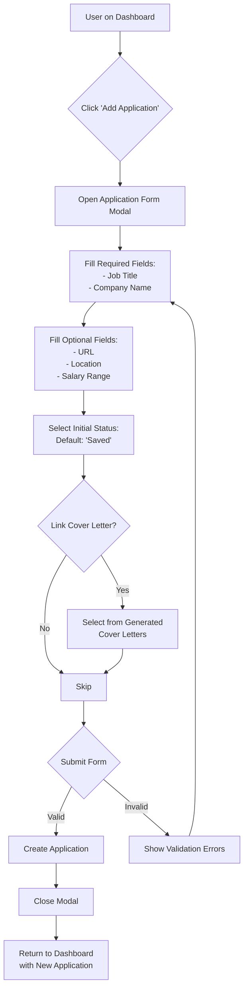
```mermaid
flowchart TD
    A[User on Dashboard] --> B{Click 'Add Application'}
    B --> C[Open Application Form Modal]
    C --> D[Fill Required Fields:<br/>- Job Title<br/>- Company Name]
    D --> E[Fill Optional Fields:<br/>- URL<br/>- Location<br/>- Salary Range]
    E --> F[Select Initial Status:<br/>Default: 'Saved']
    F --> G{Link Cover Letter?}
    G -->|Yes| H[Select from Generated<br/>Cover Letters]
    G -->|No| I[Skip]
    H --> I
    I --> J{Submit Form}
    J -->|Valid| K[Create Application]
    J -->|Invalid| L[Show Validation Errors]
    L --> D
    K --> M[Close Modal]
    M --> N[Return to Dashboard<br/>with New Application]
```

**Entry Points:**
- Primary: Dashboard "Add Application" button
- Secondary: From cover letter generation success screen

**Exit Points:**
- Success: Dashboard with new application card visible
- Cancel: Return to dashboard without changes

---

### 2. Update Application Status

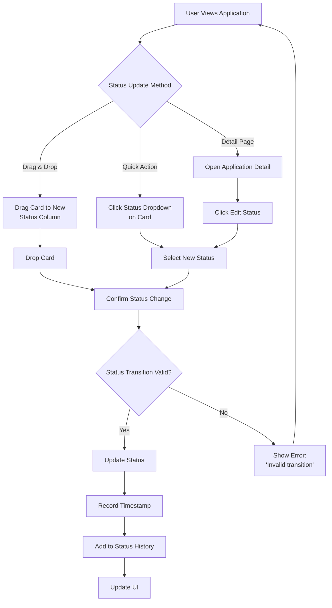
```mermaid
flowchart TD
    A[User Views Application] --> B{Status Update Method}
    B -->|Drag & Drop| C[Drag Card to New<br/>Status Column]
    B -->|Quick Action| D[Click Status Dropdown<br/>on Card]
    B -->|Detail Page| E[Open Application Detail]
    
    C --> F[Drop Card]
    D --> G[Select New Status]
    E --> H[Click Edit Status]
    
    F --> I[Confirm Status Change]
    G --> I
    H --> G
    
    I --> J{Status Transition Valid?}
    J -->|Yes| K[Update Status]
    J -->|No| L[Show Error:<br/>'Invalid transition']
    
    K --> M[Record Timestamp]
    M --> N[Add to Status History]
    N --> O[Update UI]
    
    L --> A
```

**Valid Status Transitions:**
- `Saved` → `Applied`, `Withdrawn`
- `Applied` → `Phone Screen`, `Rejected`, `Withdrawn`
- `Phone Screen` → `Interview`, `Rejected`, `Withdrawn`
- `Interview` → `Offer`, `Rejected`, `Withdrawn`
- `Offer` → (final state)
- `Rejected` → (final state)
- `Withdrawn` → (final state)

---

### 3. View Application Dashboard

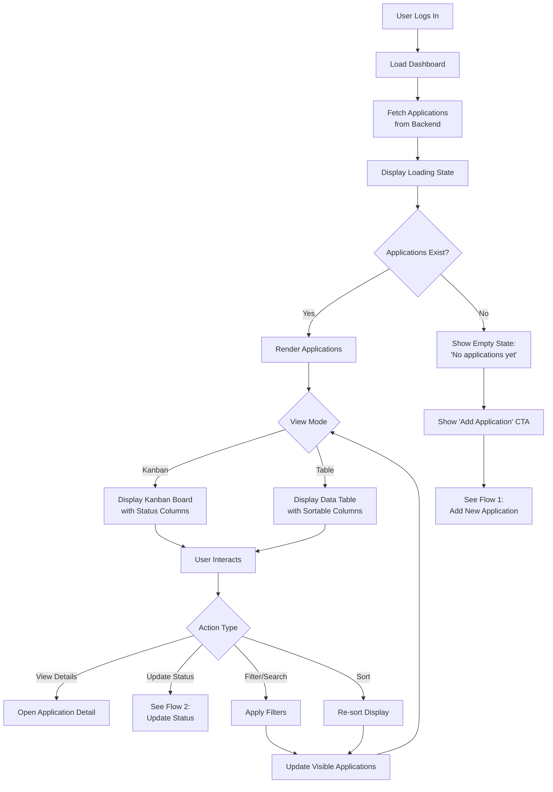
```mermaid
flowchart TD
    A[User Logs In] --> B[Load Dashboard]
    B --> C[Fetch Applications<br/>from Backend]
    C --> D[Display Loading State]
    D --> E{Applications Exist?}
    E -->|Yes| F[Render Applications]
    E -->|No| G[Show Empty State:<br/>'No applications yet']
    
    F --> H{View Mode}
    H -->|Kanban| I[Display Kanban Board<br/>with Status Columns]
    H -->|Table| J[Display Data Table<br/>with Sortable Columns]
    
    I --> K[User Interacts]
    J --> K
    G --> L[Show 'Add Application' CTA]
    L --> M[See Flow 1:<br/>Add New Application]
    
    K --> N{Action Type}
    N -->|View Details| O[Open Application Detail]
    N -->|Update Status| P[See Flow 2:<br/>Update Status]
    N -->|Filter/Search| Q[Apply Filters]
    N -->|Sort| R[Re-sort Display]
    
    Q --> S[Update Visible Applications]
    R --> S
    S --> H
```

**Dashboard Features:**
- Quick stats at top (total applications, applied this week, response rate)
- View toggle: Kanban vs Table
- Filters: Status, Company, Date range
- Search: Job title, company name
- Sort: Date, Status, Company (A-Z)

---

### 4. Link Cover Letter to Application

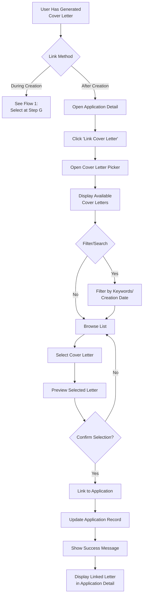
```mermaid
flowchart TD
    A[User Has Generated<br/>Cover Letter] --> B{Link Method}
    B -->|During Creation| C[See Flow 1:<br/>Select at Step G]
    B -->|After Creation| D[Open Application Detail]
    
    D --> E[Click 'Link Cover Letter']
    E --> F[Open Cover Letter Picker]
    F --> G[Display Available<br/>Cover Letters]
    G --> H{Filter/Search}
    H -->|Yes| I[Filter by Keywords/<br/>Creation Date]
    H -->|No| J[Browse List]
    
    I --> J
    J --> K[Select Cover Letter]
    K --> L[Preview Selected Letter]
    L --> M{Confirm Selection?}
    M -->|Yes| N[Link to Application]
    M -->|No| J
    
    N --> O[Update Application Record]
    O --> P[Show Success Message]
    P --> Q[Display Linked Letter<br/>in Application Detail]
```

---

### 5. Navigate Application Detail

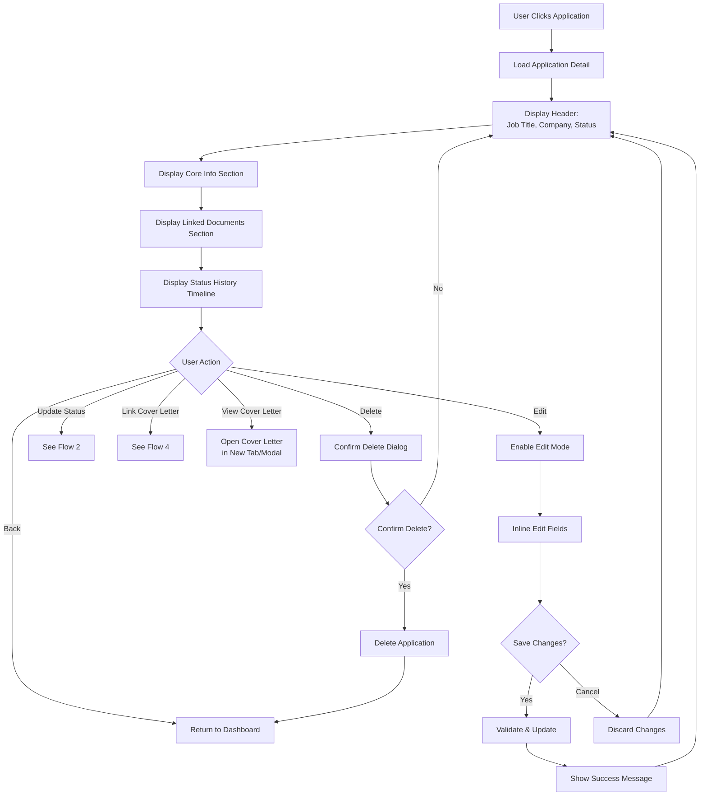
```mermaid
flowchart TD
    A[User Clicks Application] --> B[Load Application Detail]
    B --> C[Display Header:<br/>Job Title, Company, Status]
    C --> D[Display Core Info Section]
    D --> E[Display Linked Documents Section]
    E --> F[Display Status History Timeline]
    
    F --> G{User Action}
    G -->|Edit| H[Enable Edit Mode]
    G -->|Update Status| I[See Flow 2]
    G -->|Link Cover Letter| J[See Flow 4]
    G -->|View Cover Letter| K[Open Cover Letter<br/>in New Tab/Modal]
    G -->|Delete| L[Confirm Delete Dialog]
    G -->|Back| M[Return to Dashboard]
    
    H --> N[Inline Edit Fields]
    N --> O{Save Changes?}
    O -->|Yes| P[Validate & Update]
    O -->|Cancel| Q[Discard Changes]
    
    P --> R[Show Success Message]
    Q --> C
    R --> C
    
    L --> S{Confirm Delete?}
    S -->|Yes| T[Delete Application]
    S -->|No| C
    T --> M
```

---

## Navigation Map

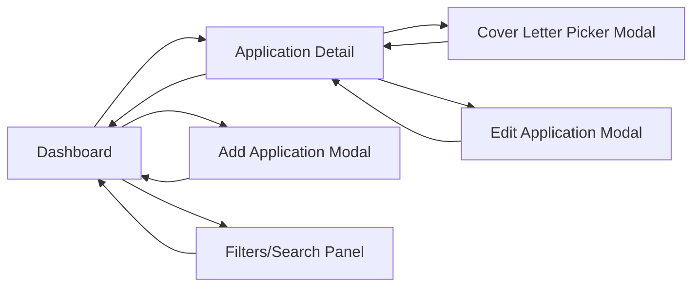
```mermaid
flowchart LR
    A[Dashboard] --> B[Application Detail]
    B --> A
    A --> C[Add Application Modal]
    C --> A
    B --> D[Cover Letter Picker Modal]
    D --> B
    B --> E[Edit Application Modal]
    E --> B
    A --> F[Filters/Search Panel]
    F --> A
```

---

## Error Flows

### Network Error During Save

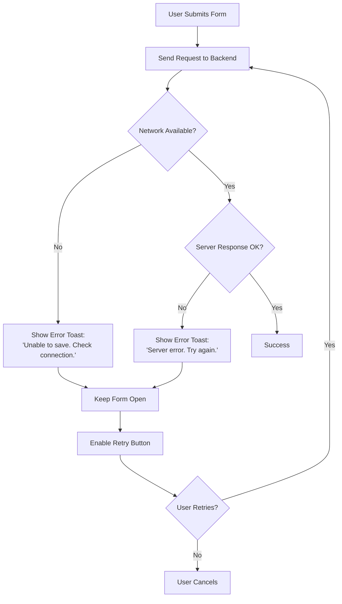
```mermaid
flowchart TD
    A[User Submits Form] --> B[Send Request to Backend]
    B --> C{Network Available?}
    C -->|No| D[Show Error Toast:<br/>'Unable to save. Check connection.']
    C -->|Yes| E{Server Response OK?}
    E -->|No| F[Show Error Toast:<br/>'Server error. Try again.']
    E -->|Yes| G[Success]
    
    D --> H[Keep Form Open]
    F --> H
    H --> I[Enable Retry Button]
    I --> J{User Retries?}
    J -->|Yes| B
    J -->|No| K[User Cancels]
```

### Invalid Status Transition

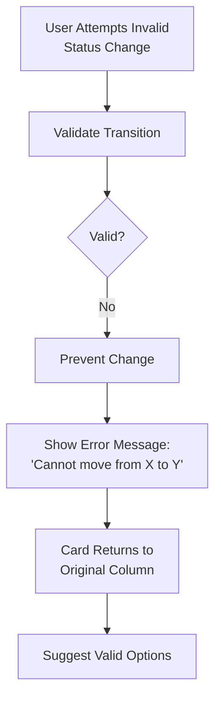
```mermaid
flowchart TD
    A[User Attempts Invalid<br/>Status Change] --> B[Validate Transition]
    B --> C{Valid?}
    C -->|No| D[Prevent Change]
    D --> E[Show Error Message:<br/>'Cannot move from X to Y']
    E --> F[Card Returns to<br/>Original Column]
    F --> G[Suggest Valid Options]
```

---

## Accessibility Considerations

- **Keyboard Navigation:** All flows must be completable via keyboard only
  - Tab order follows logical flow
  - Enter/Space to activate buttons
  - Escape to close modals
  - Arrow keys for drag-and-drop alternative

- **Screen Reader Support:**
  - Announce status changes ("Application moved to Interview")
  - Form validation errors read aloud
  - Loading states announced
  - Success/error toasts have ARIA live regions

- **Focus Management:**
  - Focus returns to trigger element after modal close
  - First interactive element receives focus on modal open
  - Focus trap within modals

---

---

## 6. Master Catalog Index (UC-2)

The Catalog is a normalized knowledge base of professional attributes extracted from resumes and applications. It surfaces companies, skills, achievements, and career themes for the user to review, curate, and use as context when tailoring future applications.

### 6a. Browse the Catalog

**Entry point**: "Catalog" in the main navigation

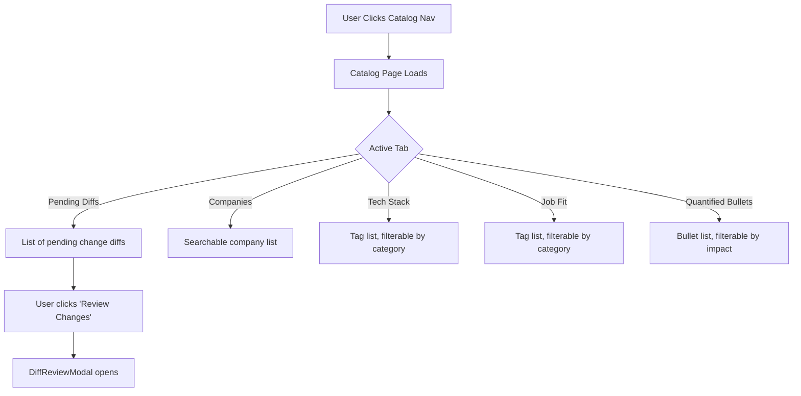
```mermaid
flowchart TD
    A[User Clicks Catalog Nav] --> B[Catalog Page Loads]
    B --> C{Active Tab}
    C -->|Pending Diffs| D[List of pending change diffs]
    C -->|Companies| E[Searchable company list]
    C -->|Tech Stack| F[Tag list, filterable by category]
    C -->|Job Fit| G[Tag list, filterable by category]
    C -->|Quantified Bullets| H[Bullet list, filterable by impact]
    D --> I[User clicks 'Review Changes']
    I --> J[DiffReviewModal opens]
```

**Tab descriptions**:
- **Pending Diffs** — Diffs waiting for user approval. Each card shows a summary, change counts (➕ new / ✏️ updated / ➖ deleted), and a warning count for ambiguities.
- **Companies** — Normalized company entries deduplicated across all applications. Searchable by name or alias.
- **Tech Stack** — Technology tags organized by category (language, frontend, backend, database, cloud, devops, ai_ml). Includes version info and legacy flags.
- **Job Fit** — Role, industry, seniority, and work-style signals extracted from application content.
- **Quantified Bullets** — Metric-bearing resume achievements categorized by business impact.

### 6b. Diff Review Flow

When a resume is uploaded or an application is updated, the system generates a diff of proposed catalog changes. The user must review and approve or reject these changes before they are committed.

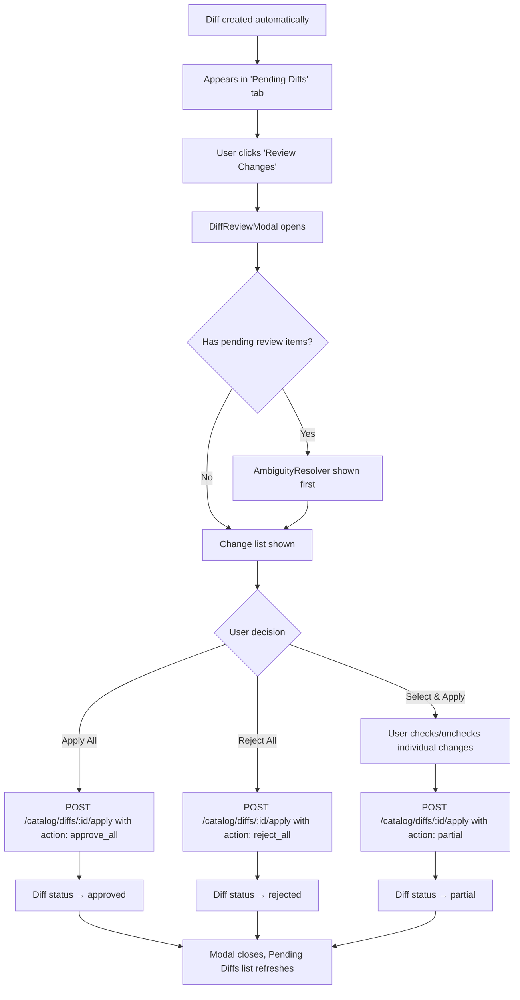
```mermaid
flowchart TD
    A[Diff created automatically] --> B[Appears in 'Pending Diffs' tab]
    B --> C[User clicks 'Review Changes']
    C --> D[DiffReviewModal opens]
    D --> E{Has pending review items?}
    E -->|Yes| F[AmbiguityResolver shown first]
    E -->|No| G[Change list shown]
    F --> G
    G --> H{User decision}
    H -->|Apply All| I[POST /catalog/diffs/:id/apply with action: approve_all]
    H -->|Select & Apply| J[User checks/unchecks individual changes]
    H -->|Reject All| K[POST /catalog/diffs/:id/apply with action: reject_all]
    J --> L[POST /catalog/diffs/:id/apply with action: partial]
    I --> M[Diff status → approved]
    K --> N[Diff status → rejected]
    L --> O[Diff status → partial]
    M & N & O --> P[Modal closes, Pending Diffs list refreshes]
```

### 6c. Resolving Ambiguities

Some extracted values cannot be resolved automatically and require human input. These appear as review items at the top of the DiffReviewModal.

| Review Type | Icon | When it appears | User action |
|-------------|------|-----------------|-------------|
| `ambiguous_tag` | ⚠️ | Text could map to multiple known tags (e.g. "PM" → "Product Manager" or "Project Manager") | Select the correct meaning via radio buttons |
| `fuzzy_match` | 🔍 | Text closely resembles an existing catalog entry | Confirm or reject the suggested match |
| `unresolved_wikilink` | 🔗 | Text contains a `[[wikilink]]` that has no registry entry | Select a catalog entity or skip |

Users can skip any review item to defer resolution. Skipped items remain in `pendingReview` until the diff is fully applied or expired.

### 6d. Diff Expiry

Diffs expire **7 days** after generation. Expired diffs cannot be applied. If a diff expires before review, the extracted changes are lost and must be regenerated by re-uploading or re-saving the source document.

### 6e. Catalog Curation

Users can curate catalog data directly from the browse tabs:

- **Merge companies** — Combine duplicate company entries into one canonical record. All historical application associations are preserved.
- **Edit tags** — Update a tag's display name, category, or review flag directly from the tag list.
- **Merge tags** — Combine duplicate tags (e.g. "Node" + "Node.js" → "Node.js") so mention counts are consolidated.

---

## 7. Job Description Fit Analysis (UC-3)

### Overview
Allow users to analyze how well a job posting matches their professional profile by comparing job requirements against their catalog of skills, experiences, and achievements. The system provides an honest assessment including gaps.

### 7a. Submit Job for Analysis

**Entry Points:**
- Dashboard "Analyze Job Fit" button
- Application detail page "Check Fit" action
- Main navigation "Job Fit" link

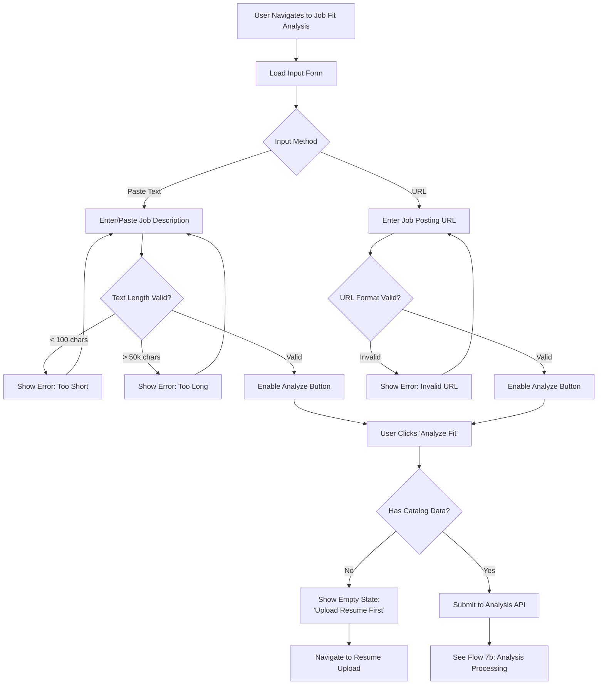
```mermaid
flowchart TD
    A[User Navigates to Job Fit Analysis] --> B[Load Input Form]
    B --> C{Input Method}
    C -->|Paste Text| D[Enter/Paste Job Description]
    C -->|URL| E[Enter Job Posting URL]
    
    D --> F{Text Length Valid?}
    E --> G{URL Format Valid?}
    
    F -->|< 100 chars| H[Show Error: Too Short]
    F -->|> 50k chars| I[Show Error: Too Long]
    F -->|Valid| J[Enable Analyze Button]
    
    G -->|Invalid| K[Show Error: Invalid URL]
    G -->|Valid| L[Enable Analyze Button]
    
    H --> D
    I --> D
    K --> E
    
    J --> M[User Clicks 'Analyze Fit']
    L --> M
    
    M --> N{Has Catalog Data?}
    N -->|No| O[Show Empty State:<br/>'Upload Resume First']
    N -->|Yes| P[Submit to Analysis API]
    
    O --> Q[Navigate to Resume Upload]
    P --> R[See Flow 7b: Analysis Processing]
```

### 7b. Analysis Processing

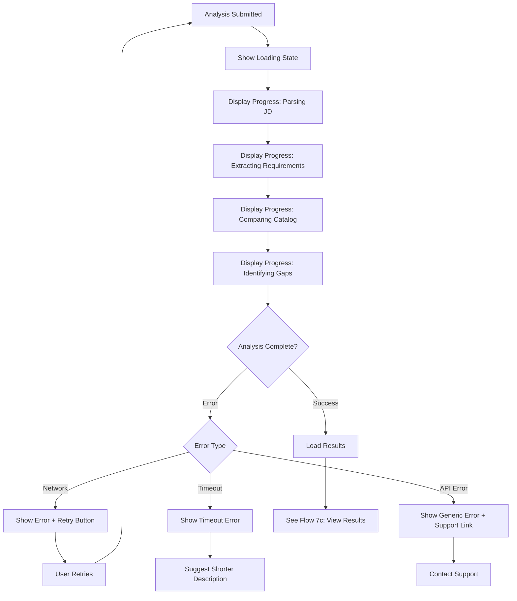
```mermaid
flowchart TD
    A[Analysis Submitted] --> B[Show Loading State]
    B --> C[Display Progress: Parsing JD]
    C --> D[Display Progress: Extracting Requirements]
    D --> E[Display Progress: Comparing Catalog]
    E --> F[Display Progress: Identifying Gaps]
    
    F --> G{Analysis Complete?}
    G -->|Success| H[Load Results]
    G -->|Error| I{Error Type}
    
    I -->|Network| J[Show Error + Retry Button]
    I -->|Timeout| K[Show Timeout Error]
    I -->|API Error| L[Show Generic Error + Support Link]
    
    J --> M[User Retries]
    M --> A
    
    K --> N[Suggest Shorter Description]
    L --> O[Contact Support]
    
    H --> P[See Flow 7c: View Results]
```

**Loading State Details:**
- Progress bar shows 0-100% completion
- Step-by-step status updates
- Estimated time: 10-15 seconds
- Cancelable (returns to input form)

### 7c. View and Interact with Results

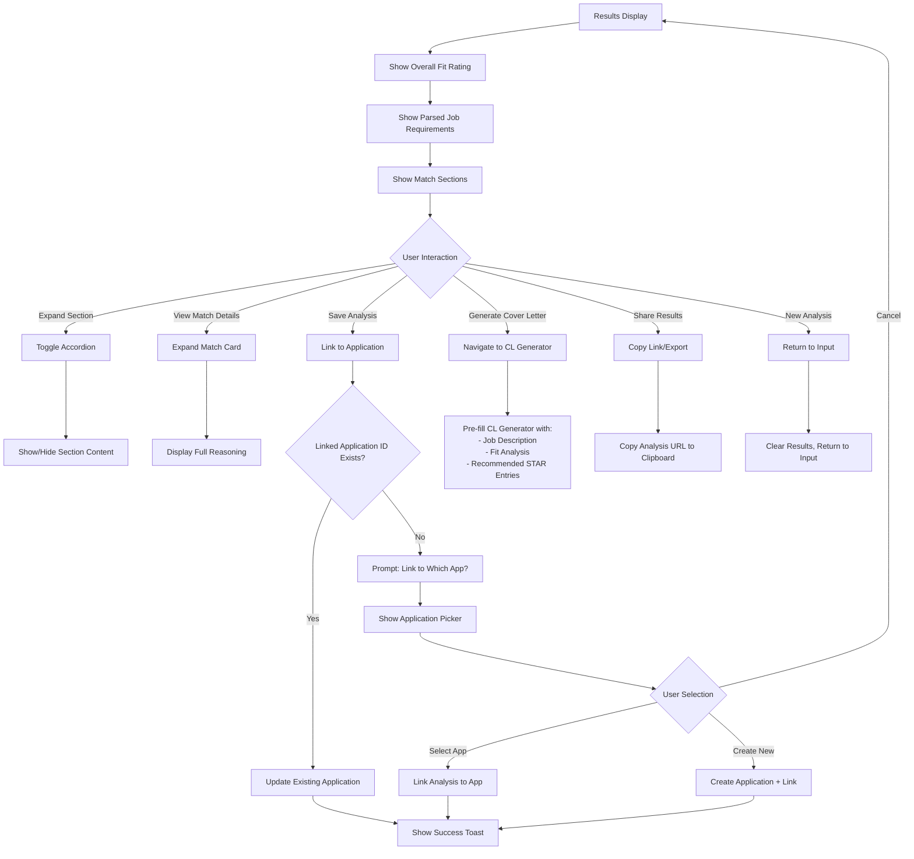
```mermaid
flowchart TD
    A[Results Display] --> B[Show Overall Fit Rating]
    B --> C[Show Parsed Job Requirements]
    C --> D[Show Match Sections]
    
    D --> E{User Interaction}
    E -->|Expand Section| F[Toggle Accordion]
    E -->|View Match Details| G[Expand Match Card]
    E -->|Save Analysis| H[Link to Application]
    E -->|Generate Cover Letter| I[Navigate to CL Generator]
    E -->|Share Results| J[Copy Link/Export]
    E -->|New Analysis| K[Return to Input]
    
    F --> L[Show/Hide Section Content]
    G --> M[Display Full Reasoning]
    
    H --> N{Linked Application ID Exists?}
    N -->|Yes| O[Update Existing Application]
    N -->|No| P[Prompt: Link to Which App?]
    
    P --> Q[Show Application Picker]
    Q --> R{User Selection}
    R -->|Select App| S[Link Analysis to App]
    R -->|Create New| T[Create Application + Link]
    R -->|Cancel| A
    
    S --> U[Show Success Toast]
    T --> U
    O --> U
    
    I --> V[Pre-fill CL Generator with:<br/>- Job Description<br/>- Fit Analysis<br/>- Recommended STAR Entries]
    
    J --> W[Copy Analysis URL to Clipboard]
    
    K --> X[Clear Results, Return to Input]
```

### 7d. Review Matches and Gaps

**Strong Matches Section:**
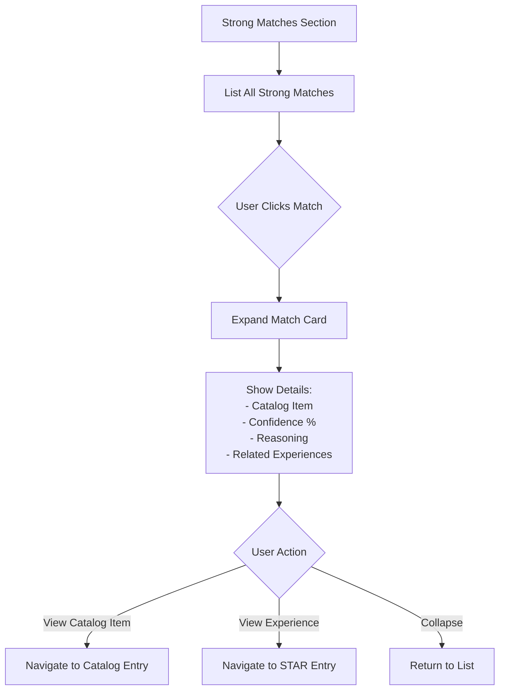
```mermaid
flowchart TD
    A[Strong Matches Section] --> B[List All Strong Matches]
    B --> C{User Clicks Match}
    C --> D[Expand Match Card]
    D --> E[Show Details:<br/>- Catalog Item<br/>- Confidence %<br/>- Reasoning<br/>- Related Experiences]
    E --> F{User Action}
    F -->|View Catalog Item| G[Navigate to Catalog Entry]
    F -->|View Experience| H[Navigate to STAR Entry]
    F -->|Collapse| I[Return to List]
```

**Gaps Section (Visually Prominent):**
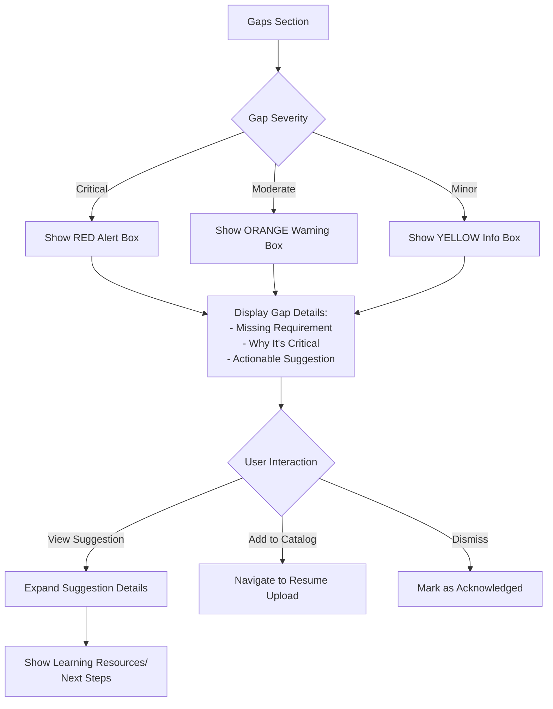
```mermaid
flowchart TD
    A[Gaps Section] --> B{Gap Severity}
    B -->|Critical| C[Show RED Alert Box]
    B -->|Moderate| D[Show ORANGE Warning Box]
    B -->|Minor| E[Show YELLOW Info Box]
    
    C --> F[Display Gap Details:<br/>- Missing Requirement<br/>- Why It's Critical<br/>- Actionable Suggestion]
    D --> F
    E --> F
    
    F --> G{User Interaction}
    G -->|View Suggestion| H[Expand Suggestion Details]
    G -->|Add to Catalog| I[Navigate to Resume Upload]
    G -->|Dismiss| J[Mark as Acknowledged]
    
    H --> K[Show Learning Resources/<br/>Next Steps]
```

**Gap Visual Hierarchy:**
1. **Critical** (Required skills missing): Large, red border, top of list
2. **Moderate** (Nice-to-have missing): Medium, orange border, middle
3. **Minor** (Adjacent skills): Small, yellow border, bottom

### 7e. Use Recommendations

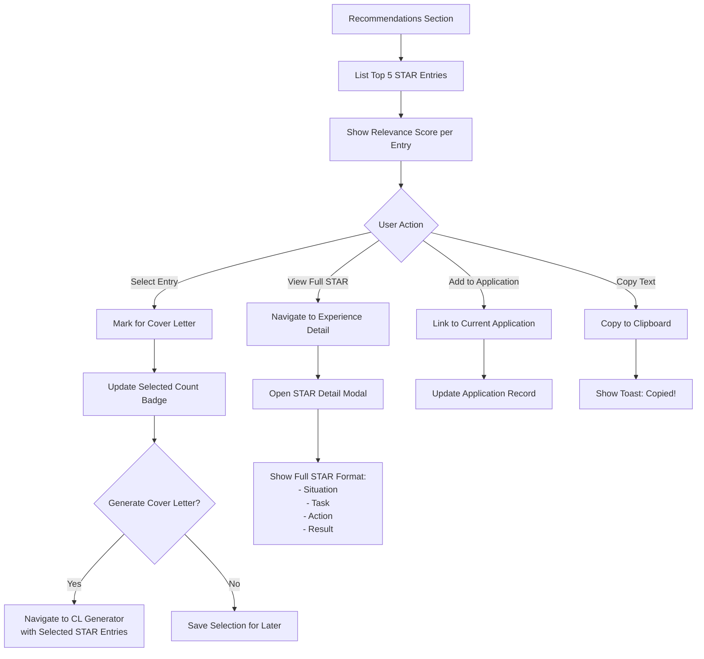
```mermaid
flowchart TD
    A[Recommendations Section] --> B[List Top 5 STAR Entries]
    B --> C[Show Relevance Score per Entry]
    C --> D{User Action}
    
    D -->|Select Entry| E[Mark for Cover Letter]
    D -->|View Full STAR| F[Navigate to Experience Detail]
    D -->|Add to Application| G[Link to Current Application]
    D -->|Copy Text| H[Copy to Clipboard]
    
    E --> I[Update Selected Count Badge]
    I --> J{Generate Cover Letter?}
    J -->|Yes| K[Navigate to CL Generator<br/>with Selected STAR Entries]
    J -->|No| L[Save Selection for Later]
    
    F --> M[Open STAR Detail Modal]
    M --> N[Show Full STAR Format:<br/>- Situation<br/>- Task<br/>- Action<br/>- Result]
    
    G --> O[Update Application Record]
    
    H --> P[Show Toast: Copied!]
```

### 7f. Save or Link Analysis

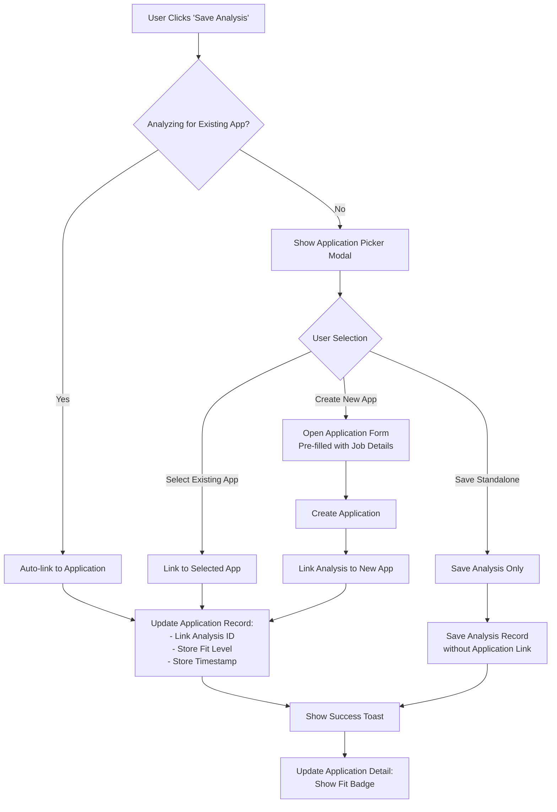
```mermaid
flowchart TD
    A[User Clicks 'Save Analysis'] --> B{Analyzing for Existing App?}
    B -->|Yes| C[Auto-link to Application]
    B -->|No| D[Show Application Picker Modal]
    
    C --> E[Update Application Record:<br/>- Link Analysis ID<br/>- Store Fit Level<br/>- Store Timestamp]
    
    D --> F{User Selection}
    F -->|Select Existing App| G[Link to Selected App]
    F -->|Create New App| H[Open Application Form<br/>Pre-filled with Job Details]
    F -->|Save Standalone| I[Save Analysis Only]
    
    G --> E
    H --> J[Create Application]
    J --> K[Link Analysis to New App]
    K --> E
    
    I --> L[Save Analysis Record<br/>without Application Link]
    
    E --> M[Show Success Toast]
    L --> M
    
    M --> N[Update Application Detail:<br/>Show Fit Badge]
```

**Saved Analysis Persistence:**
- Analysis results saved for 90 days
- Accessible from application detail page
- Can re-run analysis to update
- Old analyses archived, not deleted

### 7g. Error Handling Flows

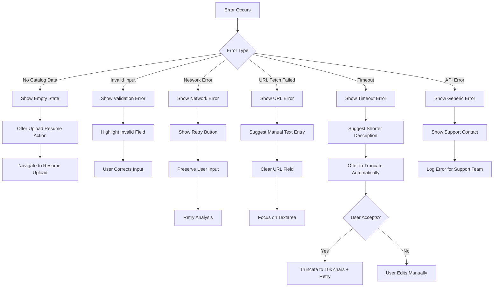
```mermaid
flowchart TD
    A[Error Occurs] --> B{Error Type}
    
    B -->|No Catalog Data| C[Show Empty State]
    B -->|Invalid Input| D[Show Validation Error]
    B -->|Network Error| E[Show Network Error]
    B -->|URL Fetch Failed| F[Show URL Error]
    B -->|Timeout| G[Show Timeout Error]
    B -->|API Error| H[Show Generic Error]
    
    C --> I[Offer Upload Resume Action]
    I --> J[Navigate to Resume Upload]
    
    D --> K[Highlight Invalid Field]
    K --> L[User Corrects Input]
    
    E --> M[Show Retry Button]
    M --> N[Preserve User Input]
    N --> O[Retry Analysis]
    
    F --> P[Suggest Manual Text Entry]
    P --> Q[Clear URL Field]
    Q --> R[Focus on Textarea]
    
    G --> S[Suggest Shorter Description]
    S --> T[Offer to Truncate Automatically]
    T --> U{User Accepts?}
    U -->|Yes| V[Truncate to 10k chars + Retry]
    U -->|No| W[User Edits Manually]
    
    H --> X[Show Support Contact]
    X --> Y[Log Error for Support Team]
```

---

## Navigation Map (Updated)

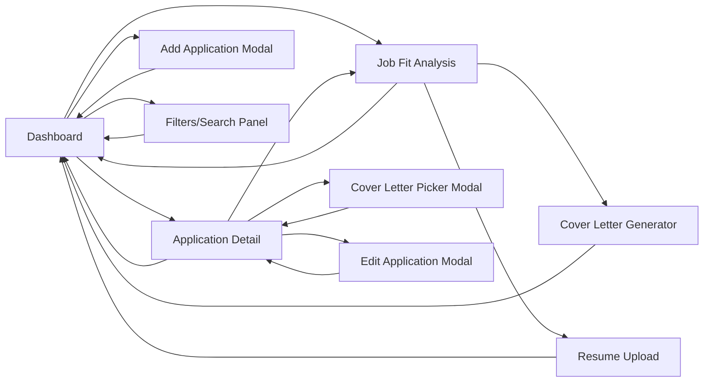
```mermaid
flowchart LR
    A[Dashboard] --> B[Application Detail]
    A --> C[Job Fit Analysis]
    B --> A
    B --> C
    C --> A
    C --> D[Cover Letter Generator]
    D --> A
    C --> E[Resume Upload]
    E --> A
    A --> F[Add Application Modal]
    F --> A
    B --> G[Cover Letter Picker Modal]
    G --> B
    B --> H[Edit Application Modal]
    H --> B
    A --> I[Filters/Search Panel]
    I --> A
```

---

## Accessibility Requirements for Job Fit Analysis

### Screen Reader Support
- **Overall Fit:** "Overall fit level: Moderate fit, 60% match"
- **Match Sections:** "Strong matches: 5 items. Partial matches: 2 items. Gaps: 2 items."
- **Gap Severity:** "Critical gap: TypeScript. Required skill not found in catalog."
- **Recommendations:** "Recommended STAR entry 1 of 3: Led React migration, 95% relevance"

### Keyboard Navigation
- **Tab Order:** Input → Submit → Results Header → Fit Rating → Sections → Action Buttons
- **Arrow Keys:** Navigate within match/gap lists
- **Enter/Space:** Expand/collapse sections
- **Escape:** Close modals, return to top

### ARIA Attributes
```html
<section role="region" aria-label="Job Fit Analysis Results">
  <div role="status" aria-live="polite" aria-atomic="true">
    <!-- Overall fit rating -->
  </div>
  <div role="alert" aria-live="assertive">
    <!-- Critical gaps -->
  </div>
  <div role="feed">
    <!-- Recommendations list -->
  </div>
</section>
```

### Focus Management
1. On analysis complete: Focus moves to "Overall Fit" heading
2. On error: Focus moves to error message
3. On modal open: Focus trap within modal
4. On modal close: Return focus to trigger element

---

## Notes for Frontend Developer

1. **State Management:** Dashboard and detail views should share application state to prevent refetching
2. **Optimistic Updates:** Update UI immediately on status change, rollback if API fails
3. **Caching:** Cache cover letter list for quick picker display
4. **Loading States:** Show skeleton screens for better perceived performance
5. **Transitions:** Smooth animations for status changes (300ms ease-in-out recommended)
6. **Job Fit Analysis:** 
   - Stream results as they arrive (parsed JD first, then matches/gaps)
   - Cache analysis results for 24 hours to avoid re-analysis
   - Persist input text in localStorage to prevent data loss
   - Use progressive disclosure for match details (expand on click)
