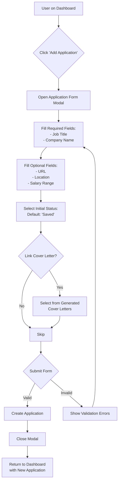
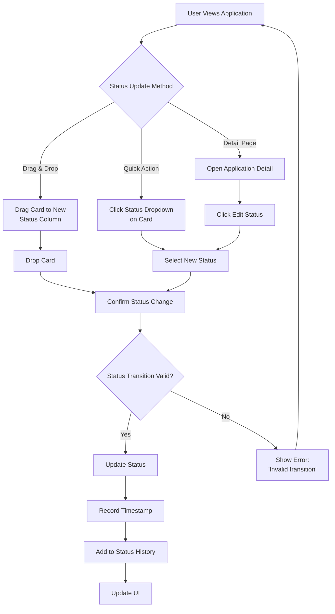
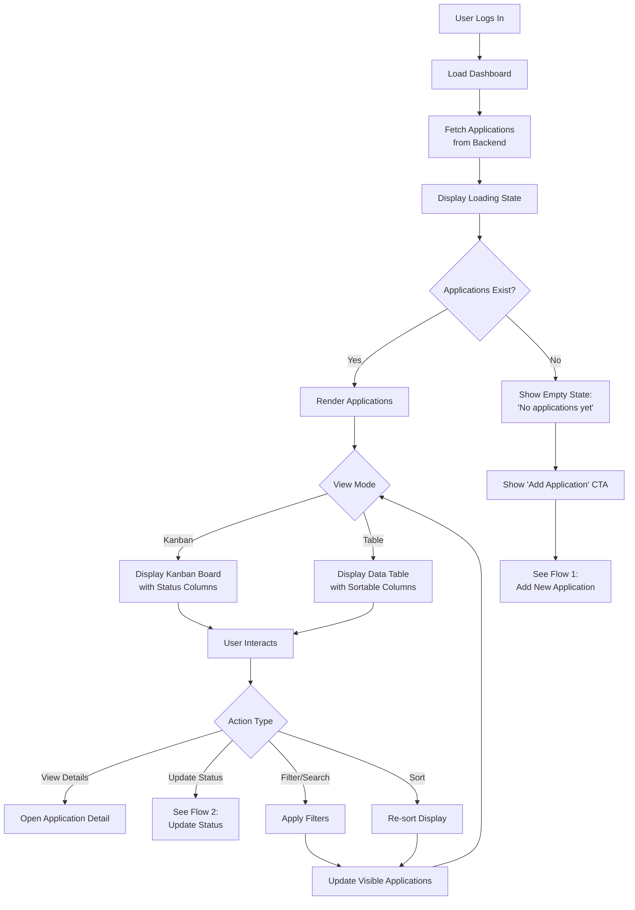
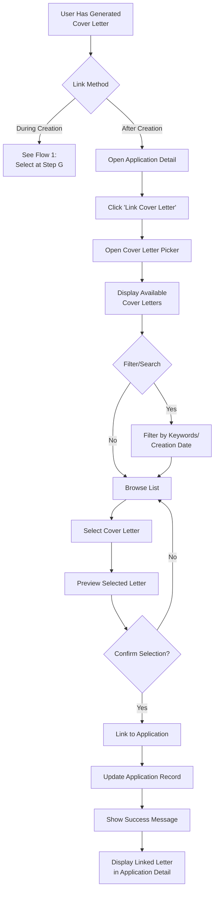
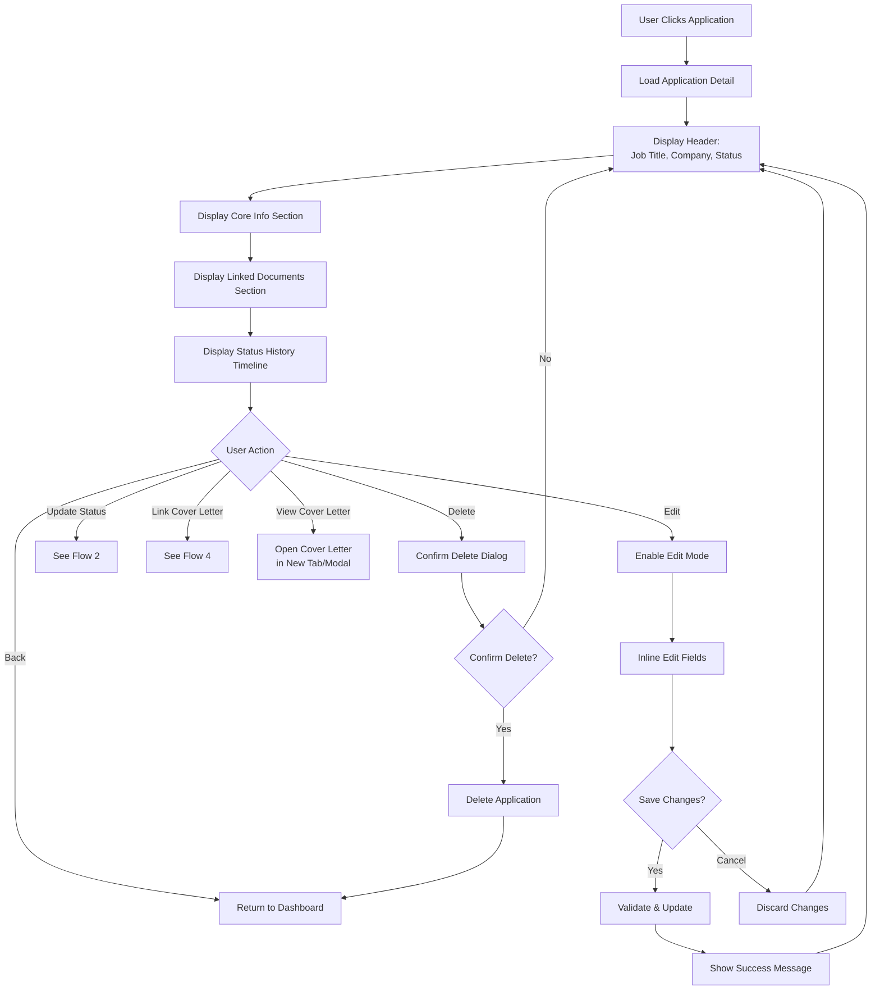
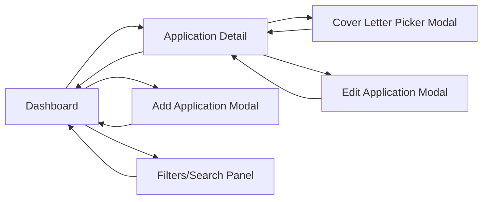
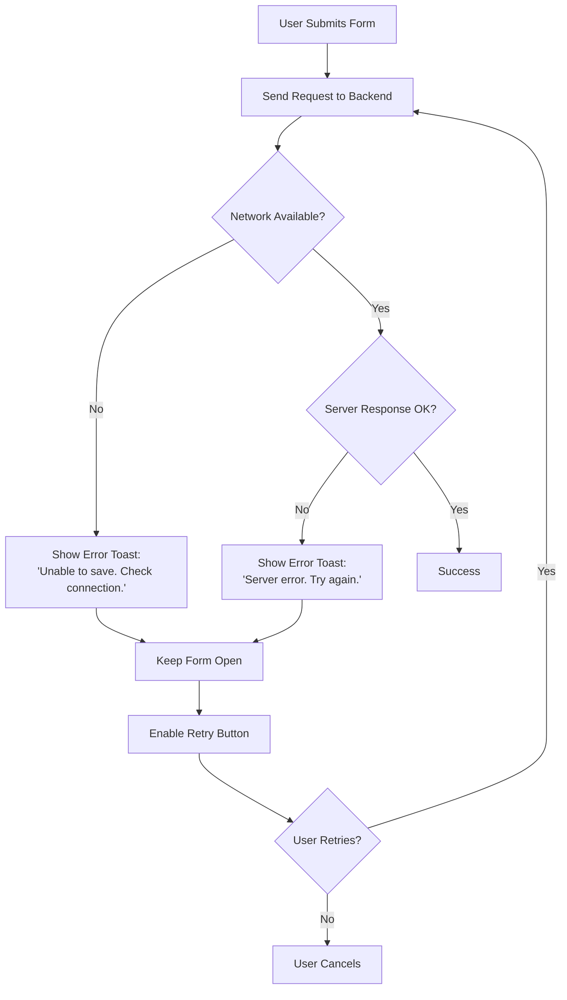
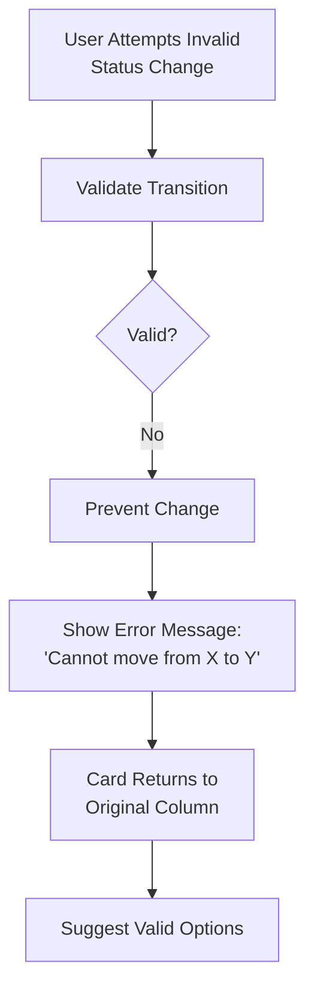

# User Flows — Job Application Manager

## Overview

This document outlines the key user flows for the application tracking features in the Job Application Manager MVP (Phase 1).

## Primary User Flows

### 1. Add New Job Application

**Entry Points:**
- Primary: Dashboard "Add Application" button
- Secondary: From cover letter generation success screen

**Exit Points:**
- Success: Dashboard with new application card visible
- Cancel: Return to dashboard without changes

---

### 2. Update Application Status

**Valid Status Transitions:**
- `Saved` → `Applied`, `Withdrawn`
- `Applied` → `Phone Screen`, `Rejected`, `Withdrawn`
- `Phone Screen` → `Interview`, `Rejected`, `Withdrawn`
- `Interview` → `Offer`, `Rejected`, `Withdrawn`
- `Offer` → (final state)
- `Rejected` → (final state)
- `Withdrawn` → (final state)

---

### 3. View Application Dashboard

**Dashboard Features:**
- Quick stats at top (total applications, applied this week, response rate)
- View toggle: Kanban vs Table
- Filters: Status, Company, Date range
- Search: Job title, company name
- Sort: Date, Status, Company (A-Z)

---

### 4. Link Cover Letter to Application

---

### 5. Navigate Application Detail

---

## Navigation Map

---

## Error Flows

### Network Error During Save

### Invalid Status Transition

---

## Accessibility Considerations

- **Keyboard Navigation:** All flows must be completable via keyboard only
  - Tab order follows logical flow
  - Enter/Space to activate buttons
  - Escape to close modals
  - Arrow keys for drag-and-drop alternative

- **Screen Reader Support:**
  - Announce status changes ("Application moved to Interview")
  - Form validation errors read aloud
  - Loading states announced
  - Success/error toasts have ARIA live regions

- **Focus Management:**
  - Focus returns to trigger element after modal close
  - First interactive element receives focus on modal open
  - Focus trap within modals

---

## Notes for Frontend Developer

1. **State Management:** Dashboard and detail views should share application state to prevent refetching
2. **Optimistic Updates:** Update UI immediately on status change, rollback if API fails
3. **Caching:** Cache cover letter list for quick picker display
4. **Loading States:** Show skeleton screens for better perceived performance
5. **Transitions:** Smooth animations for status changes (300ms ease-in-out recommended)
